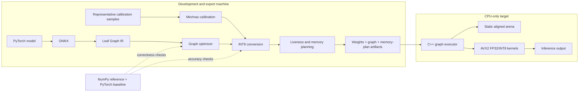
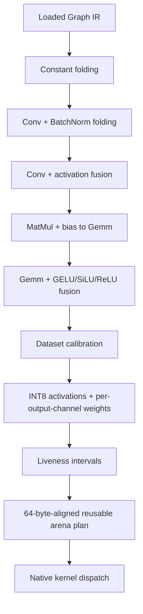

# Leaf

Leaf is a CPU-native neural-network inference optimizer. A Python development
toolchain imports ONNX, proves graph rewrites against a NumPy reference, uses
representative data to calibrate INT8, and exports a static memory plan. The
latency-sensitive path is C++17 with AVX2 kernels and no PyTorch dependency.

The project is under active implementation. The optimizer, binary artifact
format, FP32 C++ graph executor, activation-buffer pool, memory planner,
calibrated per-channel INT8 conversion, native GEMM/convolution kernels, and
benchmark gates work today. INT8 artifact loading and quantized graph dispatch
are the next integration step.

## Architecture



The optimization order is intentional:



## Implemented

- ONNX-to-Leaf IR with inferred tensor shapes, cloning, graph validation,
  producer/consumer maps, and cycle detection.
- Constant folding for shape/arithmetic subgraphs, with a materialization size
  guard and dead-initializer cleanup.
- Exact Conv+BatchNorm folding and Conv+ReLU fusion.
- Transformer feed-forward rewrites: MatMul+constant bias becomes Gemm, then
  GELU, SiLU, or ReLU is fused as an epilogue.
- Static symmetric INT8 calibration. Activations use a dataset-derived scale;
  Conv/Gemm/MatMul weights use independent scales for every output channel.
- A quantized-value simulation in the reference executor for error measurement.
- Liveness-based, best-fit buffer reuse with 64-byte alignment, graph
  fingerprints, dynamic-shape reporting, and versioned JSON export.
- C++17 scalar correctness kernels plus AVX2/FMA FP32 GEMM, signed INT8 GEMM
  with per-channel dequantization, direct convolution, im2col convolution,
  fused ReLU, packed convolution weights, and an aligned arena.
- A versioned `.leaf` binary exporter/parser and framework-free C++ executor
  for the ResNet operator path, including pooled activation buffers and a full
  PyTorch-to-ONNX-to-Leaf-to-C++ numerical parity check.
- Deterministic offline CNN and transformer calibration/evaluation workloads;
  no dataset download is required for CI or local validation.

## Correctness and latency gates

Run all Python, graph-rewrite, quantization, memory-plan, and PyTorch integration
tests:

```powershell
python -m pytest -q
```

Or run every correctness, native speed, PyTorch, dataset, and export check in
one command:

```powershell
./scripts/verify_all.ps1
```

Build and verify the native kernels with GCC:

```powershell
./scripts/build_native.ps1
./build/leaf_native_tests.exe
./build/leaf_kernel_bench.exe --enforce-speedup --output benchmark/results/native_latest.json
```

The final flag fails when an optimized native kernel is slower than its scalar
Leaf baseline. CMake is also supported:

```powershell
cmake -S . -B build -DCMAKE_BUILD_TYPE=Release
cmake --build build --config Release
ctest --test-dir build -C Release
```

Run the fixed-dataset PyTorch comparison and regenerate memory plans:

```powershell
python -m benchmark.run_baselines
```

### Latest development-machine check

The latest merged run completed 22 Python tests and all native correctness tests.
Results are machine-specific and should be regenerated on the deployment CPU.

| Check | Baseline | Optimized | Result |
|---|---:|---:|---:|
| FP32 GEMM, 64×384×384 | 5.6–6.9 ms scalar | 0.68–0.85 ms AVX2 | ~8.2× faster |
| INT8 GEMM, 64×384×384 | 3.6–4.5 ms scalar | 0.93–1.18 ms AVX2 | ~3.8× faster |
| FP32 Conv, 16→32, 3×3 | 2.8–3.4 ms direct | 0.34–0.41 ms im2col+AVX2 | ~8.2× faster |
| CNN FP32 vs PyTorch | — | max abs error 5.96e-7 | pass |
| CNN calibrated INT8 vs PyTorch | — | max abs error 0.0204 | pass |
| Transformer FP32 vs PyTorch | — | max abs error 2.71e-7 | pass |
| Transformer calibrated INT8 vs PyTorch | — | max abs error 0.0952 | pass |

The NumPy executor is deliberately a correctness oracle, not a production
runtime. Its timings are recorded to expose Python overhead, but performance
claims come only from `leaf_kernel_bench`. Raw results live in
[`benchmark/results`](benchmark/results/README.md).

## Memory-plan format

`plan_memory(graph).export_json(path)` writes `leaf-memory-plan-v1`:

```json
{
  "format": "leaf-memory-plan-v1",
  "alignment": 64,
  "arena_size": 128,
  "naive_size": 192,
  "bytes_saved": 64,
  "allocations": [
    {"tensor": "a", "offset": 0, "size": 64, "first_node": 0, "last_node": 1},
    {"tensor": "c", "offset": 0, "size": 64, "first_node": 2, "last_node": 3}
  ],
  "unplanned_tensors": []
}
```

Values reuse an offset only when their live intervals do not overlap. Unknown
or dynamic shapes are listed under `unplanned_tensors` instead of being guessed.
The native `Arena` validates alignment and bounds when applying offsets.

## Repository layout

```text
Leaf/
├── benchmark/
│   ├── datasets.py               # deterministic calibration/evaluation data
│   ├── run_baselines.py          # PyTorch and NumPy correctness/latency checks
│   ├── native_benchmark.cpp      # native regression gate
│   └── results/                  # latest JSON results and exported plans
├── engine/
│   ├── include/leaf/kernels/     # GEMM and convolution APIs
│   ├── include/leaf/runtime/     # aligned arena
│   └── src/kernels/              # scalar and AVX2 implementations
├── scripts/build_native.ps1
├── tests/
│   ├── unit/                     # optimizer and planner tests
│   ├── integration/              # PyTorch cross-checks
│   └── native/                   # C++ numerical tests
└── tools/graph_opt/              # IR, passes, calibration, pipeline, executor
```

## Development rules

Every optimization must satisfy both gates before it is kept:

1. Compare its output with the pre-optimization graph and PyTorch where an
   equivalent reference exists.
2. Benchmark it against the previous Leaf implementation using medians after
   warm-up. Reject latency regressions unless a documented accuracy or memory
   trade-off justifies them.

Benchmark data must state thread count, shapes, compiler flags, calibration
sample count, and machine context. PyTorch is a development baseline only and
never ships to the CPU target.

## Next iteration

Development continues in profiling-driven slices rather than a report phase:

- extend the binary format with INT8 dtype/scales and dispatch quantized graphs;
- replace the executor's runtime buffer pool with exported memory-plan offsets;
- add native LayerNorm, residual, softmax, and attention kernels;
- prepack weights once at load time and add cache-aware/threaded scheduling;
- run ResNet-18 and a small decoder-only transformer on held-out real datasets;
- profile whole-model latency and peak RSS, fix the largest bottleneck, then
  repeat the correctness and no-regression gates.

## Scope

Leaf performs inference only. Training, GPU execution, and unstructured
sparsity are out of scope. The deployment goal remains a CPU-only machine with
limited storage: Python, PyTorch, ONNX, and calibration data stay on the
development machine; only artifacts and the native runtime are required on the
target.
