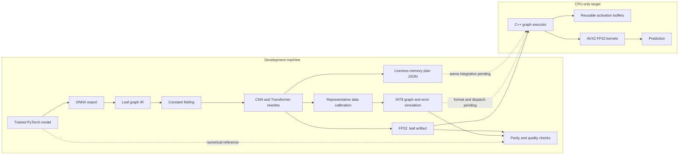
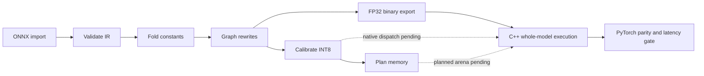

# Leaf

Leaf is a CPU inference engine and model optimizer. It takes an already trained
model, imports an ONNX graph, removes redundant work, and runs the supported
graph in a small C++ runtime. The development machine may use Python, PyTorch,
ONNX, and calibration data; the intended deployment machine only needs the
exported model and native runtime.

The project is actively developed. The end-to-end native path currently runs
FP32 ResNet-18. INT8 calibration, per-output-channel weight conversion, and
AVX2 INT8 kernels exist, but the binary format and C++ graph executor do not
yet connect those pieces into quantized whole-model inference. Transformer
graph pattern rewrites exist; full Qwen execution in Leaf is still pending.

## 1. Why build Leaf?

Large inference frameworks add installation size and Python overhead to small
CPU deployments. A GPU is also unavailable on the intended target. Leaf's
goal is to turn a trained network into a compact, predictable CPU artifact
while measuring every change against its numerical reference and prior
latency. It is an inference project, not a training framework.

The concrete targets are:

1. Import CNN and decoder-only Transformer graphs through a shared IR.
2. Remove constant work, fuse operators, and reuse activation memory.
3. Reduce CNN weight and activation cost with calibrated INT8; evaluate
   weight-only quantization for language models after FP32 correctness.
4. Move hot inference loops into C++ with AVX2 kernels, keeping Python on the
   export and verification machine.
5. Run the final artifact on a CPU-only machine with a roughly 6 GB storage
   budget, then measure latency, memory, and model quality there.

The speed rule is evidence driven: a new implementation must preserve outputs
within a stated tolerance and beat its previous Leaf baseline under the same
shape and machine conditions before it is called a performance improvement.
PyTorch is an external comparison, not a substitute for this regression gate.

## 2. What runs today?

| Component | Current state | Boundary |
|---|---|---|
| ONNX importer and graph IR | Implemented | Shape metadata, graph validation, producer/consumer maps |
| Constant folding | Implemented | Small constant-only subgraphs; 16 MiB materialization guard |
| CNN fusion | Implemented | Conv+BatchNorm folding, then Conv+ReLU |
| Transformer rewrites | Graph passes implemented | MatMul+bias and Gemm+activation; Qwen-pattern RMSNorm, RoPE table, RepeatKV, Attention, SwiGLU MLP |
| INT8 calibration and conversion | Implemented in Python | Per-tensor activation scales, per-output-channel Conv/Gemm/MatMul weight scales; NumPy execution simulates quantized values |
| Memory planning | JSON export implemented | 64-byte-aligned liveness plan; C++ still uses its runtime buffer pool rather than the exported offsets |
| `.leaf` artifact and native executor | FP32 path implemented | C++ ResNet operator subset; binary exporter does not yet serialize INT8 weights/scales |
| Native kernels | FP32 and INT8 kernels implemented | FP32 graph dispatch works; INT8 graph dispatch is pending |
| Full-model Qwen in Leaf | Pending | Qwen benchmark below is a PyTorch CPU baseline; Hydra numbers are historical reference data |
| Structured pruning and trained-model quality gates | Pending | No CIFAR accuracy or Qwen perplexity claim yet |

The Qwen-pattern fusion passes identify and rewrite graph motifs, but their
custom nodes do not yet have a complete native execution path. Pattern
recognition alone is not a claim of Qwen inference speedup.

## 3. Architecture and artifact boundary



There are two representations today. The versioned `.leaf` binary carries
FP32 graph nodes and weights for the native executor. The versioned
`leaf-memory-plan-v1` JSON carries planned activation offsets for inspection
and future runtime integration. They are not yet one combined optimized
quantized artifact.

## 4. Optimization pipeline, step by step



### Step 1: Import and validate

Export an eval-mode PyTorch model to ONNX, then load it with
`Graph.from_onnx`. Leaf stores nodes, initializers, shapes, dtypes, inputs,
outputs, and metadata. Validation checks missing values and cycles before a
rewrite can alter the graph. The ResNet test uses a full 20-Conv, eight
residual-Add, one-Gemm architecture at 32×32 for fast offline verification.

### Step 2: Fold constants

The optimizer evaluates constant-only arithmetic and shape subgraphs once at
export time. It can fold `Constant`, `Identity`, arithmetic, `MatMul`, `Gemm`,
`Reshape`, `Transpose`, `Concat`, `Squeeze`, `Unsqueeze`, `Gather`, `Shape`, and
`Cast`. Outputs larger than 16 MiB remain as nodes, preventing accidental
artifact inflation. Unused initializers are removed.

### Step 3: Rewrite the graph

For CNNs, BatchNorm's fixed eval statistics become Conv weights and bias;
then a single-consumer ReLU can become the Conv epilogue. For transformer
feed-forward blocks, `MatMul + constant bias` becomes `Gemm`, followed by
optional GELU, SiLU, or ReLU epilogue fusion. Separate Qwen ONNX pattern
passes recognize RMSNorm, RoPE table construction, grouped KV repetition,
attention, and SwiGLU MLP. Each pass preserves graph order and checks
consumer relationships so a shared intermediate is not removed incorrectly.

### Step 4: Calibrate and simulate INT8

Representative input samples collect min/max activation ranges. Leaf uses
symmetric INT8 with one scale per activation tensor and one scale per output
channel for Conv/Gemm/MatMul weights. The NumPy reference executor then
simulates quantize/dequantize at those nodes and compares the output with
PyTorch. This is an error check; current `.leaf` binary export is FP32 only.
The real CIFAR subset below uses 32 images for calibration and 100 different
images for evaluation.

### Step 5: Plan memory

`plan_memory` computes first and last uses of each statically shaped tensor.
It assigns 64-byte-aligned offsets, reusing a block only after its prior
tensor dies. Unknown shapes are listed explicitly as unplanned. A graph
fingerprint lets an exported plan be checked against the graph it describes.
The C++ executor currently reuses retired buffers via a thread-local pool;
applying the exported offsets directly is the next integration step.

### Step 6: Export and execute in C++

The FP32 exporter writes a versioned `.leaf` file with nodes, attributes, and
aligned weights. `leaf_infer` loads it and executes the supported ResNet path:
Conv, BatchNorm, ReLU, Add, MaxPool, GlobalAveragePool, Flatten, Gemm, and
Identity. `leaf_graph_bench` measures repeated full-graph inference. Native
scalar kernels are correctness baselines; AVX2/FMA GEMM, im2col Conv, packed
Conv weights, fused ReLU, and signed INT8 GEMM/Conv kernels are benchmarked
separately. The native INT8 kernels do not yet receive whole-model quantized
graphs.

### Step 7: Keep or reject a speed change

Run numerical parity first, then warmed latency tests on the same machine,
shape, dtype, and thread count. A microkernel speedup is recorded as a
microkernel result; it is not assumed to speed up the complete model. The
project's native benchmark command fails if an optimized kernel loses to its
scalar Leaf baseline.

## 5. Reproduce the development checks

From the repository root on Windows, install the development dependencies and
run the complete currently automated gate:

```powershell
python -m pip install -r requirements-dev.txt
./scripts/verify_all.ps1
```

That command runs Python tests, builds and runs native correctness tests,
enforces the native kernel speed gate, writes the deterministic PyTorch/NumPy
baseline JSON, and verifies the FP32 C++ ResNet output against PyTorch. The
latest run passed all 22 Python tests and the native/C++ checks. The
native build script uses GCC with `-O3 -mavx2 -mfma`; the current build
therefore requires an AVX2-capable x86 CPU. CMake is an alternative:

```powershell
cmake -S . -B build/cmake -DCMAKE_BUILD_TYPE=Release
cmake --build build/cmake --config Release
ctest --test-dir build/cmake -C Release --output-on-failure
```

The CMake route was also configured, built, and tested in WSL; all five CTest
targets passed.

Individual checks can be run with:

```powershell
python -m pytest -q
./scripts/build_native.ps1
./build/leaf_native_tests.exe
./build/leaf_kernel_bench.exe --enforce-speedup --output benchmark/results/native_latest.json
python -m benchmark.run_baselines
python tools/verify_cpp_runtime.py --leaf-infer ./build/leaf_infer.exe
```

The Python/NumPy executor is a numerical oracle. Its latency appears in the
results so Python overhead is visible, but it is not the deployment runtime.

## 6. Real CIFAR-10 benchmark setup

The test data is the University of Toronto CIFAR-10 test split served by its
[Hugging Face dataset mirror](https://huggingface.co/datasets/uoft-cs/cifar10/tree/main/plain_text).
The 23,940,850-byte Parquet file used for this run has SHA-256
`841389e6f2d64f28bf17310e430aebac20ec3ba611a3c5e231dc93c645ce84de`.
The first 132 original-order test images were prepared locally; the data files
are Git-ignored. Images 0–31 calibrate the small CNN optimizer graph, and
images 32–131 evaluate it. The full ResNet comparison uses the first 20
images. Download and prepare once:

```powershell
New-Item -ItemType Directory -Force benchmark/data | Out-Null
Invoke-WebRequest -Uri 'https://huggingface.co/datasets/uoft-cs/cifar10/resolve/main/plain_text/test-00000-of-00001.parquet' -OutFile benchmark/data/cifar10-test.parquet
python -m benchmarks.prepare_cifar10 --samples 132
```

The preparation command needs `pyarrow` and Pillow. Check the downloaded
file's hash if reproducing the exact rows. With the generated NPZ present,
the actual benchmarks run offline:

```powershell
python -m benchmarks.bench_cifar10 --calibration-samples 32 --evaluation-samples 100 --repeats 5 --threads 1
./scripts/build_native.ps1
python -m benchmarks.bench_cifar10_resnet18 --samples 20 --warmup 5 --runs 10 --threads 1
```

The small CNN graph is an untrained 3→8 Conv/BatchNorm/ReLU optimizer test at
16×16. The full ResNet-18 has deterministic random weights and runs at the
original 32×32 resolution. These runs establish numerical parity and latency
on real images; neither supplies a trained CIFAR classifier, so classification
accuracy is not reported. A trained model and separate held-out accuracy gate
are still needed before making an accuracy claim.

## 7. Qwen2.5-0.5B cached-weight benchmark setup

The model weights are already cached in the older `Ubuntu` WSL distro under
`/root/.cache/huggingface/hub/models--Qwen--Qwen2.5-0.5B`. The measured
snapshot revision is `060db6499f32faf8b98477b0a26969ef7d8b9987`.
The benchmark loads this snapshot offline in FP32 on one CPU thread. It uses
the same fixed 64-token input for two next-token computations:

1. Recompute all 64 tokens without a KV cache.
2. Prefill the first 63 tokens outside timing and decode the last token with
   the populated KV cache.

It checks maximum logit difference and next-token argmax agreement. On the
current WSL installation, run:

```bash
cd /mnt/c/Users/navaneeth/leaf
HF_HUB_OFFLINE=1 TRANSFORMERS_OFFLINE=1 /root/projects/leaf/venv/bin/python -m benchmarks.bench_qwen25_cached --threads 1 --sequence-length 64 --warmup 1 --runs 5
```

On another machine, use `python -m benchmarks.bench_qwen25_cached --model
<local-snapshot-or-cached-id>` after caching the complete weights. The command
does not download a model implicitly. This is a PyTorch KV-cache baseline for
future Leaf Transformer execution, not a Leaf full-model result. The historical
Hydra GPU comparison below is a different project and hardware path.

## 8. Measured results and what each number means

All results below are development-machine observations, not target-machine
promises. Windows runs used an Intel Core i7-14700HX, Windows 11, one CPU
thread, PyTorch 2.12.0+cpu, and GCC 15.2.0 for native code. The Qwen run used
the same host through WSL2 Ubuntu, Python 3.12.3, Transformers 4.57.6, and a
CPU tensor despite the CUDA-capable PyTorch package. Source JSON/CSV files
are under [`benchmark/results`](benchmark/results/README.md).

### 8.1 Real CIFAR-10, full ResNet-18, C++ versus PyTorch

Each image had five warmups and ten measured executions per runtime. The table
reports the median of 20 per-image medians. Both runtimes used the same FP32
seeded model, input images, 32×32 shape, and one thread; model load and process
startup are outside the timed section. A second independent run checked
repeatability.

| Run | PyTorch CPU p50 | Leaf C++ FP32 p50 | Leaf / PyTorch latency | Max absolute logit difference |
|---|---:|---:|---:|---:|
| First | 10.322 ms | 9.483 ms | 0.919× (Leaf 1.09× faster) | 4.62e-7 |
| Repeat | 10.609 ms | 9.701 ms | 0.914× (Leaf 1.09× faster) | 4.62e-7 |

The earlier ten-image pilot varied with host load, so the twenty-image runs
above are the comparison to use. The raw per-image p50 values are preserved in
[`cifar10_resnet18_cpp.json`](benchmark/results/cifar10_resnet18_cpp.json) and
[`cifar10_resnet18_cpp_repeat.json`](benchmark/results/cifar10_resnet18_cpp_repeat.json).
There is no accuracy figure because these are untrained weights.

### 8.2 Real CIFAR-10, calibration and optimizer micrograph

With 32 calibration images and 100 distinct evaluation images, FP32 Leaf/NumPy
versus PyTorch had maximum absolute output error `4.77e-7`; calibrated INT8
simulation versus PyTorch had error `0.02667`. Five repeated sweeps gave the
following median per-image latency:

| Runtime | Latency per image |
|---|---:|
| PyTorch CPU FP32 | 0.098 ms |
| Leaf NumPy FP32 reference | 1.504 ms |
| Leaf NumPy INT8 simulation | 1.469 ms |

These Python reference timings expose interpreter overhead. Native INT8
whole-graph execution is not available, so they do not measure INT8 deployment
speed. The complete record is [`cifar10_cpu.json`](benchmark/results/cifar10_cpu.json).

### 8.3 Qwen cached weights, PyTorch CPU baseline

One warmup and five measured runs on the cached Qwen2.5-0.5B revision produced:

| Computation | p50 latency |
|---|---:|
| Full 64-token recomputation without cache | 763.827 ms |
| Last-token decode with a populated KV cache | 91.862 ms |

The cache made this PyTorch workload `8.315×` faster. Cached and uncached
logits differed by at most `1.67e-5`, and the selected token matched. Model
parameters occupied 1,976,131,072 FP32 bytes; process RSS after loading was
2,686,046,208 bytes. Prefix prefill is deliberately excluded from the cached
single-token timing. See [`qwen25_cached_cpu.json`](benchmark/results/qwen25_cached_cpu.json).

### 8.4 Historical Hydra Qwen GPU reference

The separate local [Hydra Engine project](https://github.com/Nbit-51/Hydra_Engine)
recorded Qwen2.5-0.5B decode on an RTX 4050 Laptop GPU under WSL2: eager
Hugging Face PyTorch at `39.86 tokens/s`, and Hydra's native LibTorch path at
`58.3 tokens/s` (`1.46×`). The source is its local `HANDOVER.md` dated
2026-08-05 and its README. Those figures use GPU FP16 autoregressive decode;
they must not be compared numerically with Leaf's CPU FP32 latency above.
Hydra's fix also documented why cache length matters: attending over the
entire allocated 32,768-position cache caused unnecessary work, while slicing
to the used cache length improved its decode from 14.8 to 48.7 tokens/s;
removing a per-token GPU synchronization then reached 58.3 tokens/s. Leaf's
future attention kernel should measure actual cache length for the same reason.

### 8.5 Native kernel speed gate

The latest GCC `-O3 -mavx2 -mfma` run compared each optimized kernel against
Leaf's scalar implementation, after warmup. The GEMM shape was 64×384×384.

| Kernel | Scalar Leaf baseline | Optimized Leaf | Speedup |
|---|---:|---:|---:|
| FP32 GEMM | 6.686 ms | 0.820 ms AVX2 | 8.151× |
| INT8 GEMM | 4.274 ms | 1.128 ms AVX2 | 3.788× |
| FP32 Conv, 16→32, 3×3 | 3.185 ms direct | 0.400 ms im2col+AVX2 | 7.960× |

These are kernel measurements, not full-model speedups. The command uses
`--enforce-speedup` so a slower optimized path fails. Raw values are in
[`native_latest.json`](benchmark/results/native_latest.json).

### 8.6 Earlier full ResNet runtime stages in WSL

The older 224×224, single-image FP32 ResNet-18 runs show the cost of temporary
allocation. Their shape and WSL environment differ from the CIFAR 32×32 run.

| Stage | Mean latency | Throughput | Context |
|---|---:|---:|---|
| AVX2 4×8 GEMM | 140.904 ms | 7.097 images/s | One warmup, ten runs |
| Reuse im2col scratch buffer | 106.812 ms | 9.362 images/s | Three warmups, twenty runs; 24.2% below prior stage |
| Executor buffer pool | 126.314 ms | 7.917 images/s | Later, noisier session |

The last row should be compared with its *same-session* unpatched measurement,
`129.620 → 126.314 ms` (2.55% reduction), not with the earlier 106.812 ms
run. Final-logit parity versus PyTorch remained `3.93e-6`. The data and
measurement notes are in [`wsl_dev_machine.csv`](benchmark/results/wsl_dev_machine.csv)
and [`docs/decisions.md`](docs/decisions.md).

### 8.7 Deterministic synthetic checks

The offline CI workloads cover a small CNN and transformer FFN with fixed
synthetic data. They prove pipeline behavior when real datasets or model
weights are unavailable; they do not stand in for CIFAR classification or
Qwen generation.

| Workload | FP32 max error | INT8 simulated max error | PyTorch CPU | NumPy FP32 | NumPy INT8 simulation |
|---|---:|---:|---:|---:|---:|
| CNN | 5.96e-7 | 0.02034 | 0.0451 ms | 0.6391 ms | 0.6597 ms |
| Transformer FFN | 2.71e-7 | 0.09518 | 0.0158 ms | 0.0218 ms | 0.0355 ms |

The detailed timings and memory plans are in
[`latest.json`](benchmark/results/latest.json). The transformer row is a small
feed-forward graph, not full Qwen.

## 9. Memory-plan format and current runtime reuse

`optimize_graph(graph, calibration_samples, memory_plan_path=...)` exports
`leaf-memory-plan-v1`. A plan records the graph fingerprint, 64-byte
alignment, the arena size versus an allocate-everything size, exact tensor
offsets and live intervals, and any dynamic tensors that could not be planned.

```json
{
  "format": "leaf-memory-plan-v1",
  "graph_fingerprint": "...",
  "alignment": 64,
  "arena_size": 128,
  "naive_size": 192,
  "bytes_saved": 64,
  "allocations": [
    {"tensor": "a", "offset": 0, "size": 64, "first_node": 0, "last_node": 1},
    {"tensor": "c", "offset": 0, "size": 64, "first_node": 2, "last_node": 3}
  ],
  "unplanned_tensors": []
}
```

Two values may share an offset only when their live intervals do not overlap.
The current C++ executor instead has a grow-only, thread-local scratch buffer
for im2col and a best-fit pool of retired activation vectors. It reuses memory
without loading this JSON. Connecting verified plan offsets to a single arena
is an open implementation task, with peak RSS and latency measured before and
after that change.

## 10. Repository map

```text
Leaf/
├── tools/graph_opt/       ONNX IR, folding, fusion, calibration, planner, exporter
├── engine/                C++ graph parser, executor, FP32 and INT8 kernels
├── benchmark/             Synthetic workloads, baseline harness, native gate
│   └── results/           Committed per-run JSON and historical WSL CSV
├── benchmarks/            Real CIFAR and cached Qwen reproduction scripts
├── tests/                 Graph, quantization, integration, and native tests
├── scripts/               Native build and complete verification command
├── docs/decisions.md      Performance decisions and same-session comparisons
└── README.md              Current architecture, methods, measurements, roadmap
```

`benchmark/data/`, exported ONNX files, generated `.leaf` artifacts, and model
weights are intentionally Git-ignored. The repository keeps scripts and
small result records so the large datasets and cached weights stay local.

## 11. Development loop and remaining goals

The next work is iterative implementation, not a final-report phase. For each
candidate: profile the full model, change one bottleneck, verify outputs,
measure same-session latency and RSS, and keep the change only when the result
supports it. The current CIFAR full-model benchmark and native speed gate are
the reference points for the next C++ optimization.

- [x] Load and validate ResNet-18 ONNX as Leaf IR.
- [x] Export and run a self-contained FP32 `.leaf` ResNet artifact in C++.
- [x] Match full ResNet outputs against PyTorch.
- [x] Add constant folding and CNN/Transformer graph rewrites.
- [x] Calibrate symmetric INT8 and convert Conv/Gemm/MatMul weights per output channel.
- [x] Export a versioned, aligned liveness memory plan.
- [x] Add AVX2 FP32/INT8 kernel tests and a no-slowdown native speed gate.
- [x] Measure real CIFAR images against PyTorch and Leaf C++ FP32.
- [x] Measure locally cached Qwen2.5-0.5B PyTorch CPU decode with and without KV cache.
- [ ] Store INT8 tensors and scales in `.leaf`, then dispatch quantized whole graphs in C++.
- [ ] Apply the exported memory plan directly in the C++ executor and measure peak RSS.
- [ ] Add native transformer norm, attention, KV-cache, and FFN execution; run full Qwen parity and latency.
- [ ] Add trained CIFAR-10 accuracy and Qwen perplexity/next-token quality gates.
- [ ] Evaluate structured pruning and weight-only INT8/INT4 only after those quality gates exist.
- [ ] Profile packing, tiling, threading, and cache behavior; accept only measured whole-model improvements.
- [ ] Reproduce the final artifact and benchmarks on the CPU-only, roughly 6 GB target machine.

Training, GPU deployment, and unstructured sparsity are outside Leaf's scope.
