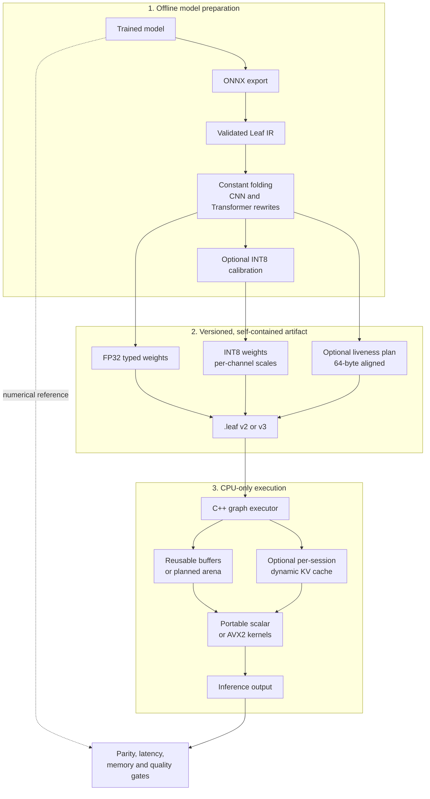
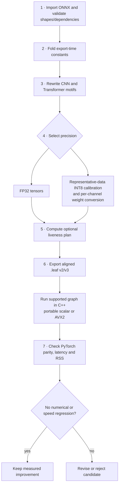

# Leaf

Leaf is a CPU inference engine and model optimizer. It takes an already trained
model, imports an ONNX graph, removes redundant work, and runs the supported
graph in a small C++ runtime. The development machine may use Python, PyTorch,
ONNX, and calibration data; the intended deployment machine only needs the
exported model and native runtime.

The project is actively developed. Its native path runs FP32 CNN graphs,
selected calibrated INT8 CNN/linear graphs, and individual FP32 Transformer
operators. ResNet-18, CIFAR-10, and
Qwen2.5-0.5B are validation workloads, not model-specific design targets.
Full decoder-only Transformer execution is still pending.

## 1. Why build Leaf?

Large inference frameworks can add installation size and Python overhead to
CPU deployments. Leaf's goal is to turn a trained network into a compact,
predictable CPU artifact while measuring every change against its numerical reference and prior
latency. It is an inference project, not a training framework.

The concrete targets are:

1. Import supported ONNX graphs through a shared IR and expand operator
   coverage across model families.
2. Remove constant work, fuse operators, and reuse activation memory.
3. Reduce weight and activation cost with calibrated INT8; evaluate
   weight-only formats after FP32 correctness and model-quality gates.
4. Move hot inference loops into C++, with a portable scalar build and
   architecture-specific acceleration where available.
5. Reproduce artifacts across representative CPU machines and measure latency,
   memory, and model quality without assuming a particular model or capacity.

The speed rule is evidence driven: a new implementation must preserve outputs
within a stated tolerance and beat its previous Leaf baseline under the same
shape and machine conditions before it is called a performance improvement.
PyTorch is an external comparison, not a substitute for this regression gate.

## 2. What runs today?

| Component | Current state | Boundary |
|---|---|---|
| ONNX importer and graph IR | Implemented | Shape metadata, graph validation, producer/consumer maps |
| Constant folding | Implemented | Small constant-only subgraphs; 16 MiB materialization guard |
| CNN fusion | Implemented | Conv+BatchNorm folding, then Conv+ReLU |
| Transformer rewrites | Graph passes implemented | MatMul+bias and Gemm+activation; Qwen-pattern RMSNorm, RoPE table, RepeatKV, Attention, SwiGLU MLP |
| Native Transformer operators | Partial FP32 execution | RMSNorm, two-output RoPE tables, RepeatKV, mask-aware scaled Attention, and fused SwiGLU MLP |
| Dynamic KV cache | Session API implemented | Caller-owned per-layer FP32 cache; append/reset, grouped-query decode without materializing repeated K/V, and named-input graph execution |
| INT8 calibration and conversion | Implemented in Python | Per-tensor activation scales, per-output-channel Conv/Gemm/MatMul weight scales; NumPy execution simulates quantized values |
| Memory planning | JSON and native arena implemented | Version 3 embeds 64-byte-aligned offsets; C++ executes directly in the arena; default v2 buffer-pool path remains available |
| `.leaf` artifact and native executor | FP32 and selected INT8 paths implemented | Version 2 stores aligned typed weights and per-channel scales; version 3 also embeds an arena plan |
| Native kernels | FP32 and INT8 kernels implemented | Scalar build is available; AVX2/FMA build is optional and faster on the measured host |
| Full-model Qwen in Leaf | Pending | Qwen benchmark below provides a PyTorch CPU reference |
| Structured pruning and trained-model quality gates | Pending | No CIFAR accuracy or Qwen perplexity claim yet |

The operator and cache paths above pass standalone and two-step decode tests.
The complete decoder graph, large-model export, and end-to-end Leaf parity are
not yet implemented. Pattern recognition and operator checks are not a claim
of full Qwen inference or speedup.

General-purpose describes the architecture and intended direction, not a
claim that every ONNX model runs today. The native executor accepts named
inputs and outputs through its C++ API and the inference CLI; the graph
latency benchmark CLI still targets one input and output. Conv is limited to
one NCHW image with one group.
Unsupported operators and layouts fail explicitly. Operator coverage,
dynamic shapes, batching, and CPU-specific dispatch are expanded against
independent model tests rather than hard-coded for the named benchmarks.

## 3. Architecture and artifact boundary



Version 2 `.leaf` carries FP32/INT8 initializers and calibrated scales.
Version 3 additionally embeds the exported liveness plan and executes its
offsets directly in an aligned C++ arena. The `leaf-memory-plan-v1` JSON
remains available for inspection. Version 2 remains the default artifact
until the planned path shows a repeatable whole-model advantage.

## 4. Optimization pipeline, step by step



### Step 1: Import and validate

Export an eval-mode PyTorch model to ONNX, then load it with
`Graph.from_onnx`. Leaf stores nodes, initializers, shapes, dtypes, inputs,
outputs, and metadata. Validation checks missing values and cycles before a
rewrite can alter the graph. The ResNet test uses a full 20-Conv, eight
residual-Add, one-Gemm architecture at 32×32 for fast offline verification.

### Step 2: Fold constants

The optimizer evaluates constant-only arithmetic and shape subgraphs once at
export time. It can fold `Constant`, `Identity`, arithmetic, `MatMul`, `Gemm`,
`Reshape`, `Transpose`, `Concat`, `Squeeze`, `Unsqueeze`, `Gather`, `Shape`, and
`Cast`. Outputs larger than 16 MiB remain as nodes, preventing accidental
artifact inflation. Unused initializers are removed.

### Step 3: Rewrite the graph

For CNNs, BatchNorm's fixed eval statistics become Conv weights and bias;
then a single-consumer ReLU can become the Conv epilogue. For transformer
feed-forward blocks, `MatMul + constant bias` becomes `Gemm`, followed by
optional GELU, SiLU, or ReLU epilogue fusion. Separate Qwen ONNX pattern
passes recognize RMSNorm, RoPE table construction, grouped KV repetition,
attention, and SwiGLU MLP. The Attention rewrite records whether a nonzero
mask means valid or masked-out, preserving the source graph's mask polarity.
RepeatKV fusion records a repeat count only when static head metadata proves
it; otherwise it leaves the source graph intact.
Each pass preserves graph order and checks
consumer relationships so a shared intermediate is not removed incorrectly.

### Step 4: Calibrate and simulate INT8

Representative input samples collect min/max activation ranges. Leaf uses
symmetric INT8 with one scale per activation tensor and one scale per output
channel for Conv/Gemm/MatMul weights. The NumPy reference executor then
simulates quantize/dequantize at those nodes and compares the output with
PyTorch. Version 2 `.leaf` stores INT8 initializer bytes and scales directly;
the native executor quantizes activations and dispatches Conv/Gemm/MatMul.
When a weight is shared by consumers that need different channel axes or by
an FP32 consumer, export retains separate correctly typed copies.
The real CIFAR subset below uses 32 images for calibration and 100 different
images for evaluation.

### Step 5: Plan memory

`plan_memory` computes first and last uses of each statically shaped tensor.
It assigns 64-byte-aligned offsets, reusing a block only after its prior
tensor dies. Unknown shapes are listed explicitly as unplanned. A graph
fingerprint lets an exported plan be checked against the graph it describes.
When embedded in a version 3 artifact, C++ validates allocation bounds and
overlapping live intervals, then writes planned outputs directly to the
64-byte-aligned arena. Tensors without known static shapes still use the
existing buffer pool. The default version 2 path continues to reuse retired
buffers without an arena.

### Step 6: Export and execute in C++

The exporter writes a versioned `.leaf` file with nodes, attributes, and
32-byte-aligned typed weights. Pass `memory_plan=plan` to `export_graph` to
embed the arena plan in version 3. `leaf_infer` loads either version and
executes the supported operators: Conv, BatchNorm, ReLU, Add, MaxPool,
GlobalAveragePool, Flatten, Gemm, MatMul, Identity, RMSNorm, RoPE_Table,
RepeatKV, Attention, SwiGLU MLP, Sigmoid, and elementwise Mul. Attention accepts FP32 Q/K/V with
contiguous `[batch, heads, tokens, head_dim]` layout and a broadcastable
four-dimensional mask; it produces `[batch, query_tokens, heads, head_dim]`.
The native RoPE node produces both cosine and sine tensors. The named-input
executor path supports multiple graph outputs, while `run_outputs_cached`
accepts a caller-owned cache map. A cached Attention node is opt-in through
its `cache_id` attribute; new K/V tokens are appended for each call, and
grouped-query heads access the cache without materialized RepeatKV copies.
The caller clears the map between sequences. These paths do not yet form a
complete decoder.
`leaf_graph_bench`
measures repeated full-graph inference. Native
scalar kernels are correctness baselines; AVX2/FMA GEMM, im2col Conv, packed
Conv weights, fused ReLU, and signed INT8 GEMM/Conv kernels are benchmarked
separately. Native INT8 graph execution is available for supported ops, but
remains opt-in because the measured small whole graphs below are slower.

### Step 7: Keep or reject a speed change

Run numerical parity first, then warmed latency tests on the same machine,
shape, dtype, and thread count. A microkernel speedup is recorded as a
microkernel result; it is not assumed to speed up the complete model. The
project's native benchmark command fails if an optimized kernel loses to its
scalar Leaf baseline.

## 5. Reproduce the development checks

From the repository root on Windows, install the development dependencies and
run the complete currently automated gate:

```powershell
python -m pip install -r requirements-dev.txt
./scripts/verify_all.ps1
```

That command runs Python tests, builds and runs native correctness tests,
enforces the native kernel speed gate, writes the deterministic PyTorch/NumPy
baseline JSON, and verifies the FP32 C++ ResNet output against PyTorch. The
latest run passed the Python and native/C++ checks. The default
native build uses GCC with `-O3 -mavx2 -mfma` on compatible x86 CPUs. A
portable scalar build is available with:

```powershell
./scripts/build_native.ps1 -Portable -BuildDirectory build/portable
./build/portable/leaf_native_tests.exe
```

The portable build passed the native kernel and INT8 graph parity checks.
CMake is an alternative:

```powershell
cmake -S . -B build/cmake -DCMAKE_BUILD_TYPE=Release
cmake --build build/cmake --config Release
ctest --test-dir build/cmake -C Release --output-on-failure
```

CMake defaults to portable kernels; configure with
`-DLEAF_ENABLE_AVX2=ON` only for compatible CPUs.

The CMake route was also configured, built, and tested on Linux; all five
CTest targets passed.

Individual checks can be run with:

```powershell
python -m pytest -q
./scripts/build_native.ps1
./build/leaf_native_tests.exe
./build/leaf_kernel_bench.exe --enforce-speedup --output benchmark/results/native_latest.json
python -m benchmark.run_baselines
python tools/verify_cpp_runtime.py --leaf-infer ./build/leaf_infer.exe
python tools/verify_quantized_runtime.py --leaf-infer ./build/leaf_infer.exe --leaf-bench ./build/leaf_graph_bench.exe
python tools/verify_memory_plan_runtime.py --leaf-infer ./build/leaf_infer.exe --leaf-bench ./build/leaf_graph_bench.exe --enforce-no-slowdown
python tools/verify_transformer_runtime.py --leaf-infer ./build/leaf_infer.exe --leaf-bench ./build/leaf_graph_bench.exe --portable-infer ./build/portable/leaf_infer.exe --portable-bench ./build/portable/leaf_graph_bench.exe --enforce-no-slowdown
python tools/verify_swiglu_runtime.py --leaf-infer ./build/leaf_infer.exe --leaf-bench ./build/leaf_graph_bench.exe --enforce-no-slowdown
python tools/verify_attention_runtime.py --leaf-infer ./build/leaf_infer.exe --leaf-bench ./build/leaf_graph_bench.exe --portable-infer ./build/portable/leaf_infer.exe --portable-bench ./build/portable/leaf_graph_bench.exe --enforce-no-slowdown
python tools/verify_rope_repeatkv_runtime.py --leaf-infer ./build/leaf_infer.exe --leaf-bench ./build/leaf_graph_bench.exe
python tools/verify_kv_cache_runtime.py --session-exe ./build/leaf_kv_session.exe
```

The Python/NumPy executor is a numerical oracle. Its latency appears in the
results so Python overhead is visible, but it is not the deployment runtime.

## 6. Real CIFAR-10 benchmark setup

The test data is the University of Toronto CIFAR-10 test split served by its
[Hugging Face dataset mirror](https://huggingface.co/datasets/uoft-cs/cifar10/tree/main/plain_text).
The 23,940,850-byte Parquet file used for this run has SHA-256
`841389e6f2d64f28bf17310e430aebac20ec3ba611a3c5e231dc93c645ce84de`.
The first 132 original-order test images were prepared locally; the data files
are Git-ignored. Images 0–31 calibrate the small CNN optimizer graph, and
images 32–131 evaluate it. The full ResNet comparison uses the first 20
images. Download and prepare once:

```powershell
New-Item -ItemType Directory -Force benchmark/data | Out-Null
Invoke-WebRequest -Uri 'https://huggingface.co/datasets/uoft-cs/cifar10/resolve/main/plain_text/test-00000-of-00001.parquet' -OutFile benchmark/data/cifar10-test.parquet
python -m benchmarks.prepare_cifar10 --samples 132
```

The preparation command needs `pyarrow` and Pillow. Check the downloaded
file's hash if reproducing the exact rows. With the generated NPZ present,
the actual benchmarks run offline:

```powershell
python -m benchmarks.bench_cifar10 --calibration-samples 32 --evaluation-samples 100 --repeats 5 --threads 1
./scripts/build_native.ps1
python -m benchmarks.bench_cifar10_resnet18 --samples 20 --warmup 5 --runs 10 --threads 1
python -m benchmarks.bench_cifar10 --calibration-samples 32 --evaluation-samples 100 --repeats 5 --threads 1 --leaf-infer build/leaf_infer.exe --leaf-bench build/leaf_graph_bench.exe --native-evaluation-samples 20 --output benchmark/results/cifar10_native_int8.json
```

The small CNN graph is an untrained 3→8 Conv/BatchNorm/ReLU optimizer test at
16×16. The full ResNet-18 has deterministic random weights and runs at the
original 32×32 resolution. These runs establish numerical parity and latency
on real images; neither supplies a trained CIFAR classifier, so classification
accuracy is not reported. A trained model and separate held-out accuracy gate
are still needed before making an accuracy claim.

## 7. Qwen2.5-0.5B reference benchmark

The benchmark loads locally cached Qwen2.5-0.5B weights without network
access. The measured snapshot revision is
`060db6499f32faf8b98477b0a26969ef7d8b9987`. It runs in FP32 on one
CPU thread and uses the same fixed 64-token input for two next-token
computations:

1. Recompute all 64 tokens without a KV cache.
2. Prefill the first 63 tokens outside timing and decode the last token with
   the populated KV cache.

It checks maximum logit difference and next-token argmax agreement. Run the
following from the repository root in an environment containing the cached
model:

```bash
HF_HUB_OFFLINE=1 TRANSFORMERS_OFFLINE=1 python -m benchmarks.bench_qwen25_cached --model Qwen/Qwen2.5-0.5B --threads 1 --sequence-length 64 --warmup 1 --runs 5
```

`--model` also accepts a complete local snapshot directory. The benchmark
does not download weights implicitly. Its output is a PyTorch KV-cache
reference for future Leaf Transformer execution, not a Leaf full-model
measurement.

For another locally available causal decoder, supply its complete snapshot
with `--model`, a distinct `--benchmark-name`, and a separate `--output`.
This was used for the TinyLlama fallback measurement below; its numbers are
not interchangeable with Qwen's.

## 8. Measured results and what each number means

All results below are development-machine observations, not target-machine
promises. Windows runs used an Intel Core i7-14700HX, Windows 11, one CPU
thread, PyTorch 2.12.0+cpu, and GCC 15.2.0 for native code. The Qwen run used
WSL2 on the same host, Python 3.12.3, Transformers 4.57.6, and CPU execution.
Source JSON/CSV files are under
[`benchmark/results`](benchmark/results/README.md).

### 8.1 Real CIFAR-10, full ResNet-18, C++ versus PyTorch

Each image had five warmups and ten measured executions per runtime. The table
reports the median of 20 per-image medians. Both runtimes used the same FP32
seeded model, input images, 32×32 shape, and one thread; model load and process
startup are outside the timed section. A second independent run checked
repeatability.

| Run | PyTorch CPU p50 | Leaf C++ FP32 p50 | Leaf / PyTorch latency | Max absolute logit difference |
|---|---:|---:|---:|---:|
| First | 10.322 ms | 9.483 ms | 0.919× (Leaf 1.09× faster) | 4.62e-7 |
| Repeat | 10.609 ms | 9.701 ms | 0.914× (Leaf 1.09× faster) | 4.62e-7 |
| After Transformer-operator additions | 10.048 ms | 9.913 ms | 0.987× | 4.62e-7 |

The earlier ten-image pilot varied with host load, so the twenty-image runs
above are the comparison to use. The raw per-image p50 values are preserved in
[`cifar10_resnet18_cpp.json`](benchmark/results/cifar10_resnet18_cpp.json) and
[`cifar10_resnet18_cpp_repeat.json`](benchmark/results/cifar10_resnet18_cpp_repeat.json)
and [`cifar10_resnet18_cpp_transformer_update.json`](benchmark/results/cifar10_resnet18_cpp_transformer_update.json).
There is no accuracy figure because these are untrained weights.

To check that the executor changes did not slow the existing CNN path, the
pre-change commit (`eb6236d`) and current build were then measured in
baseline–candidate–candidate–baseline order on those same 20 images. Each
process used five warmups and ten timed runs per image. Median native p50
across the two runs was `10.1268 ms` for the prior executor and `9.8165 ms`
for the current one; maximum logit error was `4.62e-7` for both. This is a
same-session no-regression observation, not evidence that Transformer additions
accelerated ResNet. The measurements are preserved in
[`cifar10_resnet18_transformer_no_regression.json`](benchmark/results/cifar10_resnet18_transformer_no_regression.json).

### 8.2 Real CIFAR-10, calibration and optimizer micrograph

With 32 calibration images and 100 distinct evaluation images, FP32 Leaf/NumPy
versus PyTorch had maximum absolute output error `4.77e-7`; calibrated INT8
simulation versus PyTorch had error `0.02667`. Five repeated sweeps gave the
following median per-image latency:

| Runtime | Latency per image |
|---|---:|
| PyTorch CPU FP32 | 0.098 ms |
| Leaf NumPy FP32 reference | 1.504 ms |
| Leaf NumPy INT8 simulation | 1.469 ms |

These Python reference timings expose interpreter overhead; they are not native
INT8 deployment speed. The complete record is
[`cifar10_cpu.json`](benchmark/results/cifar10_cpu.json).

### 8.3 Real CIFAR-10, native INT8 versus native FP32

Using the same 32 calibration images and a disjoint 100-image evaluation
subset, the optional native harness measured the first 20 evaluation images.
Each graph was warmed five times and timed ten times per image, then the
median of per-image p50 latencies was reported:

| Runtime | Median per-image p50 | Maximum absolute output difference vs PyTorch FP32 |
|---|---:|---:|
| Leaf C++ FP32 | 0.014 ms | 4.77e-7 |
| Leaf C++ INT8 | 0.062 ms | 0.02277 |

This is an untrained optimizer micrograph, not a classification accuracy
result. Native INT8 is currently slower, so FP32 remains the preferred
latency path. The complete environment and methodology are recorded in
[`cifar10_native_int8.json`](benchmark/results/cifar10_native_int8.json).

### 8.4 Native INT8 graph integration check

On this development host, version 2 artifacts matched the quantized Python
reference within `4.77e-7` for the synthetic CNN and `1.72e-7` for the fused
transformer FFN. Relative RMSE against PyTorch FP32 was `1.000%` and `1.076%`.
With ten warmups and 50 timed runs, native p50 latency was:

| Workload | Leaf FP32 | Leaf INT8 | Decision |
|---|---:|---:|---|
| CNN, 1×3×16×16 | 0.014 ms | 0.062 ms | Keep FP32 as latency default |
| FFN, 1×8×16 | 0.004 ms | 0.011 ms | Keep FP32 as latency default |

An 8-output-channel AVX2 INT8 lane improved the synthetic CNN from an
earlier `0.081 ms` p50 to `0.062 ms`; a direct scalar convolution candidate
was measured and rejected at `0.116 ms`. These tiny graphs remain sensitive
to activation quantization, packing, and workspace allocation overhead.
They establish functional INT8 integration,
not a speedup or trained-model quality result. Reproduce with
`tools/verify_quantized_runtime.py`; larger shapes need a separate
same-session whole-model gate before promotion. The record includes peak
process RSS for each native run:
[`native_int8_graph.json`](benchmark/results/native_int8_graph.json).

### 8.5 Embedded memory plan, native ResNet-18

The version 3 artifact embeds 65 planned activation allocations for the same
seeded FP32 ResNet-18 at 1×3×32×32. The 64-byte-aligned arena is 146,432
bytes versus 492,480 bytes if each planned tensor had separate storage; no
tensors were unplanned. Both version 2 and version 3 logits matched PyTorch
within `8.64e-7` maximum absolute difference.

The native benchmark used five warmups and 20 timed executions per process,
then alternated process order twice (buffer pool, arena, arena, buffer pool).
The median of each path's four p50 values in the saved run was:

| Runtime | Median p50 | Median peak process RSS |
|---|---:|---:|
| Version 2 buffer pool | 9.5445 ms | 53,958,656 bytes |
| Version 3 planned arena | 9.4780 ms | 53,917,696 bytes |

The planned path passed the 2% no-slowdown gate in this run. Absolute latency
and the small relative difference varied across independent sessions, so
version 2 remains the default pending broader-machine confirmation. The small
RSS change should not be mistaken for the much larger
theoretical activation-allocation reduction: model weights and process
overhead dominate peak RSS. Reproduce with
`tools/verify_memory_plan_runtime.py`; the individual measurements are in
[`memory_plan_native.json`](benchmark/results/memory_plan_native.json).

### 8.6 Qwen cached weights, PyTorch CPU baseline

One warmup and five measured runs on the cached Qwen2.5-0.5B revision produced:

| Computation | p50 latency |
|---|---:|
| Full 64-token recomputation without cache | 763.827 ms |
| Last-token decode with a populated KV cache | 91.862 ms |

The cache made this PyTorch workload `8.315×` faster. Cached and uncached
logits differed by at most `1.67e-5`, and the selected token matched. Model
parameters occupied 1,976,131,072 FP32 bytes; process RSS after loading was
2,686,046,208 bytes. Prefix prefill is deliberately excluded from the cached
single-token timing. See [`qwen25_cached_cpu.json`](benchmark/results/qwen25_cached_cpu.json).

### 8.7 Native kernel speed gate

The latest GCC `-O3 -mavx2 -mfma` run compared each optimized kernel against
Leaf's scalar implementation, after warmup. The GEMM shape was 64×384×384.

| Kernel | Scalar Leaf baseline | Optimized Leaf | Speedup |
|---|---:|---:|---:|
| FP32 GEMM | 6.837 ms | 0.851 ms AVX2 | 8.038× |
| INT8 GEMM | 4.386 ms | 1.129 ms AVX2 | 3.884× |
| FP32 Conv, 16→32, 3×3 | 3.272 ms direct | 0.535 ms im2col+AVX2 | 6.110× |

These are kernel measurements, not full-model speedups. The command uses
`--enforce-speedup` so a slower optimized path fails. Raw values are in
[`native_latest.json`](benchmark/results/native_latest.json).

### 8.8 Prior full ResNet runtime measurements

The 224×224, single-image FP32 ResNet-18 measurements show the effect of
temporary-buffer reuse. Their input shape and WSL2 environment differ from
the CIFAR 32×32 comparison.

| Stage | Mean latency | Throughput | Context |
|---|---:|---:|---|
| AVX2 4×8 GEMM | 140.904 ms | 7.097 images/s | One warmup, ten runs |
| Reuse im2col scratch buffer | 106.812 ms | 9.362 images/s | Three warmups, twenty runs; 24.2% below prior stage |
| Executor buffer pool | 126.314 ms | 7.917 images/s | Separate measurement session |

The last row should be compared with its *same-session* unpatched measurement,
`129.620 → 126.314 ms` (2.55% reduction), not with the earlier 106.812 ms
run. Final-logit parity versus PyTorch remained `3.93e-6`. The data and
measurement notes are in [`wsl_dev_machine.csv`](benchmark/results/wsl_dev_machine.csv)
and [`docs/decisions.md`](docs/decisions.md).

### 8.9 Deterministic synthetic checks

The offline CI workloads cover a small CNN and transformer FFN with fixed
synthetic data. They prove pipeline behavior when real datasets or model
weights are unavailable; they do not stand in for CIFAR classification or
Qwen generation.

| Workload | FP32 max error | INT8 simulated max error | PyTorch CPU | NumPy FP32 | NumPy INT8 simulation |
|---|---:|---:|---:|---:|---:|
| CNN | 5.96e-7 | 0.02034 | 0.0400 ms | 0.6766 ms | 0.7625 ms |
| Transformer FFN | 2.71e-7 | 0.09518 | 0.0155 ms | 0.0220 ms | 0.0341 ms |

The detailed timings and memory plans are in
[`latest.json`](benchmark/results/latest.json). The transformer row is a small
feed-forward graph, not full Qwen. These Python reference timings varied
substantially with host load and are not native speed claims.

### 8.10 Native Transformer operator milestones

These are standalone FP32 operator graphs using deterministic synthetic
inputs, one CPU thread, ten warmups, and 100 timed iterations per native
process. They test reusable shapes and semantics, not a full decoder or
end-to-end Qwen latency. Version 2 uses the buffer pool; version 3 embeds a
liveness plan. PyTorch is the numerical reference and an external latency
comparison; the no-slowdown check uses the prior Leaf or portable Leaf path.

| Operator and input shape | PyTorch CPU p50 | Leaf portable v2 | Leaf AVX2 v2 | Leaf AVX2 v3 | Max absolute AVX2 error |
|---|---:|---:|---:|---:|---:|
| RMSNorm, 1×64×896 | 0.0480 ms | 0.138 ms | 0.103 ms | 0.091 ms | 7.15e-7 |
| Masked attention prefill, Q 1×8×32×64 / K 1×8×32×64 | 0.1192 ms | 0.552 ms | 0.466 ms | 0.433 ms | 5.96e-8 |
| Masked attention decode, Q 1×8×1×64 / K 1×8×64×64 | 0.0477 ms | 0.054 ms | 0.046 ms | 0.044 ms | 3.73e-8 |

The AVX2 attention dot-product path passed a 2% no-slowdown gate against the
portable build on both measured shapes. RMSNorm also passed its portable
comparison. Prefill attention remains substantially slower than PyTorch on
this host, so attention tiling, softmax, and cache behavior are active
profiling targets. Records: [`native_transformer_ops.json`](benchmark/results/native_transformer_ops.json)
and [`native_attention.json`](benchmark/results/native_attention.json).

For a 1×16×128 SwiGLU feed-forward graph with intermediate width 256, the
order-alternated version-2 Leaf comparison was 0.451 ms unfused versus
0.4085 ms fused (9.4% lower latency); the fused version-3 artifact measured
0.382 ms. Fused native output differed from PyTorch by at most `1.19e-7`.
PyTorch's p50 was 0.0514 ms on the same shape, so this is a Leaf-relative
improvement, not a PyTorch win. The raw samples and methodology are in
[`native_swiglu.json`](benchmark/results/native_swiglu.json).

### 8.11 RoPE, RepeatKV, and stateful KV-cache checks

The RoPE table uses `[1,32,1]` frequencies and `[1,1,64]` positions to
produce separate `[1,64,64]` cosine and sine outputs. A named-input,
two-output graph passed both version-2 and version-3 parity, including memory
plan validation. RepeatKV expanded `[1,2,64,64]` to `[1,14,64,64]` with
`n_rep=7` and matched PyTorch exactly.

| Native standalone graph | Version 2 p50 | Version 3 p50 | Maximum absolute error vs PyTorch |
|---|---:|---:|---:|
| RoPE cosine | 0.128 ms | 0.101 ms | 5.96e-8 |
| RoPE sine | 0.131 ms | 0.104 ms | 1.19e-7 |
| RepeatKV | 0.017 ms | 0.013 ms | 0 |

The caller-owned cache then appended a 63-token prefix and one decode token
for 14 query heads, two KV heads, and a 64-wide head. Its grouped-query
attention reads K/V directly from capacity-strided cache storage; no repeated
K/V tensor is materialized. Across 50 timed session runs, native p50 latency
was `2.9756 ms` prefill and `0.0921 ms` decode for version 2, versus
`2.9776 ms` and `0.0914 ms` for version 3. Maximum output differences from
PyTorch were `7.45e-8` and `6.71e-8` for prefill and decode. These are
single-attention-node measurements, not full-model decode. Records:
[`native_rope_repeatkv.json`](benchmark/results/native_rope_repeatkv.json) and
[`native_kv_cache.json`](benchmark/results/native_kv_cache.json).
The version-3 decode timing was not consistently faster in a repeat run, so
version 2 remains the default rather than treating this small difference as
an established speedup.

An alternating same-session run of the full FP32 ResNet-18 on ten real
CIFAR-10 images checked that these Transformer branches did not materially
regress the existing CNN path. The previous commit measured `9.931` and
`9.8385 ms` (median `9.8848 ms`); the updated build measured `10.117` and
`9.864 ms` (median `9.9905 ms`). The updated-to-baseline ratio was `1.0107`,
within the 2% no-slowdown gate. Maximum absolute error against PyTorch was
`4.62e-7` in both builds. This is a no-regression result, not a speedup:
[`cifar10_resnet18_kv_no_regression.json`](benchmark/results/cifar10_resnet18_kv_no_regression.json).

### 8.12 Complete cached decoder baseline and Leaf coverage boundary

The complete locally available TinyLlama-1.1B weights supplied an offline
fallback when a complete Qwen snapshot could not be located for this run.
On one Windows CPU thread, FP32 PyTorch measured `1,612.864 ms` for a
64-token full-context forward and `169.301 ms` for the last token with a
populated KV cache (`9.527×` faster). The two paths selected the same token;
their maximum logit difference was `1.43e-5`. This is a full *PyTorch*
model run, not a Leaf result. See
[`tinyllama_cached_cpu.json`](benchmark/results/tinyllama_cached_cpu.json).

Before attempting a multi-gigabyte Leaf export, a one-layer, reduced-width
graph using the same decoder architecture was exported through the current
PyTorch ONNX exporter and passed through Leaf's existing rewrites. Thirteen
operator types remain unsupported in the native executor: `Concat`, `Expand`,
`Gather`, `Neg`, `Pow`, `Reciprocal`, `ReduceMean`, `Reshape`, `Slice`,
`Softmax`, `Sqrt`, `Transpose`, and `Unsqueeze`. This bounded probe did not
load the full model's weights; it identifies a concrete graph-coverage
blocker rather than implying a Leaf full-model run succeeded. Its operator
counts are in
[`tinyllama_leaf_coverage.json`](benchmark/results/tinyllama_leaf_coverage.json).
An attempted `.leaf` export of that reduced graph stopped first at an
unsupported `int64` initializer; native execution would additionally require
the listed operators. The full trained model was therefore not falsely
presented as a Leaf run.
With any complete compatible local snapshot, reproduce the two stages using:

```powershell
python -m benchmarks.bench_qwen25_cached --model 'C:\path\to\snapshot' --benchmark-name local-decoder-pytorch-cpu-kv-cache --threads 1 --sequence-length 64 --warmup 1 --runs 3 --output benchmark/results/local_decoder_cached_cpu.json
python -X utf8 tools/probe_decoder_coverage.py --config 'C:\path\to\snapshot' --output benchmark/results/local_decoder_leaf_coverage.json
```

## 9. Memory-plan format and runtime reuse

`optimize_graph(graph, calibration_samples, memory_plan_path=...)` exports
`leaf-memory-plan-v1`. A plan records the graph fingerprint, 64-byte
alignment, the arena size versus an allocate-everything size, exact tensor
offsets and live intervals, and any dynamic tensors that could not be planned.

```json
{
  "format": "leaf-memory-plan-v1",
  "graph_fingerprint": "...",
  "alignment": 64,
  "arena_size": 128,
  "naive_size": 192,
  "bytes_saved": 64,
  "allocations": [
    {"tensor": "a", "offset": 0, "size": 64, "first_node": 0, "last_node": 1},
    {"tensor": "c", "offset": 0, "size": 64, "first_node": 2, "last_node": 3}
  ],
  "unplanned_tensors": []
}
```

Two values may share an offset only when their live intervals do not overlap.
The C++ executor applies these offsets when a plan is embedded in a version 3
`.leaf` artifact. It verifies bounds and live-range overlap on load and checks
each runtime tensor fits its planned block. A thread-local aligned arena is
reused across inferences. Version 2 retains its grow-only im2col scratch
buffer and best-fit pool of retired activation vectors. Both paths are measured
with `leaf_graph_bench`, which reports latency and peak process RSS.

## 10. Repository map

```text
Leaf/
├── tools/graph_opt/       ONNX IR, folding, fusion, calibration, planner, exporter
├── engine/                C++ graph parser, executor, FP32 and INT8 kernels
├── benchmark/             Synthetic workloads, baseline harness, native gate
│   └── results/           Committed per-run JSON and prior runtime measurements
├── benchmarks/            Real CIFAR and cached Qwen reproduction scripts
├── tests/                 Graph, quantization, integration, and native tests
├── scripts/               Native build and complete verification command
├── docs/decisions.md      Performance decisions and same-session comparisons
└── README.md              Current architecture, methods, measurements, roadmap
```

`benchmark/data/`, exported ONNX files, generated `.leaf` artifacts, and model
weights are intentionally Git-ignored. The repository keeps scripts and
small result records so the large datasets and cached weights stay local.

## 11. Development loop and remaining goals

The next work is iterative implementation, not a final-report phase. For each
candidate: profile the full model, change one bottleneck, verify outputs,
measure same-session latency and RSS, and keep the change only when the result
supports it. The current CIFAR full-model benchmark and native speed gate are
the reference points for the next C++ optimization.

- [x] Load and validate ResNet-18 ONNX as Leaf IR.
- [x] Export and run a self-contained FP32 `.leaf` ResNet artifact in C++.
- [x] Match full ResNet outputs against PyTorch.
- [x] Add constant folding and CNN/Transformer graph rewrites.
- [x] Calibrate symmetric INT8 and convert Conv/Gemm/MatMul weights per output channel.
- [x] Export a versioned, aligned liveness memory plan.
- [x] Add AVX2 FP32/INT8 kernel tests and a no-slowdown native speed gate.
- [x] Measure real CIFAR images against PyTorch and Leaf C++ FP32.
- [x] Measure locally cached Qwen2.5-0.5B PyTorch CPU decode with and without KV cache.
- [x] Store INT8 tensors and scales in `.leaf`, then dispatch supported quantized graphs in C++.
- [x] Provide a portable scalar build alongside the AVX2/FMA build.
- [x] Apply the exported memory plan directly in the C++ executor and measure peak RSS.
- [x] Add native FP32 RMSNorm, mask-aware Attention, and fused SwiGLU FFN with standalone PyTorch parity and latency gates.
- [x] Add native RoPE, RepeatKV, named multi-output graph execution, and caller-owned dynamic GQA KV-cache with prefill/decode parity.
- [ ] Add remaining decoder operators and large-model export, then run end-to-end Leaf parity and latency against a complete local causal decoder snapshot.
- [ ] Add trained CIFAR-10 accuracy and Qwen perplexity/next-token quality gates.
- [ ] Evaluate structured pruning and weight-only INT8/INT4 only after those quality gates exist.
- [ ] Profile packing, tiling, threading, and cache behavior; accept only measured whole-model improvements.
- [ ] Reproduce representative final artifacts and benchmarks on additional CPU machines.

Training, GPU deployment, and unstructured sparsity are outside Leaf's scope.
