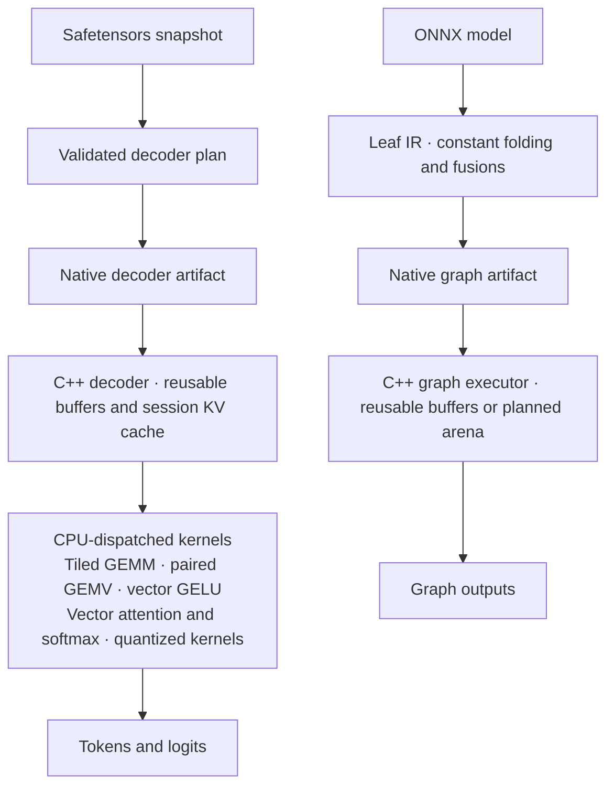
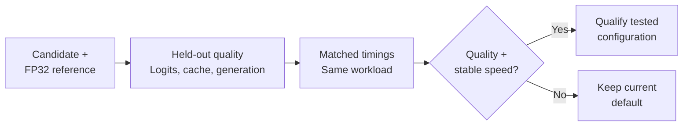

<p align="center">
  
</p>

# Leaf

**Native CPU inference for smaller models.**

Leaf helps people run trained models locally on the CPUs they already own.
It combines a C++ inference runtime, compact weight formats, reusable memory,
and a lightweight command-line interface. The goal is practical latency and
memory use without requiring a GPU.

[Get started](#quick-start) · [How it works](#how-it-works) ·
[Benchmarks](#measured-performance) · [Documentation](docs/README.md) ·
[Contributing](#development-and-contributing)

## Why Leaf?

- **Lightweight execution.** Native prefill, cached decode and greedy generation;
  PyTorch and Transformers stay outside the deployed generation loop.
- **Measured CPU optimizations.** Tiled linear operations, SIMD kernels and
  reusable buffers, with portable fallbacks and explicit correctness checks.
- **Smaller artifacts when quality permits.** FP32, INT8/INT4 and calibrated
  W8A8 paths. Automatic lower precision requires a matching quality and speed
  profile; otherwise Leaf keeps FP32.
- **Local, reusable preparation.** Import supported snapshots once, cache native
  artifacts, and run offline with your own prompts and datasets.

Leaf is an early-stage inference engine. It has a qualified GPT-2 FP32 prefill
win over PyTorch on the tested Windows workload, but it does not outperform
PyTorch for every model. Current measurements and limitations are below.

## Quick start

Requires **Python 3.10+**. Installing from source also requires a **C++17 compiler**.
A platform wheel with a bundled decoder does not require a compiler for inference.

```sh
git clone https://github.com/Nbit-51/Leaf.git
cd Leaf
python -m pip install .
leaf --help
leaf run openai-community/gpt2 --prompt "Local inference is" --max-tokens 32
```

The first Hub run downloads and prepares the model; subsequent runs reuse the
cache. To use a complete local snapshot containing configuration, safetensors
weights and tokenizer files:

```sh
leaf run ./models/decoder --offline --prompt "Explain CPU inference." --max-tokens 32
```

Chat templates are applied when supplied by the tokenizer configuration; use
`--raw` for an unformatted prompt. Generation is currently greedy.

To evaluate precision candidates, install the validation tools and use separate
calibration and held-out text:

```sh
python -m pip install ".[validation]"
leaf optimize ./models/decoder --offline --dataset ./data/test.jsonl --calibration-dataset ./data/train.jsonl --text-column text --threads 1
```

`--bits auto` is the default for generation. It only selects lower precision
when the validation profile matches the artifact, runtime, device settings and
workload. Explicit `--bits 8` or `--bits 4` overrides are experimental.

See the [usage reference](docs/project-reference.md#2-install-and-run-with-one-command)
for aliases, cache controls, metrics, CPU pinning and custom decoder plans.
On Windows, use ASCII cache/artifact paths; arbitrary Unicode paths are a known
native-loader limitation.

## What is implemented?

| Area | Current capabilities |
|---|---|
| Decoder execution | Full native prefill, single-token decode, chunked evaluation and greedy generation |
| CPU kernels | Windows FP32 packed GEMM with row reuse, paired GEMV, vector GELU, vector attention/softmax; AVX2/FMA checks and scalar fallback; optional VNNI quantized execution |
| Memory | Memory-mapped weights, reusable activation buffers, per-session KV caches with dynamic growth and reset/reuse |
| Precision | FP32, weight-only INT8/INT4, dynamic W8A8, smoothing and optional FP32 protection |
| Graph execution | ONNX-to-Leaf IR, constant folding, supported CNN/Transformer fusions, native operators and an optional liveness-planned arena |
| Validation | Held-out quality, reference logits, generation/cache parity, matched latency workloads and retained timing samples |

Complete trained evaluations cover **GPT-2, TinyLlama-1.1B and ResNet-20**.
Reduced-model tests also exercise multiple decoder architecture families.

Import adapters cover supported configurations from Llama/Qwen2, GPT-2,
GPT-NeoX, OPT and dense Mistral-style blocks. Compatibility depends on operators
and tensor layouts—not just a model-family name. Scaled RoPE, sliding-window
attention, Q/K normalization, MoE, encoder-decoder models and general sampling
are not implemented. Unsupported configurations fail explicitly.

[Detailed compatibility and operator boundaries](docs/project-reference.md#3-coverage-and-explicit-boundaries)

## How it works

Models enter through either a decoder snapshot or an ONNX graph. Preparation
validates their semantics and produces a versioned native artifact.


```mermaid
flowchart TB
    S["Safetensors snapshot"] --> P["Validated decoder plan"]
    O["ONNX model"] --> G["Leaf IR · constant folding and fusions"]
    P --> D["Native decoder artifact"]
    G --> A["Native graph artifact"]
    D --> R["C++ decoder · reusable buffers and session KV cache"]
    A --> E["C++ graph executor · reusable buffers or planned arena"]
    R --> K["CPU-dispatched kernels<br/>Tiled GEMM · paired GEMV · vector GELU<br/>Vector attention and softmax · quantized kernels"]
    K --> T["Tokens and logits"]
    E --> U["Graph outputs"]
```

The validated FP32 kernel stack is enabled by default on supported Windows
CPUs. Other operating systems retain their existing defaults pending performance
qualification. The CLI uses a lightweight Python/tokenizer launcher; the native
decoder owns the generation loop. Decoder and graph artifacts are distinct formats.

Quantization and new kernels are evaluated against the work they actually replace:


```mermaid
%%{init: {"flowchart": {"nodeSpacing": 24, "rankSpacing": 24}}}%%
flowchart LR
    C["Candidate +<br/>FP32 reference"] --> Q["Held-out quality<br/>Logits, cache, generation"]
    Q --> B["Matched timings<br/>Same workload"]
    B --> V{"Quality +<br/>stable speed?"}
    V -- "Yes" --> I["Qualify tested<br/>configuration"]
    V -- "No" --> H["Keep current<br/>default"]
```

## Measured performance

Latest installed-runtime measurements on one Windows host, one pinned P-core,
batch one, **63-token prefill + one cached decode token**, with last-token logits.
These are warmed native-forward timings, not model loading or complete-command
latency. The runtime and source hashes are recorded in the linked reports.

| Model / runtime | Prefill | Decode | Result |
|---|---:|---:|---|
| GPT-2 · Leaf FP32 | **144.31 ms** | 28.11 ms | Stable; **4.85% lower prefill time** than SDPA |
| GPT-2 · PyTorch SDPA FP32 | 151.66 ms | 28.57 ms | Stable reference |
| TinyLlama 1.1B · Leaf FP32 | 1,944.31 ms | 225.55 ms | Stable; slower than PyTorch eager |
| TinyLlama 1.1B · Leaf W8A8 | 1,381.91 ms | 92.71 ms | Faster medians, **stability failed** |
| TinyLlama 1.1B · PyTorch eager FP32 | 1,800.69 ms | 213.21 ms | Stable reference |
| TinyLlama 1.1B · PyTorch SDPA FP32 | 1,881.60 ms | 243.58 ms | Pooled decode stability failed |

GPT-2 decode passes non-regression; its 1.62% reduction falls below the separate
2% improvement threshold. GPT-2 uses 101 measured samples per pass; TinyLlama
uses 31. Both use ten warmups and forward/reverse process order. Failures and
all samples remain available, including earlier unsuccessful experiments.

TinyLlama W8A8 is a quality tradeoff: **95.08% next-token agreement**, **1.24%
higher held-out perplexity**, and non-identical generated text. Its artifact is
**1.10 GB versus 4.40 GB** for FP32. This is an artifact-size reduction from
quantization, not a measured PyTorch process-memory comparison or model pruning.

- [GPT-2 release, quality and performance evidence](docs/windows-attention-softmax.md)
- [TinyLlama comparison, quality limits and current hot paths](docs/windows-tinyllama-current.md)
- [Complete benchmark history and retained failures](docs/project-reference.md#7-current-trained-model-and-dataset-results)

## Scope and next steps

Leaf targets supported smaller trained models on local CPUs, particularly for
people without GPU access. Windows is the current performance-validation focus;
portable correctness CI runs on Windows, Linux and macOS. CI success does not
establish equivalent performance across those systems.

The next measured target is **vector SiLU/gating**: it accounts for about 25%
of TinyLlama FP32 prefill and 39% of W8A8 prefill. Quantized-path vector attention
is a separate follow-up. Neither is claimed as an implemented improvement yet.

Further work includes broader quality datasets, complete-command latency,
independent CPU/Linux evaluation, and compatible small Qwen, Mistral, Granite
and Gemma-family workloads. Embedding models require their own operator and
task-quality validation. Structured pruning remains future work; training and
GPU deployment are outside the current scope.

## Development and contributing

Bug reports, reproducible workloads, compatibility improvements and measured
kernel changes are welcome through [issues](https://github.com/Nbit-51/Leaf/issues)
and pull requests. Include the model/configuration, OS, CPU, runtime revision,
quality checks and retained samples with performance claims.

```sh
python -m pip install -r requirements-dev.txt
python -m pytest -q --basetemp build/pytest
cmake -S . -B build/cmake -DCMAKE_BUILD_TYPE=Release
cmake --build build/cmake --config Release
ctest --test-dir build/cmake -C Release --output-on-failure
```

Windows also provides `./scripts/verify_all.ps1` for the repository gate.
Trained-model runs require local model/data assets and are separate from the
automated suite. The accepted kernel release passed 831 Python tests and native
checks; the latest benchmark/profiling follow-up passed 251 focused tests.

[Build and validation guide](docs/project-reference.md#6-reproduce-validation-and-benchmarks) ·
[Architecture and artifact reference](docs/project-reference.md#4-architecture) ·
[Documentation index](docs/README.md)

## License

[Apache License 2.0](LICENSE).
