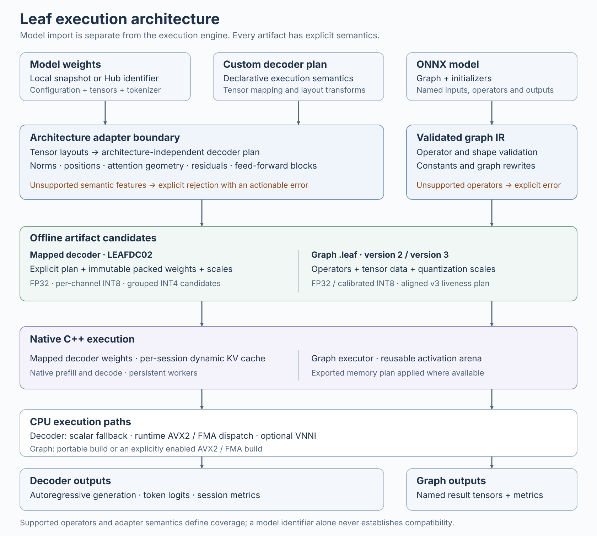
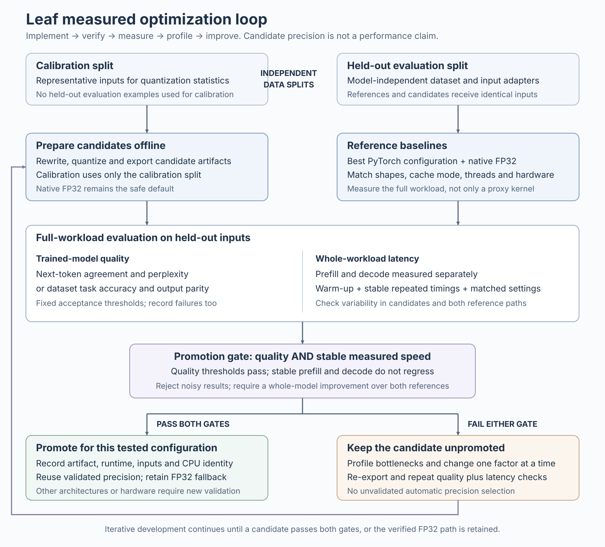

# Leaf

Leaf is a CPU inference framework and measured model optimizer. Its purpose is
to make already trained models practical on local devices through native
execution, graph simplification, compact weight formats, and reusable memory.
Models and datasets are validation workloads, not identities embedded in the
execution engine.

Two preparation routes share that purpose:

- ONNX graphs become validated Leaf IR, optimized graph artifacts, and native
  CNN/linear/Transformer-operator execution.
- Safetensors model snapshots become declarative decoder plans and
  memory-mapped native autoregressive execution.

Leaf now runs complete trained TinyLlama-1.1B and GPT-2 decoders, and a trained
ResNet-20 across all 10,000 CIFAR-10 test images. This establishes more than a
single-model prototype, but does **not** mean every LLM or architecture is
supported today. Compatibility is determined by operator semantics and tensor
layouts; unsupported features fail explicitly.

The trained-model checks establish FP32 parity and quantized task-quality
boundaries. Fresh matched Windows measurements qualify smoothed W8A8 for the
tested TinyLlama runtime; GPT-2 fails prefill promotion on Windows and Linux.
These decisions belong to their exact recorded workloads and binaries.
The earlier TinyLlama speed qualification is **superseded**: its
PyTorch prefill projected logits for every prefix token, while Leaf projected
only the last token. Those preserved timings cannot authorize current automatic
selection. Both runtimes now require matched last-token-only logits and KV
cache semantics before speed qualification. The
[result records](#7-current-trained-model-and-dataset-results) include successes,
failures, memory, and baseline comparisons. All previous benchmark tables remain
in the [historical measurements](#9-historical-benchmarks-preserved).

## Contents

1. [Purpose and performance rules](#1-purpose-and-performance-rules)
2. [Install and run with one command](#2-install-and-run-with-one-command)
3. [Coverage and explicit boundaries](#3-coverage-and-explicit-boundaries)
4. [Architecture](#4-architecture)
5. [Implementation pipeline, step by step](#5-implementation-pipeline-step-by-step)
6. [Reproduce validation and benchmarks](#6-reproduce-validation-and-benchmarks)
7. [Current trained-model and dataset results](#7-current-trained-model-and-dataset-results)
8. [Package and portability checks](#8-package-and-portability-checks)
9. [Historical benchmarks, preserved](#9-historical-benchmarks-preserved)
10. [Artifact formats and trust boundary](#10-artifact-formats-and-trust-boundary)
11. [Memory-plan format and runtime reuse](#11-memory-plan-format-and-runtime-reuse)
12. [Repository map](#12-repository-map)
13. [Implemented work and next goals](#13-implemented-work-and-next-goals)

## 1. Purpose and performance rules

Leaf is an inference project, not a training framework. The goal is a
general-purpose local CPU framework: model import and preprocessing adapters
describe the inputs; reusable native operators execute them; measurements decide
which optimizations are worth keeping.

The engineering goals are:

1. Expand supported model architectures without model-name branches in the
   native execution loop.
2. Remove constant work, fuse compatible operators, and reuse activation
   storage.
3. Reduce weight bandwidth and memory with quantization only when trained-model
   quality remains within a stated acceptance gate.
4. Execute prefill, decode, attention, norms, and feed-forward computation in
   C++, with scalar portability and optional CPU-specific acceleration.
5. Offer a simple local command while keeping preparation and validation
   reproducible.
6. Qualify performance on additional CPUs, rather than assuming one host proves
   portability or speed everywhere.

A smaller artifact or faster kernel is not automatically a faster model.
Candidate results must distinguish numerical correctness, task quality,
steady-state latency, startup/first-token latency, and memory.

For automatic decoder precision selection, a candidate must pass the quality
gate, have stable repeated timings, decode faster than native FP32 and at least
2% faster than the fastest measured PyTorch implementation, and avoid a prefill
regression greater than 2% against either reference. The fastest PyTorch
implementation is selected independently for each phase. These are local,
tested-configuration gates—not a universal speed guarantee.
Both references must use batch-one prefill over the same prefix, one-token
decode with the resulting KV cache, and last-token-only output logits. Missing
or mismatched workload metadata invalidates automatic selection; a decode-only
gain cannot compensate for an unfair or slower prefill comparison.

## 2. Install and run with one command

### 2.1 Install from this repository

Python 3.10 or newer is required for the lightweight CLI. From a checkout:

~~~powershell
python -m pip install .
leaf --help
~~~

Building from source requires a C++17 compiler. A platform wheel contains a
native decoder binary, so an installed wheel does not require a compiler for
generation. A source checkout can also build and cache the decoder on first
use; an already built executable can be supplied through `LEAF_DECODER_BIN`.

The generation dependencies are NumPy, the Rust-backed `tokenizers` package,
Hugging Face Hub, and Jinja2. PyTorch and Transformers are used for preparation
validation and reference measurements, not the native generation loop.
Install the optional validation dependencies when optimizing:

~~~powershell
python -m pip install ".[validation]"
~~~

For all repository tests and CNN/ONNX benchmarks:

~~~powershell
python -m pip install -r requirements-dev.txt
~~~

### 2.2 Run a model

A complete local snapshot needs `config.json`, safetensors weights, and
`tokenizer.json`:

~~~powershell
leaf run C:\models\decoder --offline --prompt "Explain why careful measurement matters." --max-tokens 32
~~~

A supported Hugging Face model ID can be used directly:

~~~powershell
leaf run openai-community/gpt2 --prompt "Local inference is" --max-tokens 32
~~~

The first Hub run downloads the model and prepares a native artifact. Subsequent
runs reuse the cache. `--offline` prohibits Hub downloads; the local snapshot
or Hub cache must already contain the required files. Configuration support is
checked before fetching large weight shards.

Register a short name and reuse it:

~~~powershell
leaf alias local-decoder C:\models\decoder
leaf run local-decoder --offline --prompt "Give a short explanation of CPU inference."
~~~

Chat templates are applied when supplied by the tokenizer configuration.
Use `--raw` for an unformatted prompt. Generation is currently greedy; the C++
process owns the autoregressive loop and KV cache, while the launcher encodes
the prompt and renders streamed tokens.

For recognized older SentencePiece-style JSON backends with `legacy=false`,
the launcher applies a structure-based Metaspace migration to preserve prefix
space behavior around special tokens. This does not branch on a model name or
tokenizer class; unrelated and already modern backends are unchanged. Measured
TinyLlama/GPT-2 preflights reproduced the saved 29-token/13-token reference
prompts exactly. New tokenizer structures still require their own parity tests;
this is not a promise of universal Hugging Face tokenizer compatibility.

### 2.3 Validate before selecting quantization

Use separate calibration and held-out text splits:

~~~powershell
leaf optimize C:\models\decoder --offline --dataset C:\datasets\test.jsonl --calibration-dataset C:\datasets\train.jsonl --text-column text --threads 1 --warmup 5 --runs 11
leaf run C:\models\decoder --offline --prompt "Summarize the purpose of this project." --threads 1
~~~

`leaf optimize` measures FP32, weight-only INT8/INT4, and, with calibration data,
channel-smoothed W8A8. Optional experiments are `--protected-int8`,
`--grouped-int8`, and `--grouped-int8-smooth`. Protection keeps embeddings,
learned positional embeddings where present, and the output head in source
FP32; grouped INT8 uses 64-column groups. Grouped smoothing requires calibration.

`--bits auto` is the generation default. It uses a lower-precision artifact
only when a matching validation profile qualifies it. Missing, malformed,
unstable, stale, or mismatched profiles fall back to FP32. Explicit
`--bits 8` or `--bits 4` is an experimental user override, not evidence that the
requested precision passes quality or speed gates.

Profiles bind the artifact and native binary hashes, source/configuration and
export request, measured platform/CPU signature, thread count, and optional CPU
pin. CPU signatures are not unique hardware identities: do not copy a profile
to another machine and treat it as validation there. Revalidate on that device.
Nonempty experimental-kernel flags, or a persisted experimental native policy,
cannot authorize automatic lower precision. A rebuilt binary also needs its
own qualification; it does not inherit an older binary's speed profile.
Profiles also require the canonical `leaf-decoder-latency-workload-v1` tag with
`logits: last_token_only` and KV-cached decode. Legacy full-prefix PyTorch-logit
profiles fail closed even when their saved eligibility field is true and all
binary/artifact hashes still match.
Selection checks workload tags for both PyTorch implementations, native FP32,
and the candidate, then recomputes quality, stability, and speed gates from the
recorded measurements. Stored `true` flags are not authorization; conservative
stored rejections remain rejected. Reported phase medians must agree with their
retained samples within the narrow native JSON rounding tolerance.

`--cpu` optionally pins to a logical CPU. Use the same pin for optimization and
generation, or omit it in both. A pin from the published measurements is not a
portable recommendation for other machines.

### 2.4 Cache and platform controls

| Control | Purpose |
|---|---|
| `LEAF_CACHE_DIR` | Change the model/artifact/native cache root; default `~/.cache/leaf` |
| `LEAF_DECODER_BIN` | Use a supplied native executable instead of the bundled or cached build |
| `CXX` | Select GCC or Clang for a source-checkout build |
| `LEAF_DISABLE_VNNI` | A nonempty value disables VNNI; changed ISA policy invalidates automatic precision selection |
| `LEAF_EXPERIMENTAL_FLOAT_TILES` / `LEAF_EXPERIMENTAL_FLOAT_GEMV` | Nonempty research-only opt-ins; both are off by default and disable automatic lower-precision selection |
| `LEAF_DECODER_PROFILE` | Emit native phase diagnostics on stderr; profiling is excluded from acceptance timing runs |
| `--metrics path.json` | Record artifact, native timings, memory, generated IDs, CLI first-token and end-to-end time |
| `--plan path.json` | Supply a custom decoder plan with supported block semantics and tensor mappings |

On Windows, use ASCII cache/artifact paths for the current native decoder,
for example `$env:LEAF_CACHE_DIR = 'C:\leaf-cache'`. Its mapped-file path API
does not yet support arbitrary Unicode paths. This is a known implementation
limit, not a requirement of the framework's intended design.

## 3. Coverage and explicit boundaries

### 3.1 Model-independent native decoder

The native decoder consumes dimensions, tensor descriptors, and block semantics,
not a model identifier. Import adapters normalize different source layouts into
`leaf-decoder-plan-v1`. A custom plan can map another snapshot to those same
operators without adding a model-name branch.

| Semantic component | Implemented options |
|---|---|
| Normalization | RMSNorm and affine LayerNorm; configurable epsilon |
| Positions | Standard/partial RoPE, learned positional embeddings, or no positional transform |
| Attention | Causal dense attention, multi-head or grouped-query heads, persistent per-layer FP32 KV cache |
| Residual structure | Sequential or parallel attention/FFN residuals |
| Feed-forward blocks | Gated or ordinary FFN; SiLU, GELU, GELU-new, or ReLU |
| Weight layouts | Separate or fused QKV source tensors; declarative slice, reshape, and transpose transforms |
| Weights | FP32, symmetric per-output-channel INT8, grouped INT4, optional mixed FP32 protection |
| Execution | Native prefill, single-token decode, chunked cache evaluation, greedy generation, persistent worker threads |

Built-in adapter boundaries are:

| Adapter | Covered semantics | Important restriction |
|---|---|---|
| Llama / Qwen2 | RMSNorm, standard RoPE, gated FFN, MHA/GQA | Scaled RoPE and Q/K normalization rejected |
| Mistral | Compatible dense decoder blocks | Sliding-window configurations rejected |
| GPT-2 | LayerNorm, learned positions, fused QKV/Conv1D layouts, GELU-new | Nonstandard attention scaling/upcast variants rejected |
| GPT-NeoX | LayerNorm, partial RoPE, parallel or sequential residuals, fused per-head QKV | Unsupported positional/norm extensions require new operators |
| OPT | Pre-norm LayerNorm, learned position offset, ordinary FFN | Post-norm or unequal embedding/hidden projection variants rejected |
| Custom plan | Supported components above with explicit tensor mappings | A new mapping does not implement a missing operator |

Eight reduced-model cases across five architecture families test complete
forward passes, scalar/vector execution, two-thread FP32 execution, chunked KV
cache, generation, and precision candidates. The extra variants exercise an odd
GPT-2 head width, bias-free/tied GPT-NeoX, and bias-free OPT. Their weights are
random; trained model quality is checked separately.

Encoder-decoder models, mixture-of-experts routing, sliding-window attention,
scaled RoPE, Q/K normalization, arbitrary dynamic graph shapes, multiple EOS
terminators, and general sampling policies are not implemented. Existing
generation uses a single scalar EOS or no-stop sentinel. Source
`generation_config.json` termination settings must match the supported plan;
multiple, malformed, or mismatched EOS settings are rejected. Greedy generation
and `--max-tokens` are explicit Leaf CLI policies, not implementation of every
Hugging Face generation default. Unsupported semantics
must be added and independently validated before claiming those models work.

### 3.2 ONNX graph execution

| Component | Current state and boundary |
|---|---|
| Import and graph IR | Shapes, dtypes, named inputs/outputs, producer/consumer validation |
| Constant folding | Supported constant-only arithmetic/shape subgraphs; 16 MiB materialization guard |
| CNN rewrites | Conv+BatchNorm folding and single-consumer Conv+ReLU epilogue fusion |
| Transformer rewrites | MatMul+bias, Gemm+activation, and recognized RMSNorm/RoPE/RepeatKV/Attention/SwiGLU motifs |
| Native graph operators | Conv, BatchNorm, ReLU, Add, MaxPool, GlobalAveragePool, Flatten, Gemm, MatMul, Identity, RMSNorm, RoPE_Table, RepeatKV, Attention, SwiGLU MLP, Sigmoid, Mul |
| Quantization | Symmetric activation INT8 and per-output-channel Conv/Gemm/MatMul weight scales |
| Memory | v2 reusable buffers; optional v3 aligned liveness arena |
| Session cache | Caller-owned per-layer FP32 K/V append/reset and direct GQA cache access |
| CNN layout | Batch-one NCHW Conv with one group; broader batching/layouts remain future work |

Graph-pattern recognition is not the same as accepting every ONNX export.
The complete decoder route avoids assuming that a particular exporter emits
only the graph executor's current operator subset.

### 3.3 Datasets are adapters, not hard-coded identities

Text quality validation accepts local TXT/Markdown, JSON arrays, JSONL/NDJSON,
CSV, and Parquet, with a configurable text column. JSONL, CSV, and Parquet
iterate records/batches; plain-text token prefix reading is bounded. JSON arrays
are eager, so prefer JSONL for large corpora.

The native classification runner consumes prepared FP32 tensors, labels, and
reference outputs independently of a dataset name. CIFAR-10 is one benchmark
adapter providing the image decoding, normalization, and trained model.

This architecture permits additional datasets, but does not automatically
supply preprocessing or task metrics for every dataset. New tasks need their
own reproducible input adapter and appropriate held-out quality gate.

## 4. Architecture



[Open the full-size architecture diagram](docs/architecture.svg).

Offline preparation and deployed execution are separate. ONNX graph artifacts
and decoder artifacts have different formats and runtimes; neither is silently
treated as the other. The decoder uses runtime scalar/AVX2/FMA/optional VNNI
dispatch. The graph executor is built portable by default or with explicitly
enabled AVX2/FMA.

A graph can run directly through the native API/executable without Python.
The `leaf` generation command retains a lightweight Python/tokenizer launcher,
but no PyTorch or Transformers model is needed in its inference loop.

## 5. Implementation pipeline, step by step



[Open the full-size optimization-loop diagram](docs/optimization-loop.svg).

### Step 1: Import explicit semantics

For ONNX, `Graph.from_onnx` records nodes, initializers, shapes, types, inputs,
outputs, and metadata. Validation rejects missing producers and cycles before
rewrites modify a graph.

For decoders, an import adapter constructs `leaf-decoder-plan-v1` with dimensions,
norm/position/attention/residual/FFN choices and tensor mappings. GPT-style fused
QKV and Conv1D weights are reshaped/transposed at preparation time. Tied
embeddings/output weights can share payloads when their transforms and
precision match.

The motive is correctness across architectures: different layouts should not
change attention geometry or numerical semantics. An unsupported feature is an
error, not a configuration silently discarded.

### Step 2: Fold export-time constants

Constant-only arithmetic and shape work is evaluated once during ONNX
preparation. Supported folding includes `Constant`, `Identity`, arithmetic,
`MatMul`, `Gemm`, `Reshape`, `Transpose`, `Concat`, `Squeeze`, `Unsqueeze`,
`Gather`, `Shape`, and `Cast`. Outputs over 16 MiB stay as nodes; unused
initializers are removed.

The motive is to remove repeated work without inflating the artifact. This
folding pass belongs to the graph route; it is not a claim that all listed
operators can execute dynamically in the native graph runtime.

### Step 3: Fuse only proven graph relationships

Fixed eval BatchNorm statistics become Conv weights and bias. A ReLU can join
the Conv epilogue only when consumer relationships permit it. MatMul with
constant bias becomes Gemm, followed by optional GELU/SiLU/ReLU epilogue fusion.

Recognized Transformer graph motifs include RMSNorm, RoPE table construction,
RepeatKV, mask-aware Attention, and SwiGLU. Attention preserves mask polarity;
RepeatKV records its count only when static head metadata proves it. Shared
intermediates are not removed without checking their consumers.

The decoder plan describes equivalent block-level operations directly rather
than depending on one model family's ONNX naming patterns.

### Step 4: Establish FP32 whole-model correctness

Export native FP32 first. Compare full outputs with PyTorch, not only a norm or
linear operator. Decoder validation checks every held-out token's logits,
chunked versus full-context cache execution, and greedy generation. CNN
validation checks all classifier outputs and task predictions.

Scalar execution is a numerical reference for accelerated native kernels.
Reduced random models cover combinations of architecture semantics; trained
weights and real datasets supply the quality gates.

### Step 5: Prepare precision candidates using independent calibration

For graph INT8, representative inputs collect symmetric activation ranges;
Conv/Gemm/MatMul weights use per-output-channel scales. Export stores signed
INT8 bytes and their scales, and native execution quantizes activations.

For decoder candidates:

- W8A32 uses per-output-channel INT8 weights with floating activations.
- W4A32 packs signed INT4 weights in groups (default 64 columns) with floating
  activations.
- W8A8 dynamically quantizes linear inputs; independent channel calibration can
  smooth difficult activation channels.
- Protected INT8 leaves specified embeddings/output tensors in source FP32.
- Grouped INT8 is an additional candidate, not an assumed improvement.

For channel smoothing, preparation uses activation maxima `a_j` and weight
column maxima `w_j` to choose `s_j = a_j^alpha / w_j^(1-alpha)` (default
`alpha=0.5`, with finite/clipped safeguards). It stores scaled weights `W·s` and
the input factor `1/s`, preserving the algebraic FP32 linear transformation
before quantization. This follows the channel-rescaling principle of
[SmoothQuant](https://github.com/mit-han-lab/smoothquant).

The calibration artifact records source weight/configuration and dataset hashes.
Evaluation uses a different split. Calibration is preparation work; the
deployment decoder reads packed weights/scales without a resident PyTorch model.

### Step 6: Export aligned artifacts and reuse memory

Graph v2 stores typed FP32/INT8 payloads; optional graph v3 also embeds the
`leaf-memory-plan-v1` liveness offsets. The planner reuses an allocation only
after its previous tensor dies. C++ validates bounds and live-range overlap,
then writes directly into the aligned arena. Unknown shapes remain explicit
and use reusable fallback storage.

Decoder `LEAFDC02` stores block semantics, immutable mapped weights, quantization
scales, and optional input rescaling. Its session owns reusable workspaces and
a per-layer growing FP32 KV cache within the configured context capacity.
It does not apply the ONNX graph's v3 liveness plan.

Exported-cache provenance seals source/configuration, the plan, precision
policy, protected tensors, calibration, and the resulting artifact hash.
Changing any of these requires preparing a new candidate; a timing-only phase
cannot silently reuse an unsealed or mismatched export request.

### Step 7: Execute prefill and decode natively

The C++ decoder executes embeddings, positions, norms, projections, attention,
residuals, FFN, output projection, and greedy token selection. GQA reads the
session's KV storage directly without materializing repeated K/V tensors.

Hot matrix paths include portable scalar, runtime-dispatched AVX2/FMA, and
optional AVX-VNNI W8A8 prefill on supported compiler/CPU combinations. VNNI uses
byte-packed unsigned activations, cached signed-weight sums, and zero-point
correction. The tested AVX2 fallback remains available; single-token decode
uses its existing kernel. Persistent workers avoid creating threads per op.

Packing and weight-sum preprocessing add startup cost. Warmed prefill/decode
tables exclude constructor/export/tokenization time, so CLI first-token and
end-to-end observations are recorded separately.

### Step 8: Gate quality and stable whole-model speed

The decoder's fixed quality thresholds are:

| Weight precision | Minimum scored next-token agreement | Maximum perplexity / PyTorch perplexity |
|---|---:|---:|
| FP32 | 99.9% | 1.001 |
| INT8 | 95.0% | 1.020 |
| INT4 | 90.0% | 1.050 |

Agreement counts the same causal target positions used for perplexity; the
last input position of each independent block is not scored. Passing subset
perplexity is not a claim of whole-corpus quality. FP32 also requires logit
allclose and exact reference greedy generation. Quantized generation agreement
is reported separately and is not assumed from a passing aggregate quality gate.

A timing phase requires at least five finite positive samples. Linear
percentiles must satisfy `p90/p10 <= 1.25` in both phases for the candidate and
native FP32, and for the fastest PyTorch reference in each relevant phase.
Outliers are retained; unstable runs cannot enable automatic selection.
Reported p50 values are checked against the raw-sample median, allowing only
the native serializer's six-significant-digit rounding tolerance. Invalid or
inconsistent medians fail the gate instead of becoming a faster reference.

Latency uses the same generation work on both sides: prefill all prefix tokens
with a KV cache and project logits only for the last token, then decode one new
token using that cache. PyTorch must explicitly support `logits_to_keep=1`,
return `[1, 1, vocabulary]` logits, and supply a KV cache. The harness rejects
unsupported or mismatched behavior rather than timing a different workload.
Full held-out quality still evaluates logits for all scored positions; that
quality workload is intentionally separate from latency.

Classification uses a separate task gate: trained accuracy may drop by at most
0.5 percentage points, and FP32 outputs must pass the stated logit tolerance.
Full-dataset timing stability compares independent whole-pass medians, rather
than treating different images' intrinsic costs as timing noise.

Only a candidate satisfying its quality, stability, and speed gates is
promoted. A fast but inaccurate GPT-2 variant and a compact but slow CNN INT8
artifact are useful findings, not successful optimizations.

### Step 9: Iterate on bottlenecks

Profile a complete workload, change one factor, check parity, and measure again.
Preserve failed candidates and raw timings. Tiling, packing, cache behavior,
threading, and precision protection are experiments until their whole-model
evidence qualifies them. There is no final-report phase that ends development.

The optional native profiler groups multi-token and single-token forwards and
reports operation classes, calls, tokens, and aggregate milliseconds. It includes
all forward calls, including warmups; nested phase totals are not independent
additive end-to-end timers. Profiling adds measurement cost and is for diagnosis
only. The native comparison harness clears profiling for its timed children.
`tools/profile_decoder.py` retains these diagnostics in default/packed/packed/default
order, reports phase cost per forward, and explicitly excludes the result from
promotion. The [prefill investigation](docs/prefill-investigation.md) records the
measured priorities and packing-inclusive shape experiments.

## 6. Reproduce validation and benchmarks

### 6.1 Complete automated repository gate

From the repository root on Windows:

~~~powershell
python -m pip install -r requirements-dev.txt
./scripts/verify_all.ps1
~~~

The last completed full Python suite passed **724 tests**, with no skips and
four existing ONNX-export deprecation warnings. The complete native verification
command also passed: native correctness, executor/buffer tests, scalar-versus-
optimized kernel speed gates, synthetic PyTorch/NumPy checks, full FP32 ResNet
parity, INT8 graph integration, memory planning, norms, attention, SwiGLU,
RoPE/RepeatKV, KV-session tests, and reduced complete decoder architecture checks.
The new token-panel CMake/CTest target also passed under Linux/WSL; direct
full-K/blocked-K primitive checks passed on both Windows and Linux/WSL.

This automated command does not download trained models or substitute its
synthetic checks for trained quality/latency results.

Portable graph build:

~~~powershell
./scripts/build_native.ps1 -Portable -BuildDirectory build/portable
./build/portable/leaf_native_tests.exe
~~~

Decoder build and architecture checks:

~~~powershell
./scripts/build_decoder.ps1
python tools/verify_decoder_architectures.py --executable build/leaf_decoder.exe --output benchmark/results/decoder_architectures.json
~~~

CMake alternative:

~~~powershell
cmake -S . -B build/cmake -DCMAKE_BUILD_TYPE=Release
cmake --build build/cmake --config Release
ctest --test-dir build/cmake -C Release --output-on-failure
~~~

CMake graph kernels default to portable. Enable `-DLEAF_ENABLE_AVX2=ON` only
for compatible deployment CPUs. The decoder's optional target-specific kernels
use runtime dispatch rather than a globally native-ISA build.

### 6.2 Trained decoder quality and latency

Use complete compatible snapshots. The following Windows example uses logical
CPU 2 because that is the recorded host configuration; choose a valid logical
CPU on your device, or omit the pin consistently.

~~~powershell
python -m tools.calibrate_decoder --model C:\models\decoder --dataset benchmark/data/wikitext2-train.parquet --output build/decoder/calibration.npz --threads 1
python tools/validate_decoder.py --model C:\models\decoder --dataset benchmark/data/wikitext2-test.parquet --dataset-source https://huggingface.co/datasets/Salesforce/wikitext/tree/b08601e/wikitext-2-raw-v1 --workdir build/decoder --executable build/leaf_decoder.exe --calibration build/decoder/calibration.npz --threads 1 --cpu 2 --warmup 5 --runs 11 --output benchmark/results/trained_decoder.json
~~~

Use `--protected-int8 --grouped-int8 --grouped-int8-smooth` to reproduce the
additional GPT-2 precision candidates. Supply `--plan` for a custom supported
architecture plan and `--text-column` for another dataset schema.

`--phase all` runs reference and native evaluation in separate processes, so a
resident multi-gigabyte PyTorch model does not compete with mapped native
weights. `--phase baseline` and `--phase native` allow explicit staging.
`--phase latency` refreshes timing only after checking sealed baseline-quality
caches, native artifact/executable identities, and export-request provenance.
If those checks fail, run full validation rather than relabeling old quality.

The committed TinyLlama/GPT-2 records preserve their completed evaluation.
They predate the later export-request sidecar hardening and are not silently
rewritten to claim a new full validation. Fresh optimization creates the sealed
provenance needed for future timing-only refreshes.

Published text measurements use the first eight contiguous 128-token blocks
from WikiText-2 test: 1,024 input tokens and 1,016 scored causal targets. Channel
calibration uses four 128-token blocks (512 tokens) from the separate training
split. This is a reproducible held-out subset, not full WikiText perplexity.

### 6.3 Full trained CIFAR-10

Use the published
[trained ResNet-20 checkpoint](https://github.com/chenyaofo/pytorch-cifar-models)
and original-order CIFAR-10 train/test splits. Large files remain Git-ignored.

~~~powershell
New-Item -ItemType Directory -Force benchmark/data | Out-Null
Invoke-WebRequest -Uri 'https://github.com/chenyaofo/pytorch-cifar-models/releases/download/resnet/cifar10_resnet20-4118986f.pt' -OutFile benchmark/data/cifar10_resnet20-4118986f.pt
Invoke-WebRequest -Uri 'https://huggingface.co/datasets/uoft-cs/cifar10/resolve/0b27149/plain_text/test-00000-of-00001.parquet' -OutFile benchmark/data/cifar10-test.parquet
Invoke-WebRequest -Uri 'https://huggingface.co/datasets/uoft-cs/cifar10/resolve/0b27149/plain_text/train-00000-of-00001.parquet' -OutFile benchmark/data/cifar10-train.parquet
./scripts/build_native.ps1
python -m benchmarks.bench_cifar10_full --samples 10000 --cpu 2 --output benchmark/results/cifar10_full_trained.json
~~~

The benchmark verifies the checkpoint hash and uses the published CIFAR
normalization (RGB means `[0.4914, 0.4822, 0.4465]`, standard deviations
`[0.2023, 0.1994, 0.2010]`). It calibrates INT8 on the first 64 **training**
images and evaluates all 10,000 test images. PyTorch runs before and after
native passes. Native order is unfused FP32, fused FP32, planned FP32, INT8,
then the reverse order, with 20 warmups per process.

Important source hashes:

| Asset | SHA-256 |
|---|---|
| CIFAR test Parquet | `841389e6f2d64f28bf17310e430aebac20ec3ba611a3c5e231dc93c645ce84de` |
| CIFAR train Parquet | `8428b53a88a11ac374111006708df51469e315a22ac6d66470afd9c78d2ae883` |
| Trained ResNet-20 checkpoint | `4118986f0df73003d572b0e397f0ac7b3f60af1f31aff3d2da164536e36f6ec8` |
| WikiText-2 test Parquet | `5f1bea067869d04849c0f975a2b29c4ff47d867f484f5010ea5e861eab246d91` |
| WikiText-2 train Parquet | `e83889baabc497075506f91975be5fac0d45c5290b6b20582c8cd1e853d0c9f7` |

Text dataset provenance:
[WikiText-2 pinned revision](https://huggingface.co/datasets/Salesforce/wikitext/tree/b08601e/wikitext-2-raw-v1).
Image dataset provenance:
[CIFAR-10 pinned revision](https://huggingface.co/datasets/uoft-cs/cifar10/tree/0b27149/plain_text).

### 6.4 Historical subset and cached-Qwen reproduction

The earlier real-image optimizer tests use an untrained small CNN and seeded
ResNet-18; they are still useful parity/latency regressions, not trained accuracy
baselines:

~~~powershell
python -m benchmarks.prepare_cifar10 --samples 132
python -m benchmarks.bench_cifar10 --calibration-samples 32 --evaluation-samples 100 --repeats 5 --threads 1
python -m benchmarks.bench_cifar10_resnet18 --samples 20 --warmup 5 --runs 10 --threads 1
python -m benchmarks.bench_cifar10 --calibration-samples 32 --evaluation-samples 100 --repeats 5 --threads 1 --leaf-infer build/leaf_infer.exe --leaf-bench build/leaf_graph_bench.exe --native-evaluation-samples 20 --output benchmark/results/cifar10_native_int8.json
~~~

The original Qwen2.5-0.5B PyTorch-only cache reference remains reproducible from
a complete local snapshot without implicit downloads:

~~~bash
HF_HUB_OFFLINE=1 TRANSFORMERS_OFFLINE=1 python -m benchmarks.bench_qwen25_cached --model Qwen/Qwen2.5-0.5B --threads 1 --sequence-length 64 --warmup 1 --runs 5
~~~

`--model` also accepts a full local snapshot directory. It compares a 64-token
uncached forward with one last-token decode after untimed 63-token prefill.
This Qwen record is not a trained full-Qwen Leaf run. A complete Qwen weight
snapshot was unavailable for the newer native-decoder evaluation; the complete
cached TinyLlama snapshot and a second trained GPT-2 architecture supplied those
checks instead.

### 6.5 Native experiment and cached full-command harnesses

Compare two binaries against unchanged trained artifacts and reference caches:

~~~powershell
python tools/benchmark_decoder_comparison.py --before C:\runtimes\validated_decoder.exe --after C:\runtimes\candidate_decoder.exe --workdir build/decoder --record benchmark/results/gpt2_full_decoder.json --keys 32 8-protected --warmup 3 --runs 7 --output benchmark/results/decoder_comparison.json
~~~

Use the model's matching reference record, artifact directory, and frozen
baseline binary. The harness verifies hashes, rechecks the complete held-out
quality/chunked cache/generation, and runs before–after–after–before serially.
Executable, artifact, reference-record, and cache identities are checked again
after the comparison; changed inputs invalidate the run.
Within-pass p90/p10 and between-pass median ratios must stay within 1.25; both
prefill and decode may regress by no more than 2%, and prefill must improve by
at least 2% for native acceptance. This does not run fresh PyTorch timings or
authorize automatic quantization. An optional `--cpu` changes the pin for both
native stages without pretending old PyTorch timings used the new pin.

`--windows-high-qos` is a separate Windows-only experiment applied and verified
on both owned child processes. It is not a CLI default, process-priority change,
or persistent system power-plan change. The API policy is described in
[Microsoft's SetProcessInformation documentation](https://learn.microsoft.com/en-us/windows/win32/api/processthreadsapi/nf-processthreadsapi-setprocessinformation).
It does not, by itself, prove why a particular CPU timing window drifted.

`--after-float-tiles` scopes the current packed FP32 token-panel experiment to
AFTER quality/timing children only; BEFORE stays at its explicitly recorded
default policy. Use a matching fresh record such as `gpt2_windows_fair.json`,
not an older record without explicit native-policy metadata. It does not permit
a changed parent policy or automatic precision promotion.

Measure cached command startup, visible streaming, and total time separately:

~~~powershell
python tools/benchmark_cli.py --model C:\models\decoder --profile benchmark/results/trained_decoder.json --artifacts-dir build/decoder --executable C:\runtimes\validated_decoder.exe --cases 32 auto --runs 5 --output benchmark/results/cli_runtime.json
~~~

This uses a complete local model, matching saved prompt IDs, an unchanged
matched-workload validation profile, and its exact native binary. It stages
existing artifacts
in a fresh cache without exporting/building/downloading, then starts a fresh
Python/native process for every sample. `auto` must genuinely select a qualified
candidate. Integrity preflight warms the OS file cache; this is not a cold-disk
benchmark or an installed-wheel qualification. Experimental policy flags must
be unset for the ordinary qualified comparison.

For native diagnostics, set `LEAF_DECODER_PROFILE` only for a direct native run
with prepared artifact/request/output paths, then unset it before timing:

~~~powershell
$env:LEAF_DECODER_PROFILE = '1'
./build/leaf_decoder.exe C:\runs\decoder.leaf C:\runs\tokens.bin C:\runs\logits.bin C:\runs\metrics.json bench 1 3 1
Remove-Item Env:LEAF_DECODER_PROFILE
~~~

The request contains little-endian uint32 sequence count, length, and token IDs.
The native process emits phase JSON on stderr at shutdown. These profiling
numbers include warmups and are not acceptance timings. The production CLI is
not a phase-profile display tool.

## 7. Current trained-model and dataset results

For current matched decoder results, see
[GPT-2 on Windows/Linux](#76-matched-last-token-logit-gpt-2-evaluation) and
[TinyLlama on Windows](#77-matched-tinyllama-11b-windows-evaluation).
The earlier decoder tables below preserve trained quality and historical
latency; [full CIFAR results](#73-trained-resnet-20-complete-cifar-10-test-split)
retain their separate image-workload decision.

Measurements below were completed on October 2, 2026. The historical decoder
latency window in sections 7.1–7.2 used one CPU thread pinned to logical CPU 2,
five warmups and eleven samples per phase. Those earlier Windows runs used an
Intel Core i7-14700HX, Windows 11, PyTorch 2.12.0+cpu and GCC 15.2.0 native
builds. These are observations on that
configuration, not promises for other devices.

All latency tables report warmed native forward work. Model download/export,
Python startup, tokenization, image decoding, and native constructor time are
outside those latency intervals. Raw timing arrays and hashes remain in
[the result records](benchmark/results/README.md).

The trained precision tables in sections 7.1–7.3 retain the measured binaries,
including decoder SHA-256
`890bba185eec56e08dd2aa04d74b4759a3121e5c78058b8527a3a6301b424032`.
Later research binaries and full-command observations are separate experiments;
they do not replace or requalify those recorded baselines.

The decoder latency tables in sections 7.1–7.2 are now **historical, unmatched
prefill comparisons**. Their PyTorch calls computed logits for every prefix
position, whereas native prefill computed only last-token logits. Quality,
artifact sizes, memory, and raw timings remain preserved; the old prefill
speedup and automatic-eligibility conclusions are superseded. The current
validator and CLI require explicit matched workload tags before promotion.
Single-token decode timings remain observations but cannot independently
qualify an automatic precision policy. This correction does not change the
separate full-CIFAR workload or its rejected timing decisions.

### 7.1 Preserved TinyLlama quality and historical latency

The complete 22-layer model uses RMSNorm, RoPE, GQA, and a gated FFN.
Source weights/configuration hashes, independent calibration, every candidate,
generation IDs, memory, and raw samples are in
[tinyllama_full_decoder.json](benchmark/results/tinyllama_full_decoder.json).

Quality on 1,016 held-out causal targets:

| Candidate | Next-token agreement | Subset perplexity | Perplexity / reference | Quality gate | 16-token generation exact |
|---|---:|---:|---:|---|---|
| PyTorch FP32 reference | 100% | 13.6974 | 1.0000 | Reference | Reference |
| Leaf FP32 | 100% | 13.6974 | 1.0000 | Pass | Yes |
| W8A32 | 97.3425% | 13.7338 | 1.00266 | Pass | Yes |
| W4A32 | 82.6772% | 15.5113 | 1.13242 | Fail | No |
| Channel-smoothed W8A8 | 95.0787% | 13.8673 | 1.01240 | Pass | No |

FP32 maximum absolute logit error is `2.2316e-4`, relative RMSE `1.0808e-6`,
and its greedy generation matches PyTorch exactly. W8A8 passing the aggregate
quality gate does **not** make its generated text token-identical.

Historical warmed latency and artifact/memory cost (prefill work unmatched):

| Runtime | 63-token prefill p50 | Cached one-token decode p50 | Artifact bytes | Held-out native peak RSS |
|---|---:|---:|---:|---:|
| PyTorch eager FP32 | 1,873.2919 ms | 204.2617 ms | — | — |
| PyTorch SDPA FP32 | 1,871.8874 ms | 210.7265 ms | — | — |
| Leaf FP32 | 4,054.3532 ms | 263.2102 ms | 4,400,212,544 | 4,182,384,640 bytes |
| Leaf W8A32 | 3,591.0361 ms | 103.2698 ms | 1,102,176,832 | 1,078,657,024 bytes |
| Leaf W4A32 | 5,280.4338 ms | 206.6974 ms | 619,113,024 | 627,978,240 bytes |
| Leaf smoothed W8A8 | 1,627.2248 ms | 97.3332 ms | 1,103,777,152 | 1,085,812,736 bytes |

PyTorch parameter storage is 4,400,193,536 bytes; recorded resident memory after
loading is 5,195,530,240 bytes. Native peak RSS above comes from held-out
evaluation, not the timing process; resident mapped pages and process overhead
mean artifact size and RSS are different quantities.

The frozen record classified smoothed W8A8 as passing quality, stability, and
automatic selection under the earlier harness. That automatic-selection
conclusion is superseded by the workload correction. Its recorded ratios are
`1.1504×` for prefill and `2.0986×` for decode against the fastest old PyTorch
phase, and `2.4916×` / `2.7042×` against native FP32. The prefill ratio is not a
matched PyTorch speedup; the decode ratio alone cannot qualify promotion.
The held-out quality pass remains valid. Ordinary W8A32 remains an observed
decode improvement, not a currently qualified policy; INT4 fails quality.

W8A8's timed constructor reports `500.9569 ms` versus FP32's `0.6668 ms` in this
window. These constructor observations exclude mapped-page costs subsequently
paid by inference and are not cold-start distributions. Startup preprocessing
must still be considered when choosing precision for short requests.

### 7.2 Preserved GPT-2 quality and historical latency

GPT-2 supplies a different trained architecture: affine LayerNorm, learned
positions, fused QKV/Conv1D source layouts, and an ordinary GELU-new FFN.
The full record is
[gpt2_full_decoder.json](benchmark/results/gpt2_full_decoder.json).

All seven Leaf candidates were evaluated on the same 1,016 scored targets:

| Candidate | Next-token agreement | Subset perplexity | Perplexity / reference | Quality gate | 16-token generation exact |
|---|---:|---:|---:|---|---|
| PyTorch FP32 reference | 100% | 62.5801 | 1.0000 | Reference | Reference |
| Leaf FP32 | 100% | 62.5801 | 1.0000 | Pass | Yes |
| W8A32 | 84.1535% | 61.9680 | 0.99022 | Fail | No |
| W4A32 | 30.4134% | 1,874.1079 | 29.94734 | Fail | No |
| Channel-smoothed W8A8 | 88.5827% | 63.0767 | 1.00794 | Fail | Yes |
| Protected W8A32 | 96.8504% | 62.7824 | 1.00323 | Pass | Yes |
| Grouped W8A8 | 47.7362% | 178.4719 | 2.85190 | Fail | No |
| Grouped smoothed W8A8 | 92.8150% | 62.2619 | 0.99492 | Fail | Yes |

A lower perplexity alone cannot override a failed next-token-agreement gate.
One matching short generation also cannot establish held-out quality.

Historical latency and decisions (prefill work unmatched):

| Runtime | 63-token prefill p50 | Cached one-token decode p50 | Artifact bytes | Recorded decision, not current qualification |
|---|---:|---:|---:|---|
| PyTorch eager FP32 | 219.9268 ms | 28.4353 ms | — | Reference |
| PyTorch SDPA FP32 | 215.4603 ms | 29.5759 ms | — | Reference |
| Leaf FP32 | 395.6224 ms | 31.0835 ms | 497,777,600 | FP32 fallback |
| Leaf W8A32 | 377.0227 ms | 12.6908 ms | 125,359,168 | No: quality/prefill |
| Leaf W4A32 | 491.8874 ms | 26.5319 ms | 70,432,896 | No: quality/prefill |
| Leaf smoothed W8A8 | 167.7722 ms | 10.7552 ms | 164,499,648 | No: quality |
| Leaf protected W8A32 | 379.3001 ms | 17.9639 ms | 243,305,408 | No: prefill |
| Leaf grouped W8A8 | 349.4502 ms | 22.2686 ms | 132,592,128 | No: quality/prefill |
| Leaf grouped smoothed W8A8 | 354.1289 ms | 22.6191 ms | 173,943,872 | No: quality/prefill |

Protected W8A32 keeps `model.embed_tokens.weight`,
`model.position_embeddings.weight`, and `lm_head.weight` in source FP32.
It repairs the quality failure, but lost prefill against the earlier unmatched
PyTorch reference. Those old timing verdicts are retained as history, not a new
matched-workload qualification. No quantized candidate from this legacy record
can be automatically selected. Native FP32 remains the conservative fallback;
that fallback is not a claim that Leaf beats PyTorch.

### 7.3 Trained ResNet-20, complete CIFAR-10 test split

All 10,000 test images were evaluated in every complete pass. Calibration used
64 separate training images. FP32 native outputs passed allclose with
`atol=rtol=1e-3` for every image, with maximum absolute logit error
`1.5259e-5`. The full 10,000-image accuracy baseline is now established:

| Runtime | Correct / 10,000 | Accuracy | Prediction agreement with PyTorch | Maximum absolute logit error | Quality gate |
|---|---:|---:|---:|---:|---|
| PyTorch FP32 | 9,260 | 92.60% | Reference | Reference | Reference |
| Leaf unfused FP32 | 9,260 | 92.60% | 100% | 1.5259e-5 | Pass |
| Leaf fused FP32 | 9,260 | 92.60% | 100% | 1.5259e-5 | Pass |
| Leaf planned FP32 | 9,260 | 92.60% | 100% | 1.5259e-5 | Pass |
| Leaf calibrated INT8 | 9,218 | 92.18% | 98.05% | 3.81844 | Pass: 0.42 percentage-point drop |

INT8 meets the 0.5-percentage-point accuracy gate, but is not FP32-logit
equivalent: all images fail the strict FP32 allclose tolerance. Its task quality
gate and FP32 parity criterion intentionally measure different things.

Independent whole-pass p50 values:

| Runtime | First pass p50 | Reverse/repeat pass p50 | Median of pass p50s | Promotion |
|---|---:|---:|---:|---|
| PyTorch FP32 | 2.4662 ms | 2.46865 ms | 2.467425 ms | Reference |
| Leaf unfused FP32 | 7.8905 ms | 4.7493 ms | 6.3199 ms | Baseline unstable |
| Leaf fused FP32 | 4.5636 ms | 4.6619 ms | 4.61275 ms | No |
| Leaf planned FP32 | 4.7550 ms | 4.69395 ms | 4.724475 ms | No |
| Leaf calibrated INT8 | 18.7393 ms | 18.7376 ms | 18.73845 ms | No |

The unfused native baseline drifts by `1.6614×` between complete passes,
exceeding the `1.25×` stability limit. Every candidate therefore remains
unpromoted. The observed fused median is lower than the observed unfused median,
but that is **not** an accepted speed improvement. All native paths also remain
slower than this PyTorch baseline; INT8 is clearly unsuitable as the latency
default in this run.

The record preserves all 10,000 per-image timing samples for every native and
PyTorch pass, rather than dropping the slow baseline:
[cifar10_full_trained.json](benchmark/results/cifar10_full_trained.json).

### 7.4 Iterative decoder optimization evidence and rejections

The iteration records are retained, including attempts that failed quality or
did not improve whole-model latency:

| Recorded stage | Relevant prefill / decode p50 | Decision at that stage |
|---|---:|---|
| Initial TinyLlama FP32 | 9,351.9285 / 575.3178 ms | Correct, uncompetitive baseline |
| Initial TinyLlama W8A32 | 14,348.5056 / 943.9697 ms | Quality pass, speed fail |
| Unsmoothed TinyLlama W8A8 | 6,173.5757 / 222.0356 ms | Quality fail: perplexity ratio 1.04774 |
| Revised TinyLlama W8A32 | 8,163.6836 / 229.2613 ms | Quality pass, prefill fail |
| Smoothed W8A8 before prefill tiling | 6,357.1980 / 165.0016 ms | Quality pass, prefill fail |
| AVX2 4-row/2-token prefill experiment | 2,961.0532 → 2,258.8294 ms prefill | Same-session 23.7% reduction; not independent trained promotion |
| Same-binary AVX-VNNI comparison | 2,419.6272 → 1,716.1854 ms prefill | Same-session 29.1% reduction; startup cost recorded |
| AVX2 2-row/4-token alternative | 2,449.3316/2,419.8717 vs 2,329.3248/2,424.1808 ms prefill | Rejected: small, inconsistent gain |
| VNNI 4-row/3-token alternative | Raw samples retained; baseline jumped to 3,463.1984 ms | Rejected: register spill and unstable session |

Stage timings are from distinct sessions/binaries and cannot be subtracted to
claim a controlled end-to-end speedup. The trained quality/latency decisions in
sections 7.1–7.2 retain trained quality and historical unmatched latency; their
former automatic-selection conclusion is superseded. Section 7.3 remains the
complete trained CIFAR comparison.

Records:
[initial decoder](benchmark/results/tinyllama_decoder_initial.json),
[dynamic INT8](benchmark/results/tinyllama_decoder_dynamic_i8.json),
[weight-only](benchmark/results/tinyllama_decoder_weight_only.json),
[pre-tiling smoothing](benchmark/results/tinyllama_decoder_smoothing_pre_tiling.json),
[AVX2 tiling](benchmark/results/decoder_prefill_tiling.json),
[rejected AVX2 tile](benchmark/results/decoder_prefill_tile2_rejected.json),
[VNNI and rejected wider tile](benchmark/results/decoder_prefill_vnni.json).
Earlier noisy windows remain in
[tinyllama_decoder_unstable_latency.json](benchmark/results/tinyllama_decoder_unstable_latency.json)
and
[tinyllama_decoder_before_latency_refresh.json](benchmark/results/tinyllama_decoder_before_latency_refresh.json).

Subsequent GPT-2 float-kernel experiments repeated full 1,016-target quality,
chunked/full cache parity, and greedy generation for FP32 and protected INT8.
Both policies passed quality in each experiment, but none qualified for a
default speed change:

| Experiment / policy | Prefill before → after p50 | Decode before → after p50 | Verdict |
|---|---:|---:|---|
| Specialized float tile / FP32 | 337.0607 → 274.6343 ms | 28.3863 → 34.9147 ms | Reject: unstable; 23.0% decode regression |
| Specialized float tile / protected INT8 | 318.1136 → 255.8345 ms | 16.8456 → 18.3489 ms | Reject: unstable; 8.9% decode regression |
| Float GEMV experiment / FP32 | 462.2968 → 305.7437 ms | 46.1929 → 31.0669 ms | Reject: unstable |
| Float GEMV experiment / protected INT8 | 795.9624 → 280.7811 ms | 33.1543 → 21.9463 ms | Reject: unstable |
| Windows HighQoS experiment / FP32 | 356.4927 → 264.9654 ms | 32.1770 → 31.2729 ms | Reject: unstable |
| Windows HighQoS experiment / protected INT8 | 280.0556 → 270.3266 ms | 17.4765 → 19.4958 ms | Reject: unstable; 11.6% decode regression |
| CPU 6 + verified HighQoS / FP32 | 319.8759 → 249.4212 ms | 31.4087 → 30.1930 ms | Reject: unstable |
| CPU 6 + verified HighQoS / protected INT8 | 322.9353 → 251.5526 ms | 18.3674 → 17.2700 ms | Reject: unstable |

Records: [float prefill ABBA](benchmark/results/gpt2_float_prefill_abba.json),
[float GEMV ABBA](benchmark/results/gpt2_float_gemv_abba.json), and
[HighQoS ABBA](benchmark/results/gpt2_float_high_qos_abba.json), plus
[CPU 6 HighQoS ABBA](benchmark/results/gpt2_float_cpu6_abba.json).
Every raw sample is retained, including slower baselines. Apparent fast subsets
cannot override failed stability or decode gates. Historical PyTorch context in
these native-only records is not a fresh PyTorch speed comparison.

The unqualified float-tile/GEMV implementations remain **off by default**.
Nonempty `LEAF_EXPERIMENTAL_FLOAT_TILES` or `LEAF_EXPERIMENTAL_FLOAT_GEMV` enables
research only and disables automatic lower-precision selection. HighQoS was
verified on both child processes without changing system policy; these results
do not establish CPU throttling as the cause of the remaining variability.
The CPU 6 comparison pins both new native stages to logical CPU 6 on the same
host. Its frozen quality reference remains valid, but the historical PyTorch
latency was measured on CPU 2 and is not reused as a performance gate. All
quality checks pass in that experiment; both stability gates still fail.

A separate default-policy comparison used the guarded `244d6d…` binary with
both experimental flags unset, no HighQoS, 20 warmups, and 21 samples per pass.
Both FP32 and protected INT8 passed full trained quality/chunk/generation
checks. FP32 prefill/decode ratios were `1.9335` / `1.3258`; protected INT8 ratios
were `0.8447` / `1.0118`. Both stability gates failed, so both were rejected.
[gpt2_default_runtime_abba.json](benchmark/results/gpt2_default_runtime_abba.json)
preserves every sample. It is native-only comparison evidence, not a fresh
matched PyTorch baseline or automatic promotion.

### 7.5 Latest automated kernel and synthetic checks

These are correctness/microkernel checks, not trained full-model speed claims.
The latest native GEMM shape is 64×384×384:

| Kernel | Scalar baseline | Optimized native | Speedup |
|---|---:|---:|---:|
| FP32 GEMM | 6.754 ms | 0.837 ms | 8.068× |
| INT8 GEMM | 4.283 ms | 1.134 ms | 3.778× |
| FP32 Conv, 16→32, 3×3 | 3.174 ms | 0.409 ms | 7.767× |

The gate passed, with raw values in
[native_latest.json](benchmark/results/native_latest.json). The prior kernel
table is preserved separately in section 9.7.

| Synthetic workload | FP32 maximum error | INT8 simulated maximum error | PyTorch CPU | NumPy FP32 | NumPy INT8 simulation |
|---|---:|---:|---:|---:|---:|
| CNN | 5.96e-7 | 0.02034 | 0.0403 ms | 0.6259 ms | 0.6570 ms |
| Transformer FFN | 2.71e-7 | 0.09518 | 0.0156 ms | 0.0222 ms | 0.0343 ms |

The NumPy executor is an oracle, not deployment inference. See
[latest.json](benchmark/results/latest.json) for the refreshed deterministic
records and exact samples. Their previous numbers remain in section 9.9.

### 7.6 Matched last-token-logit GPT-2 evaluation

The fresh Windows evaluation uses batch-one 63-token prefill and one-token
decode with a populated KV cache. Both PyTorch implementations explicitly
project only last-token logits with `logits_to_keep=1`; all baseline, native,
and profile workload tags match. The RoPE-cache runtime uses its default policy,
one thread pinned to logical CPU 2, ten warmups, and 21 samples per phase.

| Windows runtime | Matched prefill p50 | Cached decode p50 | Timing stability | Automatic selection |
|---|---:|---:|---|---|
| PyTorch eager FP32 | 153.9340 ms | 28.6706 ms | Pass | Reference |
| PyTorch SDPA FP32 | 152.3876 ms | 28.7901 ms | Pass | Reference |
| Leaf FP32 | 350.5344 ms | 30.8890 ms | Pass | FP32 fallback |
| Leaf protected W8A32 | 380.2857 ms | 18.3121 ms | Pass | No: prefill |

Full held-out quality still scores all 1,016 targets: FP32 has 100% next-token
agreement and perplexity `62.5801`; protected INT8 has 96.8504% agreement,
perplexity `62.7824`, and reference ratio `1.00323`. Both pass quality and their
16-token greedy generations match PyTorch. Protected INT8's faster decode does
not qualify it: prefill is slower than both native FP32 and the fastest matched
PyTorch baseline. No automatic lower precision is enabled by this run.

[gpt2_windows_fair.json](benchmark/results/gpt2_windows_fair.json) records fresh
reference-quality/cache identities, hashes, export provenance, workload tags,
all samples, and passed stability checks. Its Windows native binary is
`e952aeafe3a76aed6f4d0a8fe80858a3424140874f65042f992341c18919fbf0`.
These are matched baseline measurements, not proof that the RoPE-cache change
itself caused a speed improvement against the preceding native binary.

The same complete GPT-2 checks also ran on Linux under WSL on the same physical
host, with one thread pinned to logical CPU 2, ten warmups, and 21 samples:

| Linux/WSL runtime | Matched prefill p50 | Cached decode p50 | Timing stability | Automatic selection |
|---|---:|---:|---|---|
| PyTorch eager FP32 | 155.808288 ms | 30.077958 ms | Pass | Reference |
| PyTorch SDPA FP32 | 151.412496 ms | 28.872263 ms | Pass | Reference |
| Leaf FP32 | 458.464712 ms | 31.451446 ms | Pass | FP32 fallback |
| Leaf protected W8A32 | 419.546159 ms | 19.064593 ms | Pass | No: PyTorch prefill |

Both native policies pass full 1,016-target quality and exact reference greedy
generation. FP32 maximum absolute logit error is `0.0014496`; protected INT8
agreement is 96.8504%, perplexity `62.7824`, and reference ratio `1.00323`.
The quantized decode improvement does not offset its slower matched PyTorch
prefill, so no automatic promotion is made.
[gpt2_linux_fair.json](benchmark/results/gpt2_linux_fair.json) records native SHA
`7f0b991c715109182d1b9d453c3a2d9f0475d692ae697790f5628a9caa518f82`.

The Windows environment uses PyTorch `2.12.0+cpu`; Linux uses `2.13.0+cu130`
with computation on the CPU. These are distinct software/build environments
on one physical machine, not an independent-device test or a controlled
operating-system speed comparison. No cross-OS speed ratio is inferred.

### 7.7 Matched TinyLlama-1.1B Windows evaluation

The fresh full-model run uses the same matched 63-token prefill/one-token cached
decode workload, one thread pinned to logical CPU 2, five warmups, and eleven
samples. Calibration uses 512 tokens from WikiText-2 train, independent of the
1,016 held-out scored targets. This run retests FP32, W8A32, and smoothed W8A8;
the earlier INT4 quality failure remains historical rather than being relabeled
as a fresh evaluation.

| Candidate | Next-token agreement | Subset perplexity | Perplexity / reference | Quality | 16-token generation exact |
|---|---:|---:|---:|---|---|
| PyTorch FP32 reference | 100% | 13.6974 | 1.0000 | Reference | Reference |
| Leaf FP32 | 100% | 13.6974 | 1.0000 | Pass | Yes |
| Leaf W8A32 | 97.3425% | 13.7338 | 1.00266 | Pass | Yes |
| Leaf smoothed W8A8 | 95.0787% | 13.8673 | 1.01240 | Pass | No |

| Runtime | Matched prefill p50 | Cached decode p50 | Artifact bytes | Held-out native peak RSS | Automatic selection |
|---|---:|---:|---:|---:|---|
| PyTorch eager FP32 | 1,750.8382 ms | 207.2916 ms | — | — | Reference |
| PyTorch SDPA FP32 | 1,736.1027 ms | 201.9269 ms | — | — | Reference |
| Leaf FP32 | 3,612.9758 ms | 265.6973 ms | 4,400,212,544 | 4,181,966,848 bytes | FP32 fallback |
| Leaf W8A32 | 3,240.5264 ms | 96.4582 ms | 1,102,176,832 | 1,078,677,504 bytes | No: prefill |
| Leaf smoothed W8A8 | 1,311.0678 ms | 87.1424 ms | 1,103,777,152 | 1,085,865,984 bytes | Yes, exact tested configuration |

Every candidate/reference timing phase is stable, and all workload tags match.
Smoothed W8A8 passes the fixed quality, stability, and automatic-selection gates
on Windows native SHA
`e952aeafe3a76aed6f4d0a8fe80858a3424140874f65042f992341c18919fbf0`.
Against the fastest matched PyTorch baseline it is `1.3242×` faster for prefill
and `2.3172×` for decode; against native FP32 it is `2.7558×` and `3.0490×`.
Ordinary W8A32 decodes faster but fails prefill. Smoothed W8A8 generation is
not token-identical despite its aggregate quality pass. These are held-out
subset quality and workload/device-specific speed results, not universal LLM
quality or CPU performance guarantees.

PyTorch parameter storage is 4,400,193,536 bytes and recorded post-load resident
memory is 5,188,759,552 bytes. Held-out native RSS above is separate from timing
process RSS and includes mapped resident pages. Constructor observations in the
timing processes are `0.4822 ms` for FP32, `19.3207 ms` for W8A32, and
`459.0651 ms` for smoothed W8A8; they are not cold-start distributions.
[tinyllama_windows_fair.json](benchmark/results/tinyllama_windows_fair.json)
preserves quality, calibration/export provenance, raw samples, and identities.
Changed source builds or installed-wheel binaries need their own matching
validation rather than inheriting this binary's eligibility.

### 7.8 Packed FP32 token-panel experiments

The research-only `LEAF_EXPERIMENTAL_FLOAT_TILES` path now tests a packed 6×16
FP32 token panel for linear operations with at least eight input tokens. Short
inputs and weight-only INT8 retain their default paths; the earlier 2×4 float
and weight-only experimental dispatches are removed to isolate this candidate.
The packed kernel's inner loop was inspected for spills, and
[decoder_token_panel_architectures.json](benchmark/results/decoder_token_panel_architectures.json)
passes all eight reduced configurations across five families with the flag on.
Neither finding is a whole-model speed qualification.
The full-K kernel and separate RB96/BK256 blocked-K primitive also pass Windows
and Linux/WSL AVX2/FMA tests, including bit-exact blocked-vector/full-K results,
scalar fallback, odd K, row/token strides, and tails. The blocked-K primitive is
not dispatched by the decoder. The subsequent shape measurements below do not
justify integration or promotion.

The native-only comparisons use AFTER-only experimental policy and retain all
full trained quality, chunked-cache, generation, and raw ABBA timing evidence:

| Candidate model/environment / policy | Prefill before → after p50 | Decode before → after p50 | Verdict |
|---|---:|---:|---|
| GPT-2 Windows / FP32 | 630.28335 → 221.55740 ms | 40.50685 → 32.35820 ms | Reject: unstable |
| GPT-2 Windows / protected INT8 | 333.78125 → 349.26565 ms | 19.07040 → 19.09320 ms | Reject: unstable; prefill regression |
| GPT-2 Linux/WSL / FP32 | 450.8723145 → 220.6642555 ms | 30.4669930 → 29.7870875 ms | Accepted native experiment only |
| GPT-2 Linux/WSL / protected INT8 | 425.159692 → 432.033920 ms | 18.5091845 → 19.2210455 ms | Reject: unstable; decode regression |
| GPT-2 Windows HighQoS / FP32 | 408.53230 → 225.56200 ms | 34.11440 → 32.05765 ms | Reject: unstable |
| GPT-2 Windows HighQoS / protected INT8 | 344.13620 → 348.15790 ms | 20.30470 → 19.25535 ms | Reject: unstable; no prefill improvement |
| TinyLlama Windows / FP32 | 3,636.23800 → 2,167.06375 ms | 269.63765 → 271.22740 ms | Accepted native experiment only |
| TinyLlama Windows / smoothed W8A8 | 1,391.03085 → 1,416.40645 ms | 92.27600 → 92.86190 ms | Reject: unstable; no prefill improvement |

Linux FP32 passes full quality, timing stability, and no-slowdown checks, with
`2.0433×` native prefill speedup. This is not a fresh PyTorch comparison,
automatic precision authorization, or justification to enable the candidate by
default. Protected INT8 fails, and GPT-2 Windows results are unstable. The flag
remains off; none of these records replaces the matched baselines above.

Records: [Windows ABBA](benchmark/results/gpt2_token_panel_windows_abba.json),
[Linux/WSL ABBA](benchmark/results/gpt2_token_panel_linux_abba.json).
The separately verified child-only Windows HighQoS experiment is retained in
[gpt2_token_panel_windows_highqos_abba.json](benchmark/results/gpt2_token_panel_windows_highqos_abba.json);
its FP32 prefill/decode ratios are `0.55213` / `0.93971` and protected INT8 ratios
`1.01169` / `0.94832`. Both are unstable and rejected; protected INT8 also lacks
the required prefill improvement. No process-priority or global power-policy
change is made, and HighQoS is not a production CLI/default policy.

The larger TinyLlama comparison passes full quality and stable native FP32
gates: prefill improves `1.6780×`, while decode increases `0.5896%`, within the
defined 2% non-regression allowance. Smoothed W8A8 is unstable and lacks a
prefill improvement, so it is rejected. This AFTER-only experiment uses the
`20baa0…` Windows binary, ten warmups and eleven samples per pass; it does not
replace the matched PyTorch qualification of the distinct `e952ae…` runtime.
[tinyllama_token_panel_windows_abba.json](benchmark/results/tinyllama_token_panel_windows_abba.json)
preserves the full held-out checks and all raw timing passes.

At this implementation checkpoint, fresh repeated full-command measurements
using the matched TinyLlama profile remain incomplete. The current installed
wheel's offline first/cached correctness smoke passes, as described below.
The packed candidate stays disabled by default; no native-only
pass or unfinished check promotes it. These are the next validation steps,
not a claim that optimization work is finished.

### 7.9 Profile-first FP32 prefill follow-up (2026-10-03)

The [investigation and reproduction commands](docs/prefill-investigation.md)
continue the diagnostic sequence before changing any kernel. In two Windows
default-policy profile passes, FP32 linear accounts for 80.6–80.9% of prefill.
With 6×16 token panels it accounts for 65.1–66.0%; activation is 18.5–19.1%,
attention 12.2–12.5%, and LayerNorm 1.18–1.21%. These are inclusive-forward
normalized diagnostics over warmup and measured calls, **not acceptance
latencies**. The [raw profiles](benchmark/results/gpt2_phase_diagnostics_windows.json)
preserve both passes and their drift.

RB96/BK256 was then measured against full-K on M=63 projection, MLP up/down,
and prospective fused-QKV shapes, with input packing included. Both primitives
pass an FP64 reference check and produce bit-exact outputs. Three
[Linux/WSL shape comparisons](benchmark/results/gpt2_token_panel_shapes_linux.json)
pass timing stability, but blocked-K is respectively 0.8%, 1.7%, and 3.0%
slower. The fused-QKV shape and all four
[Windows comparisons](benchmark/results/gpt2_token_panel_shapes_windows.json)
are unstable. There is no demonstrated blocked-K win and it remains
undispatched. These are resident synthetic matrices on one host, not
whole-model or independent-device speed qualifications.

The priority is now evidence-based: investigate another GEMM candidate first,
then activation and other measured costs. LayerNorm is a lower priority on
this workload. Prefill's GEMM reuse and decode's one-token GEMV bandwidth need
different strategies; neither a shape win nor a diagnostic profile can replace
trained quality and unprofiled whole-model gates. Windows timing-state causes
remain unresolved and are investigated separately.

The saved Windows 26200 baseline could not authorize reuse on the current
26300 build. A [fresh matched FP32 run](benchmark/results/gpt2_prefill_followup_matched_windows.json)
passes trained quality and timing stability: fastest PyTorch prefill/decode
is 156.2839 / 28.1867 ms, versus default Leaf 392.9278 / 33.3914 ms.
The following [unprofiled native ABBA](benchmark/results/gpt2_prefill_followup_windows_abba.json)
passes packed trained quality, cache parity, and exact generation, but rejects
promotion: observed prefill is 367.5453 → 225.5586 ms, decode is
34.5861 → 35.8612 ms, and timing stability fails. The 3.69% decode regression
also exceeds the 2% allowance. No default is enabled. All eight reduced
architecture cases pass under both policies; the Python suite reports 726
passed and six skipped. Earlier records remain preserved.

### 7.10 GEMM candidates and vector GELU follow-up

The [next measured iteration](docs/gemm-activation-followup.md) tests bounded
weight panels, wider 3×32 token panels, and four-way unrolling of the existing
6×16 loop. All pass numerical checks, but none demonstrates a stable 2% shape
improvement. The decoder retains its existing GEMM paths.

A separate `LEAF_EXPERIMENTAL_VECTOR_GELU` **build-time** option tests vector
GELU-new for multi-token ordinary FFNs. Normal builds leave it off. The
elementwise grid has maximum absolute error below `1e-6`; trained GPT-2 quality,
chunked cache and exact generation pass. Windows whole-model observations
show 21–24% lower prefill, but remain unstable and rejected. The initial Linux
candidate stage is stable at 164.6251 ms versus a 221.1735 ms baseline;
baseline instability rejects the combined comparison. Neither observation
is automatic promotion or a fresh matched PyTorch qualification.

A longer Linux confirmation observes 223.6888 → 165.5292 ms prefill, but
baseline decode instability still rejects the combined gate. All attempts are
retained. The Python suite passes 734 tests (6 skipped); normal-build outputs
remain bit-exact in eight reduced architecture cases, and the experimental
build passes the same architecture coverage.

The candidate's packed-prefill profile puts activation at about 2 ms (1%),
linear at 81%, and attention at 14%. Diagnostics include warmups and are
separate from acceptance timing. Final experimental binaries emit a build
marker that prevents automatic precision selection. Commands, all retained
results, and remaining qualification work are in the follow-up document.

The [inference-error and benchmark audit](docs/gelu-benchmark-audit.md)
independently reproduces perplexity with PyTorch cross-entropy and replays all
four timing verdicts. Direct scalar/vector GELU logit differences pass the
existing tolerance; mean loss changes by about `3e-10` nats per target on the
1,016-target subset. These are inference-quality checks, not training results.
An identical-binary A/A control also produces an apparent 15.31% prefill
reduction, with unstable timing and slower decode. Its rejection confirms
that this measurement session cannot establish a reliable speedup.

The subsequent [Windows environment diagnosis](docs/windows-timing-diagnosis.md)
finds stable monitored controls on a performance core and no large HighQoS
benefit. A quiet unmonitored GELU comparison still fails baseline decode
stability. Fresh experimental-Leaf/PyTorch medians show an observed 8.71%
prefill and 6.81% decode gap, but PyTorch decode is unstable: this remains an
optimization target, not qualified performance parity. The historical large
slowdown was not reproduced with telemetry and has no proven root cause.

### 7.11 Linear and attention follow-up

The [linear/attention investigation](docs/linear-attention-followup.md) adds
off-by-default `LEAF_EXPERIMENTAL_ATTENTION_AVX2` runtime dispatch for
multi-token attention in portable decoder builds. Stable synthetic attention
cases show 35% lower time on Windows and 56–58% on Linux; these are operator
results, not whole-model speedups. Shared QKV input packing gave mixed results
and was not retained in decoder dispatch.

Trained GPT-2 quality, cache parity and exact generation pass on both platforms.
Windows whole-model prefill observes 7.95% lower time, but baseline decode
instability rejects the gate. Linux observes 2.22% lower prefill and 5.84% higher
decode, with candidate decode instability; its gate also rejects promotion.
All raw results are retained. Default behavior remains bit-exact in eight
reduced architecture cases; 771 Python tests pass, with six skipped.
The updated diagram and phase breakdown identify linear operations as the
remaining dominant cost. No whole-model improvement or PyTorch parity is claimed.

### 7.12 Weight-row reuse in linear GEMM

The [next linear experiment](docs/linear-row-reuse.md) reuses six weight rows
across token panels while preserving the existing 6×16 tile and FP32 reduction.
It adds no persistent weight copy. `LEAF_EXPERIMENTAL_ROW_REUSE` is off by
default and operates inside the already opt-in packed FP32 path.

The Windows single-thread GPT-2 comparison **passes all native experiment
gates**: prefill 167.4866 → 160.6633 ms (4.07% lower), decode 31.5473 →
31.0278 ms, trained quality, cache/generation parity and timing stability.
This is incremental to the experimental attention/GELU build, not a
retrospective qualification of those earlier changes. All 779 Python tests
pass with six skipped; eight default architecture cases remain bit-exact.

A fresh Windows comparison still places Leaf behind stable PyTorch eager:
159.6631 vs 152.3990 ms prefill and 31.9788 vs 28.5796 ms decode. SDPA is
unstable in that run. The linked investigation retains all shape/model samples,
separates WSL2 evidence and records the decision diagram and reproduction steps.

## 8. Package and portability checks

### 8.1 Installed lightweight package

An actual installed Windows platform wheel was run in an isolated working
directory without importing PyTorch/Transformers, with no compiler available
on PATH.
Both the first offline GPT-2 preparation and cached repeat generated the same
16 reference tokens. The bundled static native runtime was used, and the second
run reused the prepared artifact.

A profile measured against a different native binary correctly fell back to
FP32. Package preparation/inference did not load heavy model libraries.
This is stronger than a mocked command test, but the two startup observations
are not latency speed gates or cold-file-cache tests.

Current installed-wheel checkpoint observations:

| Stage | External first visible text | External complete command | CLI first-token timer | CLI complete execution | Native prefill | Native decode p50 |
|---|---:|---:|---:|---:|---:|---:|
| First offline preparation | 2,539.2746 ms | 3,130.2889 ms | 2,299.2208 ms | 2,922.6766 ms | 267.1150 ms | 33.5820 ms |
| Cached repeat | 927.6871 ms | 1,492.7168 ms | 679.6706 ms | 1,286.4191 ms | 293.1409 ms | 35.1482 ms |

These are one observation per stage, not repeated-command medians or a speed
gate. The current wheel is `leaf_cpu-0.2.0-py3-none-win_amd64.whl`, SHA-256
`34ffce87c1163a8388d605632ecadd6d9b70f583993a3aec926a7ac51b63c416`;
its bundled runtime SHA is
`40f73a9bac708dda8fdf97f595f3b27a80a1095f4206b87d3af3bb42106350e5`.
[package_runtime_checkpoint.json](benchmark/results/package_runtime_checkpoint.json)
records the exact reference IDs, absence of heavy-library imports/compiler,
artifact reuse, and conservative FP32 fallback. OS file cache was not flushed.

Prior installed-wheel observations are preserved separately:

| Stage | External first visible text | External complete command | CLI first-token timer | CLI complete execution | Native prefill | Native decode p50 |
|---|---:|---:|---:|---:|---:|---:|
| First offline preparation | 2,988.8143 ms | 3,619.4554 ms | 2,730.3798 ms | 3,378.7941 ms | 325.0853 ms | 37.4392 ms |
| Cached repeat | 897.9553 ms | 1,562.5659 ms | 636.8798 ms | 1,350.0816 ms | 334.5409 ms | 39.0359 ms |

These are one observation per stage, not medians across repeated commands.
That earlier wheel identity, generated IDs, native constructor/RSS observations,
and runtime policy remain recorded in
[package_runtime_final.json](benchmark/results/package_runtime_final.json).
The earlier installed-wheel observations remain historical in
[package_runtime.json](benchmark/results/package_runtime.json): external
complete-command time was `2,979.4237 ms` for first preparation and
`1,263.4925 ms` for the cached repeat; first-visible text was `2,432.4264 ms`
and `765.0996 ms` respectively. Neither record
turns warmed forward latency into a cold-start or accepted speed claim.
The new wheel's runtime binary is different from the frozen trained-performance
binary in section 7; passing installation/parity checks does not requalify its
latency. Existing profiles measured against that older binary therefore select
the FP32 fallback, not an automatically promoted quantized candidate.

### 8.2 Same-host Windows/Linux checks and future hardware

The native protocol passed 18 reduced-model/precision cases on Windows and
Linux under WSL on the **same physical CPU**. Checks covered FP32/INT8/INT4,
mixed FP32 protection, grouped/smoothed INT8, scalar/vector parity, chunked KV,
generation, and VNNI-enabled versus disabled comparisons where applicable.

[decoder_portability_final.json](benchmark/results/decoder_portability_final.json)
records the final guarded default runtime's OS hashes and cross-OS comparisons;
[decoder_architectures_final.json](benchmark/results/decoder_architectures_final.json)
also passes eight complete reduced cases across five decoder families with both
experimental float policies disabled.
[decoder_architectures_experimental.json](benchmark/results/decoder_architectures_experimental.json)
passes the same eight reduced cases with both research float flags enabled;
this correctness check does not overturn their rejected speed experiments.
The subsequent RoPE-cache change passes paired, bit-exact regression against
the preceding default binary across all eight reduced cases:
[decoder_rope_regression.json](benchmark/results/decoder_rope_regression.json).
Checks include FP32/INT8/INT4/smoothed INT8, scalar and two-thread execution,
custom plans, odd lengths, chunked cache, and reset/generation behavior. This
establishes correctness on those requests, not trained latency improvement.
The candidate binary with its experimental flag unset also passes paired
bit-exact regression against the RoPE-cache baseline on all eight cases,
precision policies, cache/reset, and generation requests:
[decoder_token_panel_default_regression.json](benchmark/results/decoder_token_panel_default_regression.json).
This proves the tested default outputs remain unchanged, not a latency gain.
The earlier
[portability record](benchmark/results/decoder_portability.json) and
[architecture record](benchmark/results/decoder_architectures.json) are retained.
These are portable
execution sanity checks, not trained Linux quality/latency results and not
independent hardware qualification.

A CI matrix is configured for Ubuntu, Windows, and macOS in
[the portable validation workflow](.github/workflows/cpu-validation.yml).
The [hosted run for implementation commit `ce5fe66`](https://github.com/Nbit-51/Leaf/actions/runs/36990441323)
passed on Ubuntu 24.04, Windows Server 2022, and macOS 14: native builds, the
selected Python tests, and all eight reduced-model architecture cases passed.
These portable builds disable global AVX2 compiler flags; they do not establish
trained-model quality, accelerated-path coverage, or latency on those devices.
The [hosted-check record](benchmark/results/hosted_cpu_validation.json) identifies
the exact tested implementation. ARM-specific acceleration and broader CPU
performance qualification remain development work.

### 8.3 Historical cached full-command TinyLlama measurements

Five fresh command processes per case compared explicit FP32 with the then-
selected `auto` (smoothed W8A8), using the same frozen decoder binary
and 16 generated tokens. Order alternated between cases. Exact saved prompt IDs
and generated IDs for each selected native reference were verified; auto matches
its quantized native reference, not the FP32/PyTorch token sequence. Selection
used the historical profile whose prefill workload mismatch was discovered
later; the current CLI rejects that profile rather than reusing its eligibility.

| Historical full-command observation | Explicit FP32 p50 | Then-selected W8A8 p50 | Stability |
|---|---:|---:|---|
| External first visible text | 6,246.1153 ms | 3,103.3198 ms | FP32 fails; auto passes |
| External complete command | 11,040.3993 ms | 4,778.9251 ms | Both pass |
| CLI first-token timer | 6,068.3774 ms | 2,924.3736 ms | FP32 fails; auto passes |
| CLI complete execution timer | 10,838.0387 ms | 4,587.4923 ms | Both pass |
| Native constructor | 0.6630 ms | 497.2055 ms | FP32 fails; auto passes |
| Native prompt prefill | 5,805.5380 ms | 756.0863 ms | FP32 fails; auto passes |
| Native per-run decode p50 | 276.8680 ms | 96.7737 ms | Both pass |

Native rows summarize per-command metrics across the five commands. Prompt
prefill uses the saved 29-token chat input, not the 63-token warmed-workload
shape in section 7.1.

The observed ratio of FP32 to W8A8 external complete-command medians is
`2.3102×` in this cached, 16-token workload, with both total-time sample sets
passing the existing
spread check. The observed first-visible-text ratio is `2.0127×`, but its FP32
reference is unstable, so no first-token speed qualification is claimed.
These remain full-command observations, not current automatic eligibility,
fresh PyTorch CLI comparisons, or precision qualification for this or another
binary/device.

External timers include interpreter startup; CLI timers begin later. Native
constructor/prefill/decode do not include frontend integrity hashing,
tokenization, IPC, and rendering. The remaining first-visible interval combines
all of these and cannot be called isolated Python overhead. Hash-based preflight
read source/artifact data; the OS file cache was not flushed. No model export,
native build, or download occurred in the measured commands.

[tinyllama_cli_runtime.json](benchmark/results/tinyllama_cli_runtime.json)
preserves the frozen identities, prompt IDs, ten command observations, native
timings, raw external samples, and stability verdicts. Installed-wheel startup
checks remain the separate section 8.1 evidence.

## 9. Historical benchmarks, preserved

The following twelve prior benchmark subsections retain their measured numbers
and methodology. They are historical observations—not results of the latest
trained decoder/CIFAR window and not deployment-machine promises.

Unless a subsection says otherwise, historical Windows runs used an Intel
Core i7-14700HX, Windows 11, one CPU thread, PyTorch 2.12.0+cpu, and GCC 15.2.0.
The Qwen record used Linux under WSL2 on the same host, Python 3.12.3 and
Transformers 4.57.6. Exact source records are linked beside each table.

The native-kernel and synthetic files overwritten by the current automated gate
were snapshotted byte-for-byte under
[history/pre-decoder](benchmark/results/history/pre-decoder).
The other historical result files retain their original paths. The initial
ONNX decoder-coverage probe below remains a valid record of that route's
operator boundary at the time; the newer separate declarative decoder route
now executes complete trained models.

### 9.1 Real CIFAR-10, full ResNet-18, C++ versus PyTorch

Each image had five warmups and ten measured executions per runtime. The table
reports the median of 20 per-image medians. Both runtimes used the same FP32
seeded model, input images, 32×32 shape, and one thread; model load and process
startup are outside the timed section. A second independent run checked
repeatability.

| Run | PyTorch CPU p50 | Leaf C++ FP32 p50 | Leaf / PyTorch latency | Max absolute logit difference |
|---|---:|---:|---:|---:|
| First | 10.322 ms | 9.483 ms | 0.919× (Leaf 1.09× faster) | 4.62e-7 |
| Repeat | 10.609 ms | 9.701 ms | 0.914× (Leaf 1.09× faster) | 4.62e-7 |
| After Transformer-operator additions | 10.048 ms | 9.913 ms | 0.987× | 4.62e-7 |

The earlier ten-image pilot varied with host load, so the twenty-image runs
above are the comparison to use. The raw per-image p50 values are preserved in
[`cifar10_resnet18_cpp.json`](benchmark/results/cifar10_resnet18_cpp.json) and
[`cifar10_resnet18_cpp_repeat.json`](benchmark/results/cifar10_resnet18_cpp_repeat.json)
and [`cifar10_resnet18_cpp_transformer_update.json`](benchmark/results/cifar10_resnet18_cpp_transformer_update.json).
There is no accuracy figure because these are untrained weights.

To check that the executor changes did not slow the existing CNN path, the
pre-change commit (`eb6236d`) and current build were then measured in
baseline–candidate–candidate–baseline order on those same 20 images. Each
process used five warmups and ten timed runs per image. Median native p50
across the two runs was `10.1268 ms` for the prior executor and `9.8165 ms`
for the current one; maximum logit error was `4.62e-7` for both. This is a
same-session no-regression observation, not evidence that Transformer additions
accelerated ResNet. The measurements are preserved in
[`cifar10_resnet18_transformer_no_regression.json`](benchmark/results/cifar10_resnet18_transformer_no_regression.json).

### 9.2 Real CIFAR-10, calibration and optimizer micrograph

With 32 calibration images and 100 distinct evaluation images, FP32 Leaf/NumPy
versus PyTorch had maximum absolute output error `4.77e-7`; calibrated INT8
simulation versus PyTorch had error `0.02667`. Five repeated sweeps gave the
following median per-image latency:

| Runtime | Latency per image |
|---|---:|
| PyTorch CPU FP32 | 0.098 ms |
| Leaf NumPy FP32 reference | 1.504 ms |
| Leaf NumPy INT8 simulation | 1.469 ms |

These Python reference timings expose interpreter overhead; they are not native
INT8 deployment speed. The complete record is
[`cifar10_cpu.json`](benchmark/results/cifar10_cpu.json).

### 9.3 Real CIFAR-10, native INT8 versus native FP32

Using the same 32 calibration images and a disjoint 100-image evaluation
subset, the optional native harness measured the first 20 evaluation images.
Each graph was warmed five times and timed ten times per image, then the
median of per-image p50 latencies was reported:

| Runtime | Median per-image p50 | Maximum absolute output difference vs PyTorch FP32 |
|---|---:|---:|
| Leaf C++ FP32 | 0.014 ms | 4.77e-7 |
| Leaf C++ INT8 | 0.062 ms | 0.02277 |

This is an untrained optimizer micrograph, not a classification accuracy
result. Native INT8 was slower in this run, so FP32 remains the preferred
latency path. The complete environment and methodology are recorded in
[`cifar10_native_int8.json`](benchmark/results/cifar10_native_int8.json).

### 9.4 Native INT8 graph integration check

On this development host, version 2 artifacts matched the quantized Python
reference within `4.77e-7` for the synthetic CNN and `1.72e-7` for the fused
transformer FFN. Relative RMSE against PyTorch FP32 was `1.000%` and `1.076%`.
With ten warmups and 50 timed runs, native p50 latency was:

| Workload | Leaf FP32 | Leaf INT8 | Decision |
|---|---:|---:|---|
| CNN, 1×3×16×16 | 0.014 ms | 0.062 ms | Keep FP32 as latency default |
| FFN, 1×8×16 | 0.004 ms | 0.011 ms | Keep FP32 as latency default |

An 8-output-channel AVX2 INT8 lane improved the synthetic CNN from an
earlier `0.081 ms` p50 to `0.062 ms`; a direct scalar convolution candidate
was measured and rejected at `0.116 ms`. These tiny graphs remain sensitive
to activation quantization, packing, and workspace allocation overhead.
They establish functional INT8 integration,
not a speedup or trained-model quality result. Reproduce with
`tools/verify_quantized_runtime.py`; larger shapes need a separate
same-session whole-model gate before promotion. The record includes peak
process RSS for each native run:
[`native_int8_graph.json`](benchmark/results/native_int8_graph.json).

### 9.5 Embedded memory plan, native ResNet-18

The version 3 artifact embeds 65 planned activation allocations for the same
seeded FP32 ResNet-18 at 1×3×32×32. The 64-byte-aligned arena is 146,432
bytes versus 492,480 bytes if each planned tensor had separate storage; no
tensors were unplanned. Both version 2 and version 3 logits matched PyTorch
within `8.64e-7` maximum absolute difference.

The native benchmark used five warmups and 20 timed executions per process,
then alternated process order twice (buffer pool, arena, arena, buffer pool).
The median of each path's four p50 values in the saved run was:

| Runtime | Median p50 | Median peak process RSS |
|---|---:|---:|
| Version 2 buffer pool | 9.5445 ms | 53,958,656 bytes |
| Version 3 planned arena | 9.4780 ms | 53,917,696 bytes |

The planned path passed the 2% no-slowdown gate in this run. Absolute latency
and the small relative difference varied across independent sessions, so
version 2 remains the default pending broader-machine confirmation. The small
RSS change should not be mistaken for the much larger
theoretical activation-allocation reduction: model weights and process
overhead dominate peak RSS. Reproduce with
`tools/verify_memory_plan_runtime.py`; the individual measurements are in
[`memory_plan_native.json`](benchmark/results/memory_plan_native.json).

### 9.6 Qwen cached weights, PyTorch CPU baseline

One warmup and five measured runs on the cached Qwen2.5-0.5B revision produced:

| Computation | p50 latency |
|---|---:|
| Full 64-token recomputation without cache | 763.827 ms |
| Last-token decode with a populated KV cache | 91.862 ms |

The cache made this PyTorch workload `8.315×` faster. Cached and uncached
logits differed by at most `1.67e-5`, and the selected token matched. Model
parameters occupied 1,976,131,072 FP32 bytes; process RSS after loading was
2,686,046,208 bytes. Prefix prefill is deliberately excluded from the cached
single-token timing. See [`qwen25_cached_cpu.json`](benchmark/results/qwen25_cached_cpu.json).

### 9.7 Native kernel speed gate

The historical GCC `-O3 -mavx2 -mfma` run compared each optimized kernel against
Leaf's scalar implementation, after warmup. The GEMM shape was 64×384×384.

| Kernel | Scalar Leaf baseline | Optimized Leaf | Speedup |
|---|---:|---:|---:|
| FP32 GEMM | 6.837 ms | 0.851 ms AVX2 | 8.038× |
| INT8 GEMM | 4.386 ms | 1.129 ms AVX2 | 3.884× |
| FP32 Conv, 16→32, 3×3 | 3.272 ms direct | 0.535 ms im2col+AVX2 | 6.110× |

These are kernel measurements, not full-model speedups. The command uses
`--enforce-speedup` so a slower optimized path fails. Raw values are in
[`native_latest.json`](benchmark/results/history/pre-decoder/native_latest.json).

### 9.8 Prior full ResNet runtime measurements

The 224×224, single-image FP32 ResNet-18 measurements show the effect of
temporary-buffer reuse. Their input shape and WSL2 environment differ from
the CIFAR 32×32 comparison.

| Stage | Mean latency | Throughput | Context |
|---|---:|---:|---|
| AVX2 4×8 GEMM | 140.904 ms | 7.097 images/s | One warmup, ten runs |
| Reuse im2col scratch buffer | 106.812 ms | 9.362 images/s | Three warmups, twenty runs; 24.2% below prior stage |
| Executor buffer pool | 126.314 ms | 7.917 images/s | Separate measurement session |

The last row should be compared with its *same-session* unpatched measurement,
`129.620 → 126.314 ms` (2.55% reduction), not with the earlier 106.812 ms
run. Final-logit parity versus PyTorch remained `3.93e-6`. The data and
measurement notes are in [`wsl_dev_machine.csv`](benchmark/results/wsl_dev_machine.csv)
and [`docs/decisions.md`](docs/decisions.md).

### 9.9 Deterministic synthetic checks

The offline CI workloads cover a small CNN and transformer FFN with fixed
synthetic data. They prove pipeline behavior when real datasets or model
weights are unavailable; they do not stand in for CIFAR classification or
Qwen generation.

| Workload | FP32 max error | INT8 simulated max error | PyTorch CPU | NumPy FP32 | NumPy INT8 simulation |
|---|---:|---:|---:|---:|---:|
| CNN | 5.96e-7 | 0.02034 | 0.0400 ms | 0.6766 ms | 0.7625 ms |
| Transformer FFN | 2.71e-7 | 0.09518 | 0.0155 ms | 0.0220 ms | 0.0341 ms |

The detailed timings and memory plans are in
[`latest.json`](benchmark/results/history/pre-decoder/latest.json). The transformer row is a small
feed-forward graph, not full Qwen. These Python reference timings varied
substantially with host load and are not native speed claims.

### 9.10 Native Transformer operator milestones

These are standalone FP32 operator graphs using deterministic synthetic
inputs, one CPU thread, ten warmups, and 100 timed iterations per native
process. They test reusable shapes and semantics, not a full decoder or
end-to-end Qwen latency. Version 2 uses the buffer pool; version 3 embeds a
liveness plan. PyTorch is the numerical reference and an external latency
comparison; the no-slowdown check uses the prior Leaf or portable Leaf path.

| Operator and input shape | PyTorch CPU p50 | Leaf portable v2 | Leaf AVX2 v2 | Leaf AVX2 v3 | Max absolute AVX2 error |
|---|---:|---:|---:|---:|---:|
| RMSNorm, 1×64×896 | 0.0480 ms | 0.138 ms | 0.103 ms | 0.091 ms | 7.15e-7 |
| Masked attention prefill, Q 1×8×32×64 / K 1×8×32×64 | 0.1192 ms | 0.552 ms | 0.466 ms | 0.433 ms | 5.96e-8 |
| Masked attention decode, Q 1×8×1×64 / K 1×8×64×64 | 0.0477 ms | 0.054 ms | 0.046 ms | 0.044 ms | 3.73e-8 |

The AVX2 attention dot-product path passed a 2% no-slowdown gate against the
portable build on both measured shapes. RMSNorm also passed its portable
comparison. Prefill attention remains substantially slower than PyTorch on
this host, so attention tiling, softmax, and cache behavior are active
profiling targets. Records: [`native_transformer_ops.json`](benchmark/results/native_transformer_ops.json)
and [`native_attention.json`](benchmark/results/native_attention.json).

For a 1×16×128 SwiGLU feed-forward graph with intermediate width 256, the
order-alternated version-2 Leaf comparison was 0.451 ms unfused versus
0.4085 ms fused (9.4% lower latency); the fused version-3 artifact measured
0.382 ms. Fused native output differed from PyTorch by at most `1.19e-7`.
PyTorch's p50 was 0.0514 ms on the same shape, so this is a Leaf-relative
improvement, not a PyTorch win. The raw samples and methodology are in
[`native_swiglu.json`](benchmark/results/native_swiglu.json).

### 9.11 RoPE, RepeatKV, and stateful KV-cache checks

The RoPE table uses `[1,32,1]` frequencies and `[1,1,64]` positions to
produce separate `[1,64,64]` cosine and sine outputs. A named-input,
two-output graph passed both version-2 and version-3 parity, including memory
plan validation. RepeatKV expanded `[1,2,64,64]` to `[1,14,64,64]` with
`n_rep=7` and matched PyTorch exactly.

| Native standalone graph | Version 2 p50 | Version 3 p50 | Maximum absolute error vs PyTorch |
|---|---:|---:|---:|
| RoPE cosine | 0.128 ms | 0.101 ms | 5.96e-8 |
| RoPE sine | 0.131 ms | 0.104 ms | 1.19e-7 |
| RepeatKV | 0.017 ms | 0.013 ms | 0 |

The caller-owned cache then appended a 63-token prefix and one decode token
for 14 query heads, two KV heads, and a 64-wide head. Its grouped-query
attention reads K/V directly from capacity-strided cache storage; no repeated
K/V tensor is materialized. Across 50 timed session runs, native p50 latency
was `2.9756 ms` prefill and `0.0921 ms` decode for version 2, versus
`2.9776 ms` and `0.0914 ms` for version 3. Maximum output differences from
PyTorch were `7.45e-8` and `6.71e-8` for prefill and decode. These are
single-attention-node measurements, not full-model decode. Records:
[`native_rope_repeatkv.json`](benchmark/results/native_rope_repeatkv.json) and
[`native_kv_cache.json`](benchmark/results/native_kv_cache.json).
The version-3 decode timing was not consistently faster in a repeat run, so
version 2 remains the default rather than treating this small difference as
an established speedup.

An alternating same-session run of the full FP32 ResNet-18 on ten real
CIFAR-10 images checked that these Transformer branches did not materially
regress the existing CNN path. The previous commit measured `9.931` and
`9.8385 ms` (median `9.8848 ms`); the updated build measured `10.117` and
`9.864 ms` (median `9.9905 ms`). The updated-to-baseline ratio was `1.0107`,
within the 2% no-slowdown gate. Maximum absolute error against PyTorch was
`4.62e-7` in both builds. This is a no-regression result, not a speedup:
[`cifar10_resnet18_kv_no_regression.json`](benchmark/results/cifar10_resnet18_kv_no_regression.json).

### 9.12 Complete cached decoder baseline and Leaf coverage boundary

At the initial decoder milestone, the complete locally available TinyLlama-1.1B weights supplied an offline
fallback when a complete Qwen snapshot could not be located for this run.
On one Windows CPU thread, FP32 PyTorch measured `1,612.864 ms` for a
64-token full-context forward and `169.301 ms` for the last token with a
populated KV cache (`9.527×` faster). The two paths selected the same token;
their maximum logit difference was `1.43e-5`. This is a full *PyTorch*
model run, not a Leaf result. See
[`tinyllama_cached_cpu.json`](benchmark/results/tinyllama_cached_cpu.json).

Before attempting a multi-gigabyte Leaf export, a one-layer, reduced-width
graph using the same decoder architecture was exported through the current
PyTorch ONNX exporter and passed through Leaf's then-existing ONNX rewrites. Thirteen
operator types remain unsupported in the native executor: `Concat`, `Expand`,
`Gather`, `Neg`, `Pow`, `Reciprocal`, `ReduceMean`, `Reshape`, `Slice`,
`Softmax`, `Sqrt`, `Transpose`, and `Unsqueeze`. This bounded probe did not
load the full model's weights; it identifies a concrete graph-coverage
blocker rather than implying a Leaf full-model run had succeeded at that stage. Its operator
counts are in
[`tinyllama_leaf_coverage.json`](benchmark/results/tinyllama_leaf_coverage.json).
An attempted `.leaf` export of that reduced graph stopped first at an
unsupported `int64` initializer; native execution would additionally require
the listed operators. The full trained model was therefore not falsely
presented as a Leaf run.
With any complete compatible local snapshot, reproduce the two stages using:

```powershell
python -m benchmarks.bench_qwen25_cached --model 'C:\path\to\snapshot' --benchmark-name local-decoder-pytorch-cpu-kv-cache --threads 1 --sequence-length 64 --warmup 1 --runs 3 --output benchmark/results/local_decoder_cached_cpu.json
python -X utf8 tools/probe_decoder_coverage.py --config 'C:\path\to\snapshot' --output benchmark/results/local_decoder_leaf_coverage.json
```

## 10. Artifact formats and trust boundary

| Artifact | Contents | Execution consumer |
|---|---|---|
| `leaf-decoder-plan-v1` JSON | Dimensions, supported block semantics, canonical tensor mappings/transforms | Decoder preparation |
| `LEAFDC02` decoder `.leaf`, version 2 | 64-byte-aligned mapped FP32/INT8/INT4 payloads, scales, optional input factors, decoder semantics | `leaf_decoder` |
| Graph `.leaf` version 2 | Nodes/attributes, 32-byte-aligned typed FP32/INT8 weights and per-channel scales | `leaf_infer` / graph C++ API |
| Graph `.leaf` version 3 | v2 graph data plus embedded 64-byte-aligned liveness arena plan | Graph executor planned path |
| `leaf-memory-plan-v1` JSON | Fingerprint, offsets, live intervals, alignment, unplanned tensors | Inspection and graph v3 export |
| Calibration/provenance sidecars | Model/data hashes, channel statistics, export request and artifact hash | Preparation, cache validity, quality/timing refresh |

Decoder and graph `.leaf` formats are intentionally distinct. Graph v3 is not a
decoder format, and `LEAFDC02` version 2 is not interchangeable with graph v2.

Use trusted, locally exported artifacts. Export rejects non-finite source
weights; native loaders check versions, dimensions, offsets, scales, and
workspace bounds, but the decoder does not yet validate every FP32 payload
value. Comprehensive adversarial/corrupted-artifact hardening remains pending.
Do not treat native artifact loading as a sandbox for untrusted downloaded
binaries or arbitrary artifact files.

## 11. Memory-plan format and runtime reuse

`optimize_graph(graph, calibration_samples, memory_plan_path=...)` exports
`leaf-memory-plan-v1`. A plan records the graph fingerprint, 64-byte
alignment, the arena size versus an allocate-everything size, exact tensor
offsets and live intervals, and any dynamic tensors that could not be planned.

```json
{
  "format": "leaf-memory-plan-v1",
  "graph_fingerprint": "...",
  "alignment": 64,
  "arena_size": 128,
  "naive_size": 192,
  "bytes_saved": 64,
  "allocations": [
    {"tensor": "a", "offset": 0, "size": 64, "first_node": 0, "last_node": 1},
    {"tensor": "c", "offset": 0, "size": 64, "first_node": 2, "last_node": 3}
  ],
  "unplanned_tensors": []
}
```

Two values may share an offset only when their live intervals do not overlap.
The C++ executor applies these offsets when a plan is embedded in a version 3
`.leaf` artifact. It verifies bounds and live-range overlap on load and checks
each runtime tensor fits its planned block. A thread-local aligned arena is
reused across inferences. Version 2 retains its grow-only im2col scratch
buffer and best-fit pool of retired activation vectors. Both paths are measured
with `leaf_graph_bench`, which reports latency and peak process RSS.

## 12. Repository map

~~~text
Leaf/
├── leaf/                       Lightweight run/alias/optimize CLI, affinity/power guards
├── tools/
│   ├── decoder_plan.py         Architecture adapters and declarative semantic validation
│   ├── export_decoder.py       Streaming safetensors → mapped precision candidates
│   ├── calibrate_decoder.py    Independent input-channel calibration
│   ├── validate_decoder.py     Trained parity, generation, quality, stable speed gates
│   ├── benchmark_decoder_comparison.py  Frozen-artifact native ABBA experiments
│   ├── benchmark_cli.py        Cached full-command startup/streaming measurements
│   ├── decoder_validation.py   Native protocol and shared numerical/timing measurements
│   ├── datasets.py             Text dataset format adapters and bounded token prefixes
│   └── graph_opt/              ONNX IR, folding, fusion, calibration, planner, exporter
├── engine/                     Native decoder/graph/session APIs and CPU kernels
├── benchmark/                  Synthetic workloads, baseline harness, native gates
│   └── results/                Current and preserved historical measurements
├── benchmarks/                 Trained decoder reference, full CIFAR and subset harnesses
├── tests/                      Python, graph, precision, CLI, package, and native checks
├── scripts/                    Portable/native builds and full verification command
├── .github/workflows/          Portable hosted-OS validation matrix
├── docs/
│   ├── architecture.svg        Large two-route execution diagram
│   ├── optimization-loop.svg   Quality/stability/speed decision loop
│   └── decisions.md            Earlier performance decisions and measurement context
├── pyproject.toml              Installable CLI and optional validation dependencies
└── README.md                   Purpose, methods, limits, results, iterative roadmap
~~~

Model weights, source datasets, exported ONNX/`.leaf` artifacts, caches, build
outputs, and wheels are Git-ignored. Small result records are committed for
reproducibility. Benchmark implementations own dataset/model-specific
preprocessing; the execution core does not.

## 13. Implemented work and next goals

Development continues through measured implementation, testing, bottleneck
analysis, and revision. The goal remains broad local CPU inference—not a
framework tied to Qwen, Llama, CIFAR, one operating system, or a fixed RAM target.

Implementation checkpoint (2026-10-02): the Python suite, default and
experimental reduced-model decoder checks, same-host Windows/Linux checks, and
installed Windows wheel checks pass. The new float-kernel experiments remain
disabled because stable whole-model speed qualification is incomplete.
Matched last-token-logit latency validation and fail-closed legacy-profile
checks are implemented. The former TinyLlama promotion is superseded; fresh
matched measurements independently qualify smoothed W8A8 on the exact tested
Windows TinyLlama runtime, while GPT-2 fails prefill promotion on both OS
environments. The packed FP32 token-panel experiment passes stable native-only
FP32 checks for Linux GPT-2 and Windows TinyLlama, but noisy Windows GPT-2 and
quantized candidates remain rejected; it stays off by default. The blocked-K
primitive is tested and shape-benchmarked but remains undispatched: the
2026-10-03 follow-up shows no stable speed improvement. Phase profiles confirm
linear dominates prefill and put activation ahead of LayerNorm. Fresh matched-profile
full-command checks remain in progress; the current installed wheel's offline
first/cached smoke passes without a compiler or heavy-library imports. Native
dense-kernel work and fresh matched baselines continue.
The RoPE-cache candidate
passes paired bit-exact reduced-model checks but is not a claimed speed
improvement; a successful correctness check does not close the performance work.

Implemented and checked:

- [x] Load/validate ONNX graphs and a full ResNet architecture through Leaf IR.
- [x] Fold export-time constants and apply CNN/Transformer graph rewrites.
- [x] Store typed INT8 tensors/scales and execute supported quantized whole graphs natively.
- [x] Export a versioned aligned liveness plan and apply it in the graph C++ arena.
- [x] Compare real CIFAR images with PyTorch and native FP32, retaining all prior measurements.
- [x] Add native norms, attention, SwiGLU, RoPE, RepeatKV, and caller-owned GQA KV sessions.
- [x] Add model-independent decoder block semantics and architecture import adapters.
- [x] Export complete trained decoder weights and execute native prefill, decode, and generation.
- [x] Check complete trained TinyLlama and GPT-2 FP32 parity, chunked cache, and generation.
- [x] Establish independent text calibration and held-out agreement/perplexity quality gates.
- [x] Implement/test weight-only INT8/INT4, dynamic W8A8, smoothing, grouped INT8, and FP32 protection.
- [x] Measure full-model precision candidates and retain failures; supersede the old TinyLlama promotion after identifying unmatched prefill work.
- [x] Add scalar fallback, optional AVX2/FMA/VNNI decoder dispatch, and native kernel regression tests.
- [x] Profile/test prefill tiling and packing; reject inconsistent/spilling alternatives.
- [x] Run all 10,000 trained CIFAR-10 test images, FP32 parity, INT8 accuracy, and baseline comparisons.
- [x] Keep unstable and slower CIFAR candidates unpromoted; preserve every per-image timing.
- [x] Provide `leaf run`, aliases, offline mode, reusable preparation, and validated precision selection.
- [x] Verify an installed native wheel without heavy-library imports or an available compiler, including first preparation and cached generation.
- [x] Add hashed export/cache provenance and fail-closed timing-only refresh checks.
- [x] Require matched last-token-only logits/KV-cache latency metadata and reject legacy profiles for automatic selection.
- [x] Recompute profile gates from measurements, validate all reference/candidate workload tags and sample medians, and recheck comparison identities at both boundaries.
- [x] Rerun matched trained GPT-2 on Windows/Linux and TinyLlama on Windows; qualify only the fresh tested TinyLlama smoothed W8A8 policy.
- [x] Check reusable RoPE-cache behavior against the preceding runtime with bit-exact reduced-model regression.
- [x] Preserve saved chat/raw prompt IDs through a narrow structural nonlegacy-tokenizer compatibility fix.
- [x] Measure cached complete commands separately from warmed native forwards and installed-package startup.
- [x] Add native phase diagnostics and full-quality ABBA experiments; keep unstable/slow float candidates off by default.
- [x] Test packed FP32 token panels across reduced architectures, full GPT-2, and TinyLlama; retain native-only FP32 passes and all rejected outcomes without enabling a default.
- [x] Test the separate blocked-K primitive on Windows/WSL, including vector/scalar paths, bit-exactness, strides and tails.
- [x] Profile default/packed FP32 GPT-2 and measure packing-inclusive actual projection shapes; retain noise and reject blocked-K integration without a speed win.
- [x] Check reduced-model execution across Windows/Linux on the same host and configure portable CI.

Next measured steps:

- [ ] Follow the [profile-first prefill priorities](docs/prefill-investigation.md): another measured GEMM candidate, whole-model validation, then activation and other measured costs; keep decode separate.
- [ ] Complete fresh matched-profile full-command checks; qualify any changed packed runtime against fresh PyTorch before promotion.
- [ ] Requalify changed runtime binaries and further device/model configurations against matched PyTorch/native workloads before promotion.
- [ ] Improve native FP32/GPT-2 prefill and CNN whole-model latency without weakening quality gates.
- [ ] Measure native GEMM/GEMV bottlenecks, per-core frequency behavior, and CNN packing before proposing another default kernel change.
- [ ] Reduce measured startup/integrity/tokenizer costs safely; do not attribute the mixed frontend interval to Python alone.
- [ ] Broaden quality evaluation beyond short text prefixes: larger corpora, more prompts, and task-specific metrics.
- [ ] Run full trained Qwen and further independently trained architecture families when compatible weights are available.
- [ ] Add scaled RoPE, sliding-window attention, Q/K normalization, and multiple-EOS/sampling policies with reference tests.
- [ ] Extend plan/operators for encoder-decoder models, MoE routing, and additional model domains.
- [ ] Expand graph layouts, dynamic shapes, batching, and dataset preprocessing adapters.
- [ ] Harden native artifacts against malformed/non-finite payloads and support Windows Unicode artifact paths.
- [ ] Evaluate structured pruning or additional low-bit strategies only behind established quality/speed gates.
- [ ] Optimize threading/cache behavior and add acceleration for additional CPU architectures where measured useful.
- [ ] Reproduce artifacts and trained-model benchmarks on independent CPU devices and operating systems.
- [ ] Establish device-specific optimization profiles; do not infer unique machine identity from a CPU signature.
- [ ] Expand the single-command model experience while preserving explicit compatibility checks and safe fallbacks.

Training, GPU deployment, and unstructured sparsity are outside the present
scope. General-purpose CPU execution is the direction; verified operator
coverage and measured device-specific results define what can be claimed today.
