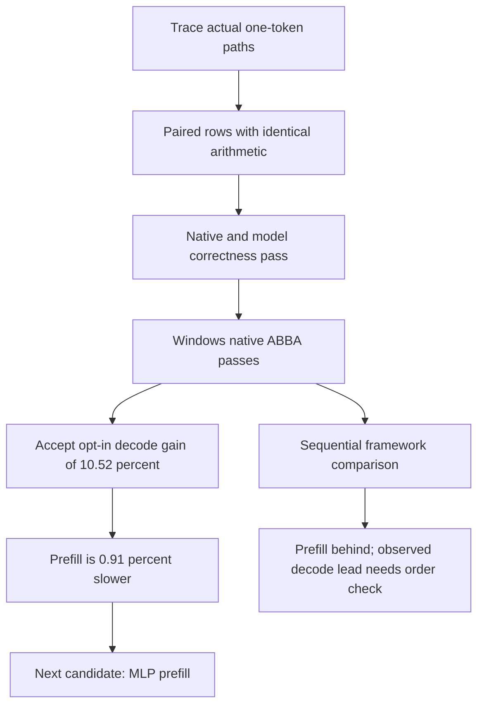

# Paired-row FP32 GEMV: Windows result

Measured 2026-10-06. **ACCEPT for the incremental Windows decode experiment**;
the implementation remains off by default. This is not an overall PyTorch win.
The [preceding trace](decode-gemv-investigation.md) defines the hypothesis and
evaluation order before implementation.

## Whole-model result

The serial native ABBA compares the existing GELU/attention/row-reuse build with
the same build plus paired-row GEMV. Both use experimental float tiles, FP32
GPT-2, one thread pinned to Windows CPU 2, ten warmups and 31 samples per pass.
No profiler, compiler or test suite ran concurrently with timing.

| Phase | Before, ms | After, ms | Change in time |
|---|---:|---:|---:|
| Prefill | 172.9838 | 174.5640 | +0.91% |
| Cached one-token decode | 34.0661 | 30.48325 | -10.52% |

All quality, within-pass stability and between-pass stability gates pass in the
[raw ABBA record](../benchmark/results/gpt2_gemv_pair_windows_abba.json).
The predeclared decode objective requires at least 2% improvement; both phases
must stay within the existing 2% slowdown allowance. Stability remains
p90/p10 <= 1.25 and between-pass median ratio <= 1.25. No thresholds were relaxed.
Historical records retain the default prefill objective and replay unchanged.
The 1.58 ms prefill increase is a measured tradeoff, not a prefill improvement.

## Fresh PyTorch context and its limitation

| Runtime | Prefill median, ms | Decode median, ms |
|---|---:|---:|
| PyTorch eager | 159.2716 | 30.7616 |
| PyTorch SDPA | 154.5930 | 30.4743 |
| Leaf candidate | 163.1301 | 29.3924 |

The [fresh matched-workload record](../benchmark/results/gpt2_gemv_pair_matched_windows.json)
uses last-token-only logits and a populated KV cache for decode. All three
sample sets pass within-run stability. Leaf prefill is 8.5371 ms (5.52%) slower
than SDPA; its observed decode time is 3.55% lower.

**This framework comparison is sequential, not order-balanced:** PyTorch eager,
then SDPA, then Leaf, each with ten warmups and 31 measured runs. The PyTorch
latency timestamp is 15:49:57 UTC and Leaf's is 15:50:18 UTC. Leaf did not run
first in this comparison. Warmups reduce cold-start effects but do not eliminate
thermal, frequency or order effects. Passing within-run stability does not prove
absence of systematic bias. Treat the small framework decode lead as an
observation pending an alternating framework comparison, not a confirmed
order-independent advantage. These medians are from a separate session from
the native ABBA and must not be mixed to calculate the candidate's improvement.

## Code path and mechanism

The previous one-token FP32 path calls the existing AVX2 dot kernel per output
row. The new optional path processes two contiguous weight rows with shared
input loads and four independent accumulator chains per row, preserving each
row's reduction order. It adds no weight packing, duplication or workspace.
Assembly inspection found eight register accumulators and shared input loads
without accumulator spills inside the main loop. This supports an instruction
reuse explanation; no hardware counters establish a DRAM bandwidth bottleneck.

Dispatch requires AVX2/FMA, FP32, one token and a width divisible by eight.
Odd output rows, scalar execution and other widths retain the existing path.
An early scalar-tail prototype failed bit-exact checks and was replaced with
this fallback. Quantized dispatch and transformer-block prefill GEMM are
unchanged. The last-token vocabulary head uses GEMV even during prefill, so
prefill is still measured. Test-only kernel access is absent from normal builds.

## Isolated measurements

The harness calls the actual decoder kernels. It includes rotating matrices
for transformer projections and a single vocabulary matrix; samples average
the calls in each rotation. Logical weight throughput is not measured DRAM
bandwidth. All attempts are retained.

| Weight shape N x K | Paired/old median ratio | Stability |
|---|---:|---|
| 768 x 768 | 0.8362 | Failed |
| 3072 x 768 | 0.9969 | Passed; essentially neutral |
| 768 x 3072 | 0.7921 | Failed |
| 50257 x 768 | 0.8904 | Failed |

The [paired shape results](../benchmark/results/gpt2_gemv_pair_shapes_windows.json)
support experimentation but **do not qualify an isolated speed gain**. The
[existing specialization control](../benchmark/results/gpt2_gemv_specialization_windows.json)
also failed timing stability. The accepted claim rests on the stable whole-model
ABBA, not these noisy shape medians.

## Correctness and validation

- Full Python suite: 794 passed, six skipped, four existing ONNX warnings.
- Native checks: bit-exact paired-versus-old results, FP64 reference tolerance,
  short/odd dimensions, unaligned inputs, worker-like row slices, output guards
  and input preservation. The older specialization control uses tolerance for
  small scalar tails; the new paired candidate requires bit-exactness.
- Eight reduced-model architecture cases pass for both the default and
  experimental builds, covering bias, tied weights, quantization, scalar,
  multithreaded, cache and generation paths.
- Trained held-out evaluation: 1,016 next-token targets, 100% agreement and
  perplexity 62.58004 versus PyTorch 62.58010; cache/generation checks pass.
- An additional [all-token cached-logit check](../benchmark/results/gpt2_gemv_pair_cached_logits_windows.json)
  runs every held-out token one at a time. Before/after logits are bit-exact,
  PyTorch allclose passes, next-token agreement is 100%, and perplexity ratio
  is 1.00000038. This explicitly exercises GEMV beyond full-sequence validation.
- [Validation record](../benchmark/results/gemv_pair_validation_windows.json)
  includes hashes and successful historical/current gate replay. Windows MinGW
  builds were tested directly; CMake was unavailable, so the new CMake targets
  were not executed. No Linux/WSL run was performed.

## Reproduction and next experiment

Build the candidate with `scripts/build_decoder.ps1` flags
`-ExperimentalVectorGelu -ExperimentalAttentionAvx2 -ExperimentalRowReuse
-ExperimentalGemvPair`; omit the last flag for the before build. Set
`LEAF_EXPERIMENTAL_FLOAT_TILES=1` for both. Obtain a fresh before quality record,
then use `tools/benchmark_decoder_comparison.py --objective decode` with the
before/after executables, workdir, frozen record, `--keys 32 --runs 31 --warmup 10
--cpu 2`, and a new output path. Preserve all attempts. The shape and cached
logit harnesses are `tools/benchmark_decode_gemv.py` and
`tools/verify_decode_gemv.py`; inspect their CLI help for required file paths.

Next: measure and tune MLP **prefill** up/down projections as a separate
candidate, protecting the accepted decode gain. Before a framework superiority
claim, compare Leaf and PyTorch SDPA in alternating order with separate process
warmups, fixed workload/thread/affinity settings, and unchanged stability gates.
Linux evaluation remains deferred under the Windows-first policy.

