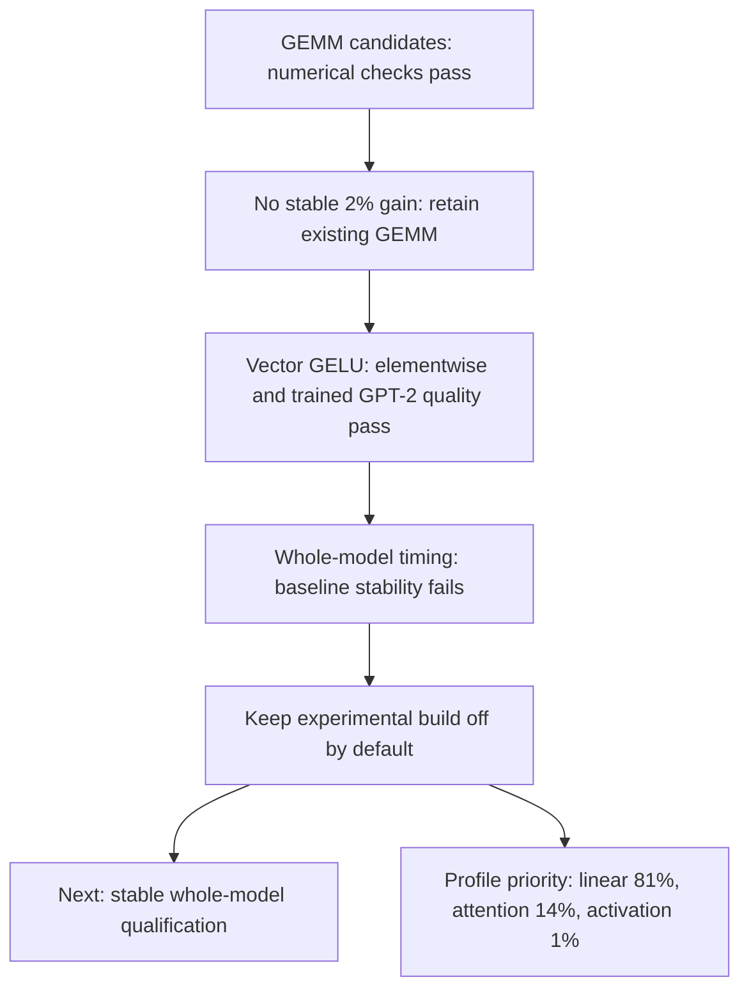

# GEMM and activation follow-up — 2026-10-03

This continues [the profile-first investigation](prefill-investigation.md).
Three new GEMM candidates pass numerical checks, but none earns decoder
integration. A separate vector GELU-new experiment passes elementwise and
trained GPT-2 quality checks. It remains disabled in normal builds.

## GEMM results

All shape tests include packing, use M=63, and compare against the existing
6×16 full-K token-panel primitive. Outputs must be bit-exact to full-K and
within the existing FP64-reference tolerance. Native tests also exercise
scalar execution, odd dimensions, token/row tails, output padding, and invalid
arguments. Source and executable hashes distinguish successive harness builds.

| Candidate | Change | Measured outcome | Decision |
|---|---|---|---|
| Weight panels | 6 tokens × 16 output channels; transient 16 KiB weight packing | Windows observed ratios 1.17–1.37; all four comparisons unstable | Do not integrate |
| Wide token panels | 3 output rows × 32 tokens; fewer weight broadcasts | Windows unstable; Linux MLP-up is stable but 6.0% slower, other shapes unstable | Do not integrate |
| Unrolled token panels | Existing 6×16 reduction with four-way loop unrolling | Linux ratios 0.9994, 1.0041, 0.9897, 1.0076; all stable | No shape reaches the 2% improvement threshold |

Linux ratio order is Q/K/V/O, MLP up, MLP down, prospective fused QKV. A ratio
below one is faster. Assembly inspection of the original 6×16 and wide-token
inner loops found register-resident accumulators; it did not establish cache
miss rates or a hardware bottleneck. Larger tiles and K blocking should not
be assumed faster without measurement. No new GEMM is dispatched by the decoder.

Records:

- [Weight panels, Windows](../benchmark/results/gpt2_weight_panel_shapes_windows.json)
- [Wide tokens, Windows](../benchmark/results/gpt2_wide_token_shapes_windows.json)
- [Wide tokens, Linux](../benchmark/results/gpt2_wide_token_shapes_linux.json)
- [Unrolled tokens, Linux](../benchmark/results/gpt2_unrolled_token_shapes_linux.json)

The research headers remain available to reproduce these candidates; they are
not dependencies of the decoder's execution path. The benchmark harness was
extended between experiments, so recorded source/executable hashes intentionally
differ. Historical records have not been replaced with later measurements.

## Vector GELU-new experiment

The build-time option `LEAF_EXPERIMENTAL_VECTOR_GELU` enables a semantic
activation branch for ordinary FFNs using GELU-new, with at least eight input
tokens and runtime AVX2/FMA support. No model-name check is used. One-token
decode, scalar execution, gated FFNs, and other activation kinds keep their
existing paths. Normal builds leave the option off.

The candidate evaluates a [13/12] Padé approximation to tanh, derived by
matching its Taylor expansion through degree 25, using vector Horner/FMA
operations. The argument saturates outside ±8, and the cubic input is bounded
to avoid overflow. Non-finite SIMD blocks use the original scalar expression.
This is an approximation, not a bit-exact replacement for `std::tanh`.

The native test samples 100,001 evenly spaced inputs over [-20,20], checks
short vectors and unaligned storage with guard values, and checks signed zero,
large finite inputs, infinities and NaNs. Maximum observed absolute error is
`9.53674e-7`, within `2e-6 + 1e-6 * abs(reference)`. This sampled check is not an
exhaustive proof over every FP32 input. Trained quality is checked separately.

Final experimental binaries emit `experimental_vector_gelu_build: true` in
native metrics. The automatic precision gate rejects that marker in either
the candidate or FP32 reference, including malformed truth-like values. Binary
hashes distinguish experimental builds; the default flag schema is unchanged.

## Whole-model evidence

Both sides of each GELU ABBA comparison enable the **same existing packed
GEMM**. Only the AFTER executable contains the vector GELU build. The frozen
held-out reference contains eight 128-token blocks, with 1,016 evaluated next
tokens. Latency uses one CPU thread pinned to CPU 2, 63-token prefill, one-token
KV-cached decode, last-token logits, ten warmups and 21 samples per pass.
Profile collection is disabled during these comparisons.

| Windows comparison | Prefill before → after ms | Decode before → after ms | Verdict |
|---|---:|---:|---|
| Initial experimental binary | 315.7750 → 238.7644 | 42.6809 → 40.7377 | Quality passes; unstable, reject promotion |
| Final binary with build marker | 472.5558 → 373.3245 | 55.3767 → 53.9249 | Quality passes; unstable, reject promotion |

The observed prefill reductions are 24.4% and 21.0%. They are **not accepted
speedups** because stability fails. Both runs retain exact greedy generation,
chunked-cache parity, FP32 allclose, 100% next-token agreement, and perplexity
ratio 0.99999921. The maximum held-out logit error is 0.0036621; the existing
combined absolute/relative FP32 allclose gate passes. Neither run is a new
matched PyTorch performance qualification. No timing outliers were discarded.

Records: [frozen Windows BEFORE quality](../benchmark/results/gpt2_gelu_before_packed_windows.json),
[initial ABBA](../benchmark/results/gpt2_gelu_packed_windows_abba.json),
[final Windows ABBA](../benchmark/results/gpt2_gelu_packed_windows_final_abba.json).

The first [Linux ABBA](../benchmark/results/gpt2_gelu_packed_linux_abba.json)
observed 221.1735 → 164.6251 ms prefill and 29.0045 → 29.5106 ms decode.
The AFTER stage passes every stability check and decode remains within the
2% allowance, but the BEFORE stage's first pass is unstable. The combined gate
therefore correctly rejects the run. Linux quality passes with 100% agreement,
perplexity ratio 0.99999897, cache parity, and exact generation. Its frozen
reference is [recorded separately](../benchmark/results/gpt2_gelu_before_packed_linux.json).

One predeclared [longer Linux confirmation](../benchmark/results/gpt2_gelu_packed_linux_confirmation_abba.json)
uses 20 warmups and 31 samples per pass. Prefill is 223.6888 → 165.5292 ms,
and decode is 30.9233 → 30.0753 ms. Both prefill stages and every AFTER check
are stable, but the first BEFORE decode pass fails stability. The combined
gate still rejects promotion. Both failed comparisons are retained; no further
timing retries were made.

The [final Windows phase profile](../benchmark/results/gpt2_gelu_phase_windows.json)
uses five iterations and two warmups per pass, including all seven forwards
in each diagnostic mean. With packed GEMM, activation averages 2.204 / 1.913 ms
(1.09% / 0.95% of forward), linear 163.774 / 163.860 ms (about 81%), and
attention 28.883 / 28.736 ms (about 14%). These are profiling diagnostics,
not steady-state medians or evidence of a precise cross-run activation
speedup. The new bottleneck order remains linear, then attention.

## Validation checkpoint

The full Python suite passes: **734 passed, 6 skipped**, with four existing
ONNX deprecation warnings. A final focused run after the benchmark candidate
identity guard passes **140 tests, 6 skipped**. Expanded native GEMM and GELU
tests pass on Windows and Linux (two CTest targets on Linux).

The [normal-build regression](../benchmark/results/gemm_activation_default_regression.json)
passes all eight reduced architecture cases with bit-exact logits and generation
against the previous executable. The [experimental-build architecture checks](../benchmark/results/gemm_activation_experimental_architectures.json)
also pass all eight cases. These cover five model families, supported precision
paths, scalar execution, two threads, caching, and generation; reduced random
models establish implementation parity, not trained-model performance.



## Reproduce and continue

Run builds/tests separately from serial performance measurements. The CPU pin
is this host's recorded setting, not a recommendation for other hardware.

```powershell
& scripts/build_decoder.ps1 -BuildDirectory build/gemm-followup/gelu-final -ExperimentalVectorGelu
$env:LEAF_EXPERIMENTAL_FLOAT_TILES = '1'
python tools/benchmark_decoder_comparison.py --before build/prefill-diagnostics/leaf_decoder.exe --after build/gemm-followup/gelu-final/leaf_decoder.exe --record benchmark/results/gpt2_gelu_before_packed_windows.json --workdir build/gpt2_prefill_followup --keys 32 --cpu 2 --runs 21 --warmup 10 --output benchmark/results/gpt2_gelu_packed_windows_final_abba.json
Remove-Item Env:LEAF_EXPERIMENTAL_FLOAT_TILES
```

For Linux, configure CMake with `-DLEAF_EXPERIMENTAL_VECTOR_GELU=ON`, build
`leaf_decoder`, `leaf_gelu_tests`, and `leaf_token_panel_tests`, then run CTest.
Use the Linux executable and Linux frozen quality record for ABBA; never edit
the platform labels or hashes in a Windows reference to reuse it on Linux.
For GEMM shape experiments, build `leaf_token_panel_bench` and use
`tools/benchmark_token_panels.py --candidate weight_panel|wide_token|unrolled`
with a single candidate name and separate result file.

Next decisions: retain the established GEMM until another candidate shows a
stable improvement; obtain stable whole-model GELU evidence and fresh matched
PyTorch measurements before considering promotion. The completed phase profile
puts linear and attention ahead of activation. Broader trained-model and longer-prefix
checks remain necessary before claiming general performance portability.
