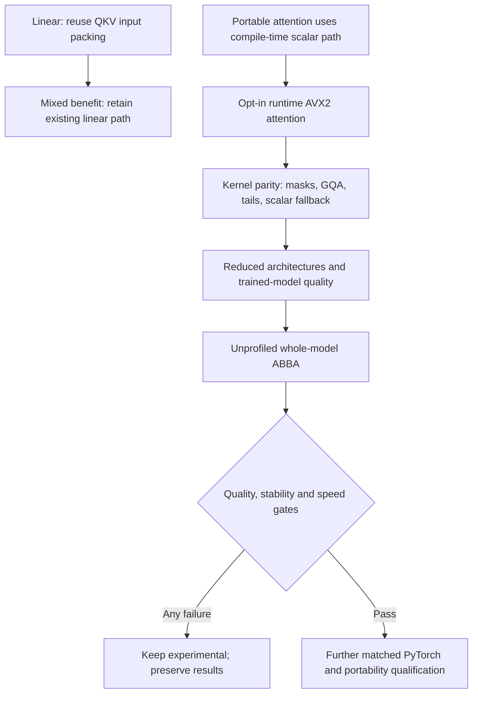

# Linear and attention follow-up — 2026-10-04

This continues the [Windows measurement diagnosis](windows-timing-diagnosis.md).
Two costs were investigated separately: repeated input packing for Q/K/V,
and attention in the portable decoder build. No default policy is promoted.

## Linear: retain the current decoder path

The three Q/K/V projections receive the same normalized input. A synthetic
63-token GPT-2 shape experiment compares three independent pack-and-GEMM calls
with packing once and reusing that workspace. Both execute the same three
6×16 GEMMs, include packing, and produce bit-exact outputs.

The initial Windows comparison is unstable (observed candidate/baseline ratio
0.9696). The Linux comparison is stable but the candidate is 1.16% slower
(ratio 1.0116). It does not establish a benefit. The decoder integration was
removed; only the reproducible operator benchmark retains this experiment.
No persistent packed weight copy, import format, or linear dispatch changes.

The later measurement alongside the refined attention kernel finds a stable
4.16% Windows QKV reduction, while Linux is unstable at a 1.87% reduction.
All attempts are retained. This mixed evidence does not establish a consistent
benefit or a whole-model gain; it does not reverse the integration decision.

## Attention: portable runtime dispatch

The existing `transformer.cpp` fast dot product depends on `__AVX2__`. Portable
decoder builds deliberately avoid global AVX2 flags, so their attention dot
product takes the scalar implementation even when decoder linear operations
use runtime-dispatched vector code. This is a build-path finding, not a claim
that all previous Leaf graph executables used scalar attention.

The new `LEAF_EXPERIMENTAL_ATTENTION_AVX2` build option is **off by default**.
For multi-token decoder calls on a supported CPU, it enables:

- AVX2 Q·K reduction with scalar tails and runtime CPU detection.
- Vector updates across contiguous output dimensions, retaining key order and
  separate multiplication/addition rather than introducing FMA.
- Hoisted broadcast-mask indexing.
- Exact zero for negative-infinity scores instead of calling `exp(-inf)`.

The Q·K reduction order changes; results are tolerance-checked rather than
declared bit-exact. Softmax's finite-score exponentials, normalization, Q/K
scaling convention, masks and output layout remain the existing computation.
Masked value updates are retained because `0 * NaN/Inf` is observable.
All-masked rows still return zero. One-token decode, forced-scalar execution,
unsupported architectures/compilers and default builds retain their old path.

No model-name check is used. Native metrics mark experimental attention builds,
and automatic precision selection rejects that marker in the candidate or its
FP32 reference. The attention header is included in source packaging.

## Tests and measurement protocol

Native tests exercise GQA, padded cache strides, all 16 mask-broadcast patterns,
both mask polarities, odd dimensions/tails, unaligned output with guards,
all-masked rows, masked nonfinite values and bit-exact scalar fallback. They
pass on Windows and Linux without global AVX2/FMA compilation flags.

The full Python suite passes **771 tests, 6 skipped**, with four existing ONNX
deprecation warnings. Reduced architectures and trained GPT-2 are checked
separately; random small-model parity is not trained-model performance.
All eight [experimental architecture cases](../benchmark/results/attention_vector_architectures.json)
pass, including scalar/two-thread checks, cache parity and generation.
All eight [default regression cases](../benchmark/results/attention_default_regression.json)
remain bit-exact against the previous default executable.

All shape timings use serial A/B/B/A with 31 samples and ten warmups per pass,
one thread pinned to logical CPU 2. Every sample is retained. The initial
attention prototype and the refinement that skips `exp(-inf)` have separate
records and binary/source hashes. Neither a noisy median nor a synthetic
kernel result can authorize whole-model promotion.

| Refined operator | Windows existing → candidate ms | Stable? | Linux existing → candidate ms | Stable? |
|---|---:|---|---:|---|
| 63-token attention | 2.41905 → 1.55775 | No | 0.83108 → 0.34918 | Yes |
| 128-token attention | 10.09510 → 6.57005 | Yes | 3.71125 → 1.64721 | Yes |
| Three 63-token QKV projections | 2.47185 → 2.36895 | Yes | 1.96685 → 1.93016 | No |

The stable Linux attention reductions are 57.98% and 55.62%; Windows's stable
128-token reduction is 34.92%. These are synthetic operator results, not
whole-model speedups. Windows and WSL share one physical host. The different
compilers/libraries/builds also mean their absolute timings are not a portable
comparison of operating systems.

Records: [initial Windows](../benchmark/results/linear_attention_shapes_windows.json),
[initial Linux](../benchmark/results/linear_attention_shapes_linux.json),
[refined Windows](../benchmark/results/linear_attention_shapes_windows_refined.json),
[refined Linux](../benchmark/results/linear_attention_shapes_linux_refined.json).

Whole-model comparisons hold packed GEMM and vector GELU constant and isolate
the additional attention option. Quality uses unchanged held-out logits,
cache/generation checks and frozen artifact/binary hashes. Timings are
unprofiled and exclude startup/loading. No builds or tests run concurrently.

The [Windows whole-model ABBA](../benchmark/results/gpt2_attention_windows_abba.json)
observes prefill **192.2828 → 176.9994 ms** and decode **35.9993 → 35.5903 ms**.
Quality passes with 100% next-token agreement over 1,016 targets, perplexity
ratio 0.99999904, FP32 allclose, chunked-cache parity and exact generation.
The AFTER stage is stable; BEFORE decode p90/p10 is 1.37389 / 1.29374, above
the 1.25 limit. The combined gate rejects the observed 7.95% prefill reduction.
Neither stage's PyTorch timings are a fresh matched framework comparison.

The [Linux whole-model ABBA](../benchmark/results/gpt2_attention_linux_abba.json)
observes prefill **163.7106 → 160.0684 ms** and decode **29.8944 → 31.6390 ms**.
Quality passes with 100% next-token agreement over 1,016 targets, perplexity
ratio 0.99999939, FP32 allclose, chunked-cache parity and exact generation.
BEFORE is stable; the second AFTER decode pass has p90/p10 1.38722, exceeding
1.25. The observed 5.84% decode slowdown also exceeds the 2% allowance.
Both conditions reject promotion despite the observed 2.22% prefill reduction.
The [Linux baseline quality record](../benchmark/results/gpt2_attention_before_linux.json)
freezes the existing GELU-only executable and quality inputs for this comparison.

The option changes multi-token calls only. These measurements do not establish
why one-token decode slowed down: whole-process state, code layout and host
variation remain possible explanations, not proven causes. No failed timing
samples were discarded and no gate thresholds were changed. Raw-sample replay
reproduces both whole-model verdicts. Neither platform establishes a qualified
whole-model improvement, and no fresh PyTorch speed claim is made.

The final [Windows phase diagnostic](../benchmark/results/gpt2_attention_phase_windows.json)
uses the attention-plus-GELU executable throughout. Its `default` and
`token_panel` labels toggle packed GEMM only, not attention. The two packed
passes attribute 84.8–86.2% of prefill to linear, 9.0–10.1% to attention and
1.1% to activation. These means include warmup and first use, so they are
prioritization evidence rather than acceptance latency or a matched comparison
with older profiles. Linear GEMM remains the next optimization target; packing
reuse alone did not consistently help. Further work should isolate projection
shapes and weight/data movement before changing decoder dispatch, then repeat
the same quality and whole-model gates for a concrete new candidate.

Reproduction uses `scripts/build_decoder.ps1 -ExperimentalVectorGelu
-ExperimentalAttentionAvx2` or CMake with both corresponding options set to
`ON`. Build `leaf_attention_vector_tests` and `leaf_decoder_operator_bench`
for native correctness and synthetic operator comparisons. Use
`tools/benchmark_decoder_operators.py` with a new output path for each run.
