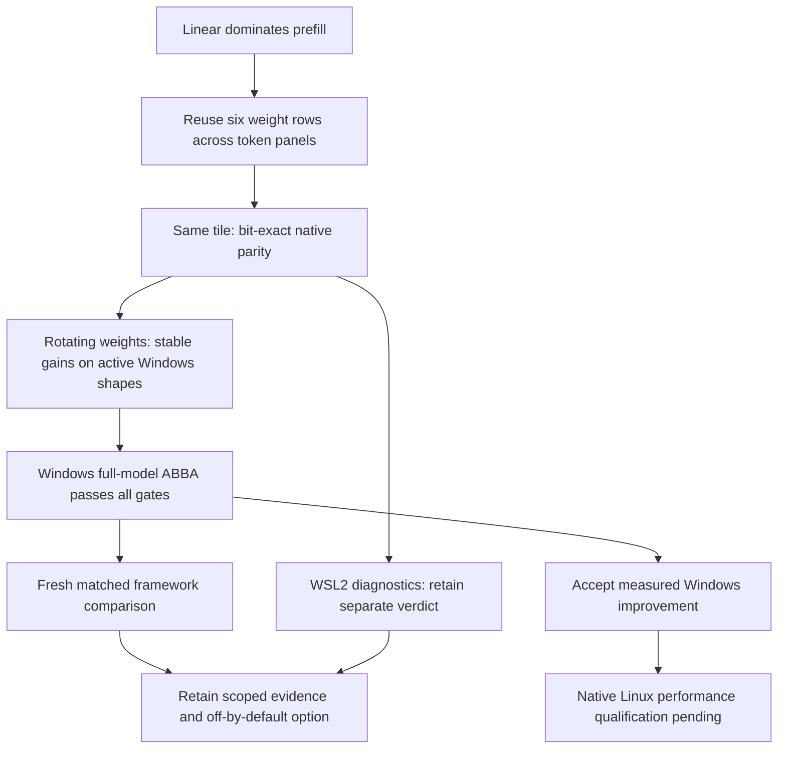

# Linear weight-row reuse — 2026-10-04

This follows the [attention investigation](linear-attention-followup.md).
Its final diagnostic attributed about 85–86% of experimental Windows prefill
time to linear operations. The new candidate changes weight reuse, not the
floating-point reduction or the model format.

## Mechanism and scope

The existing 6×16 FP32 GEMM visits every weight row for one 16-token panel
before moving to the next panel. The candidate visits all token panels for
six weight rows before advancing those rows. It calls the same AVX2/FMA tile,
retains increasing-K accumulation and bias placement, and uses the same
input-only packing workspace. No extra weight copy or partial-output buffer
is introduced. Better cache reuse is the hypothesis; hardware cache-miss
counters were not measured, so a specific hardware bottleneck is not proven.

`LEAF_EXPERIMENTAL_ROW_REUSE` is off by default. It changes only the already
opt-in packed FP32 branch (`LEAF_EXPERIMENTAL_FLOAT_TILES=1`, at least eight
tokens, supported AVX2/FMA CPU). Scalar calls, one-token decode and quantized
kernels keep their established paths. The build emits an experimental marker
and cannot authorize automatic precision selection. No model-name dispatch
is used; the header is included in packaged sources.

## Shape experiments

Both experiments use synthetic GPT-2 projection dimensions, include input
packing, and compare serial A/B/B/A with 31 samples and ten warmups per pass,
one thread pinned to logical CPU 2. Output parity is bit-exact against the
existing vector GEMM, with an additional FP64-reference tolerance check.

The [single-matrix Windows run](../benchmark/results/gpt2_row_reuse_shapes_windows.json)
shows a stable 1.24% reduction for 768×768; MLP up/down are unstable and the
prospective fused-QKV shape has a stable 2.36% reduction. This does not qualify
the active decoder shapes for integration by itself.

A separate [rotating-weight Windows run](../benchmark/results/gpt2_row_reuse_rotating_windows.json)
uses twelve resident replicas at distinct addresses. Replicas contain identical
synthetic values; this is a controlled weight-working-set experiment, not a
full-model simulation or a cold-disk benchmark. Each sample times all twelve
GEMMs, including each input pack, and reports milliseconds per matrix. That
averaging can smooth short disturbances, so stability here cannot replace
whole-model timing. All samples and both attempts are retained. Harness hashes
differ because replica support was added after the single-matrix measurement.

| Projection (N×K, M=63) | Before → candidate ms per matrix | Reduction | Stable? |
|---|---:|---:|---|
| Q/K/V/O: 768×768 | 0.84914 → 0.83150 | 2.08% | Yes |
| MLP up: 3072×768 | 3.49403 → 3.33847 | 4.45% | Yes |
| MLP down: 768×3072 | 3.36783 → 3.25500 | 3.35% | Yes |
| Prospective fused QKV: 2304×768 | 2.67285 → 2.50875 | 6.14% | No |

The first three shapes are used by this decoder. The fused shape is retained
as diagnostic evidence and excluded from the integration decision. Each GPT-2
block executes four square projections and two MLP projections; MLP projections
account for two thirds of these blocks' linear arithmetic by dimension. The
vocabulary projection and measured memory costs are separate from that count.

## Windows whole-model result

The [frozen BEFORE quality record](../benchmark/results/gpt2_row_reuse_before_windows.json)
and [whole-model ABBA](../benchmark/results/gpt2_row_reuse_windows_abba.json)
hold packed GEMM, experimental GELU and experimental attention constant.
Only AFTER adds the row-reuse build option. This isolates its incremental effect;
it does not retrospectively qualify earlier GELU/attention comparisons.

| Phase | BEFORE median | AFTER median | Change |
|---|---:|---:|---:|
| 63-token prefill, last-token logits | 167.48655 ms | 160.66325 ms | 4.07% lower |
| One-token KV-cached decode | 31.54725 ms | 31.02775 ms | 1.65% lower |

**The native experiment gate passes:** trained quality, every pass's stability,
pooled stability, between-pass drift, at least 2% prefill reduction and no more
than 2% slowdown in either phase. Timings use 31 samples and ten warmups per
pass, CPU 2, one thread, no profiler, and no simultaneous builds/tests.
The decode implementation is unchanged; its lower measured median is not an
isolated decode-kernel optimization claim.

Held-out quality covers 1,016 targets: 100% next-token agreement, perplexity
62.58004233 versus 62.58010265 for the reference (ratio 0.99999904), FP32
allclose, chunked-cache parity and exact greedy generation. This is held-out
inference loss, not a training experiment or whole-corpus quality qualification.

## Fresh Windows framework comparison

The [fresh comparison](../benchmark/results/gpt2_row_reuse_matched_windows.json)
uses the same model, tokens, CPU pin, thread count, last-token logits and cache
workload. Both PyTorch eager and Leaf pass their sample-stability checks:

| Implementation | Prefill median | Decode median | Stable? |
|---|---:|---:|---|
| PyTorch eager | 152.3990 ms | 28.5796 ms | Yes |
| PyTorch SDPA | 152.6636 ms | 29.1589 ms | No |
| Experimental Leaf with row reuse | 159.6631 ms | 31.9788 ms | Yes |

Leaf remains 4.77% slower in prefill and 11.89% slower in decode than the
stable eager reference in this measurement. The SDPA samples are retained;
they fail stability for both phases. This is a fresh sequential framework
comparison, not an ABBA framework experiment. The earlier 169 ms PyTorch
measurement must not be paired with this session's 160 ms Leaf result to
claim a win. The passing native ABBA supports an incremental Leaf improvement,
not PyTorch parity. Reference quality remains frozen and separately timestamped.

## Correctness and next checks

The full Python suite passes **779 tests, 6 skipped**, with four existing ONNX
warnings. Expanded native GEMM tests pass on Windows and WSL2: odd dimensions,
token and row tails, biases, padded strides, input preservation, scalar fallback,
invalid arguments and overflow checks. The vector candidate is bit-exact to
the established tile.

All eight [experimental architecture cases](../benchmark/results/row_reuse_architectures.json)
pass, including scalar/two-thread, cache and generation checks. All eight
[default regression cases](../benchmark/results/row_reuse_default_regression.json)
are bit-exact to the previous normal executable. Raw-sample replay reproduces
the passing Windows whole-model verdict without filtering samples.

## Separate WSL2 evidence

The [rotating-weight WSL2 shapes](../benchmark/results/gpt2_row_reuse_rotating_wsl.json)
show stable MLP-up/down reductions of 6.39% / 4.20%. The square projection
observes a 4.09% increase and is unstable; the prospective fused projection
observes a stable 5.80% reduction. These results do not establish a universal
shape win across the two environments.

The [WSL2 baseline](../benchmark/results/gpt2_row_reuse_before_wsl.json) and
[whole-model ABBA](../benchmark/results/gpt2_row_reuse_wsl_abba.json) retain
all samples. Prefill observes **160.1709 → 152.9133 ms** (4.53% lower) and
decode **31.0604 → 30.3076 ms** (2.42% lower). Trained quality, cache parity
and exact generation pass, with 100% next-token agreement and perplexity ratio
0.99999939. Prefill stability passes, but the second BEFORE and AFTER decode
passes have p90/p10 ratios 1.25563 and 1.31277, above the unchanged 1.25 limit.
**The combined WSL2 experiment gate rejects the comparison.** Raw-sample replay
reproduces this verdict. There is no retry to replace it with a passing run.

This is Linux under WSL2 on the same physical Windows host, not bare-metal
Linux or an independent machine. Native loading is outside the measured
inference intervals; the repository/artifacts are on `/mnt/c/`. Neither a
specific virtualization overhead nor a cause of timing variation was isolated.
The fresh WSL2 build compiled every requested target and native tests passed;
CMake/Make reported a sub-second host/guest timestamp skew warning during
the build. No compilation or tests overlapped any performance measurement.

All experimental options remain off in normal builds. Further prefix lengths,
models and independent hardware need their own qualification; this result is
specific to the recorded single-thread GPT-2 workload on this host.

## Platform acceptance policy

Windows is the primary optimization and performance acceptance platform for
the next development steps. A Windows candidate that passes trained quality,
cache/generation checks and the unchanged whole-model ABBA stability and speed
gates counts as an accepted improvement for its measured Windows configuration.
A failed WSL2 timing run does not veto that Windows result. The row-reuse
candidate therefore has an accepted 4.07% Windows prefill improvement.

WSL2 remains supporting build, correctness and performance-diagnostic evidence;
its failed timing verdicts remain visible. Correctness failures on any supported
platform still require investigation. Native Linux machines must independently
qualify Linux performance before a Linux speed claim is made. Windows and Linux
are the current targets; macOS optimization is outside the current priority.

Guest/host CPU placement is a hypothesis to investigate, not a measured latency
penalty or established explanation for the WSL2 spread. Acceptance thresholds
are unchanged, and a native Leaf improvement does not imply superiority to
PyTorch: that requires a fresh matched framework comparison. Broad default
promotion remains distinct from accepting a measured configuration.



Reproduce the Windows candidate with:

```powershell
& scripts/build_decoder.ps1 -BuildDirectory build/linear-reuse/candidate -ExperimentalVectorGelu -ExperimentalAttentionAvx2 -ExperimentalRowReuse
$env:LEAF_EXPERIMENTAL_FLOAT_TILES = '1'
python tools/benchmark_decoder_comparison.py --before build/linear-attention/attention-final/leaf_decoder.exe --after build/linear-reuse/candidate/leaf_decoder.exe --record benchmark/results/gpt2_row_reuse_before_windows.json --workdir build/gpt2_prefill_followup --keys 32 --cpu 2 --runs 31 --warmup 10 --output build/new-row-reuse-abba.json
```

Build `leaf_token_panel_bench` and use `tools/benchmark_token_panels.py
--candidate row_reuse --weight-copies 12` for the rotating synthetic experiment.
Use a new output path for every attempt.
