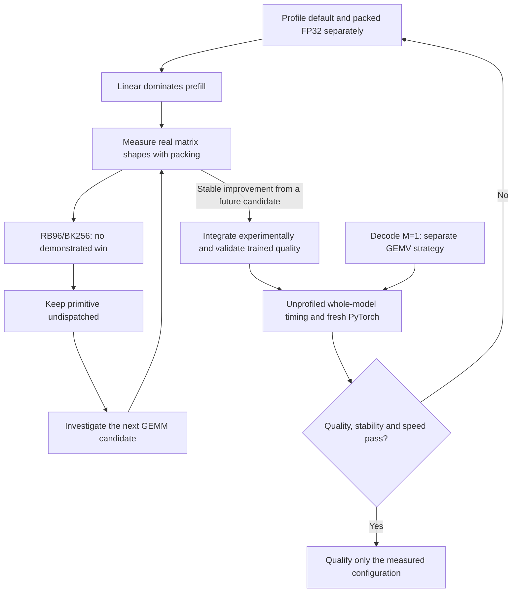

# FP32 prefill investigation, 2026-10-03

The requested diagnostic order is now measured through the blocked-K shape
experiment. Linear FP32 dominates GPT-2 prefill, but the existing RB96/BK256
primitive does **not** earn integration. No decoder dispatch or default policy
changes in this checkpoint.

## Priorities and completion criteria

| Order | Work | Evidence / next condition |
|---|---|---|
| 1 | Profile default FP32 | Complete: about 81% of prefill is `linear_fp32` |
| 2 | Profile 6×16 token panels with identical input/binary | Complete: linear share falls to 65–66%; retain both ABBA passes |
| 3 | Rank remaining costs | Linear first, activation next, attention after that; LayerNorm is only about 1% in this short-prefix packed workload |
| 4 | Measure RB96/BK256 on actual projection dimensions | Complete on Windows and Linux/WSL; no demonstrated advantage; leave undispatched |
| 5 | Improve the measured GEMM bottleneck | Next: investigate cache/register behavior and alternative blocking with packing included; require a stable shape win before integration |
| 6 | Revalidate an integrated winner | Reduced architectures, trained quality, cache/generation, unprofiled serial whole-model ABBA, then fresh matched PyTorch; protect decode |
| 7 | Address secondary operators | After GEMM: measure vector GELU-new; evaluate semantic QKV fusion and attention; defer LayerNorm behind larger measured costs |

Windows measurement-state investigation is a separate track. These records
do not identify throttling, core type, power state, or any other cause of noise.
The stable Linux comparisons use the same physical host through WSL, not an
independent device. Longer prefixes need their own profiles before applying
this priority order to attention.



## Phase evidence

[Raw Windows diagnostics](../benchmark/results/gpt2_phase_diagnostics_windows.json)
use one thread pinned to logical CPU 2, 63-token prefill, KV-cached one-token
decode, last-token-only logits, and the same freshly built FP32 executable and
artifact in A/B/B/A order. Each pass has five warmups and eleven timed iterations.

**These are profiled means over all 16 forwards, including warmup and first
use, not steady-state latency medians.** The profiler's `forward` entry is
inclusive; individual operator entries must not be added to it. The diagnostic
tool reports residual unattributed time separately. The profiler does not
separate warmup aggregates, so subtracting them would be invalid.

| Prefill phase | Default A1 / A2 mean ms | Packed B1 / B2 mean ms |
|---|---:|---:|
| Entire forward | 739.52 / 638.41 | 339.89 / 352.44 |
| Linear FP32 | 598.08 / 514.36 | 221.39 / 232.51 |
| Activation | 76.83 / 69.17 | 64.77 / 65.26 |
| Attention | 51.02 / 43.64 | 42.36 / 43.09 |
| LayerNorm | 5.15 / 4.31 | 4.12 / 4.15 |

The decline in linear cost accounts for most of the forward reduction. Other
phases also vary, so this does not isolate a precise kernel speedup. Decode
forward means are 48.09 / 40.03 ms for default and 41.65 / 43.83 ms for packed;
the opt-in does not change the one-token linear path. No diagnostic run passes
an acceptance gate or replaces a previous timing record.

The ordering in the pasted analysis was a hypothesis. Measurement supports
GEMM first, but does not support prioritizing LayerNorm ahead of activation.
GELU-new uses scalar `std::tanh`; a future vector implementation needs numerical
and trained-quality checks. Fused source QKV is still imported as separate
execution projections; the fused microbenchmark is only a prospective shape.

## Packing-inclusive shape evidence

The C++ benchmark compares the existing full-K and RB96/BK256 primitives on
deterministic synthetic FP32 inputs with bias, using AVX2/FMA. It checks all
outputs against an FP64 reference (`atol=1e-3`, `rtol=1e-4`) and requires the two
FP32 primitives to be bit-exact. Each A/B/B/A pass uses ten warmups and 31
samples. Every sample includes input packing. Input, weights, and output
storage are resident and reused; this is not a cold-cache or whole-model test.
All raw samples are retained. Both within-pass p90/p10 and between-pass median
ratios must be at most 1.25; an aggregate pass cannot hide a failed individual
pass.

All shapes have M=63, with weight storage W[N,K] and output X × Wᵀ.

| Shape | N | K | Windows full-K → blocked ms | Stable? | Linux full-K → blocked ms | Stable? |
|---|---:|---:|---:|---|---:|---|
| Q / K / V / O | 768 | 768 | 0.8133 → 0.8607 | No | 0.6927 → 0.6983 | Yes |
| MLP up | 3072 | 768 | 3.2954 → 3.5131 | No | 2.7663 → 2.8125 | Yes |
| MLP down | 768 | 3072 | 3.2833 → 3.4160 | No | 2.7462 → 2.8296 | Yes |
| Prospective fused QKV | 2304 | 768 | 2.6007 → 2.5830 | No | 2.0737 → 2.1690 | No |

The three stable Linux comparisons show blocked/full-K ratios of 1.0081,
1.0167, and 1.0304. None is a speedup. Windows and fused-QKV observations
cannot establish speed because of noise. All shape correctness checks pass on
both systems. A cache-blocked algorithm is a candidate, not a guarantee of
better cache behavior or speed on these dimensions.

Records: [Windows](../benchmark/results/gpt2_token_panel_shapes_windows.json),
[Linux/WSL](../benchmark/results/gpt2_token_panel_shapes_linux.json).

## Fresh trained validation and decision

The OS-build mismatch was resolved by running a new PyTorch and native FP32
baseline, exporting to a new work directory and preserving the old records.
The [matched Windows 26300 record](../benchmark/results/gpt2_prefill_followup_matched_windows.json)
uses eight held-out 128-token blocks (1,016 evaluated next tokens), the same
63-token latency prefix, one thread, CPU 2, ten warmups, and 21 timing samples.
Default FP32 passes allclose, chunked-cache checks, exact greedy generation,
100% next-token agreement, and a perplexity ratio of 0.99999998. Both PyTorch
implementations and native FP32 pass the existing timing stability threshold.

| Fresh matched baseline | Prefill p50 ms | Decode p50 ms |
|---|---:|---:|
| PyTorch eager | 158.7507 | 28.9437 |
| PyTorch SDPA | 156.2839 | 28.1867 |
| Leaf default FP32 | 392.9278 | 33.3914 |

The subsequent [unprofiled native ABBA](../benchmark/results/gpt2_prefill_followup_windows_abba.json)
uses that newly frozen reference and the same binary for both policies.
Packed FP32 passes trained quality, allclose, chunked parity, and exact
generation. Its perplexity ratio is 0.99999921 and agreement is 100%.
Observed aggregate medians are 367.5453 → 225.5586 ms prefill and
34.5861 → 35.8612 ms decode. **Reject promotion:** both stages fail the full
stability gate, and the decode ratio 1.0369 exceeds the 1.02 allowance. The
apparent prefill ratio 0.6137 cannot override either failure. The ABBA record
itself is native-only; it does not recompute a PyTorch promotion gate, and the
separate baseline is not used to imply candidate qualification.

Validation of this checkpoint:

- Python suite: 726 passed, six skipped; four existing ONNX deprecation warnings.
- Fresh Windows and Linux/WSL token-panel native correctness checks pass,
  covering scalar/vector paths, strides, tails, and blocked-K bit-exactness.
- All eight reduced cases across five architecture families pass for both
  [default](../benchmark/results/decoder_prefill_followup_default_architectures.json)
  and [packed](../benchmark/results/decoder_prefill_followup_packed_architectures.json)
  policies, including scalar/two-thread FP32, cache and generation checks.
- Both SVG diagrams were rendered and visually inspected. No whole-CNN speed,
  additional-device, or fresh installed-wheel qualification is claimed here.

The validated deliverable is diagnostic tooling and recorded evidence. It
does not enable a new production kernel. Existing automatic-selection rules
and experimental opt-ins remain unchanged.

## Reproduction

Run performance measurements serially, without concurrent builds or tests.
CPU 2 is this record's pin, not a recommendation for another device. The raw
records bind executable, artifact/input or kernel-source hashes and identify
the platform. The diagnostic command clears other experimental policies only
within its child-run scope and restores the caller's environment afterward.

```powershell
& scripts/build_decoder.ps1 -BuildDirectory build/prefill-diagnostics
python tools/profile_decoder.py --executable build/prefill-diagnostics/leaf_decoder.exe --artifact build/gpt2_windows_fair/decoder-32.leaf --tokens build/gpt2_windows_fair/tokens.json --cpu 2 --runs 11 --warmup 5 --output benchmark/results/gpt2_phase_diagnostics_windows.json
g++ -std=c++17 -O3 -DNDEBUG -static -I engine/include benchmark/token_panel_benchmark.cpp -o build/prefill-diagnostics/leaf_token_panel_bench.exe
python tools/benchmark_token_panels.py --executable build/prefill-diagnostics/leaf_token_panel_bench.exe --cpu 2 --runs 31 --warmup 10 --output benchmark/results/gpt2_token_panel_shapes_windows.json
python tools/validate_decoder.py --model build/models/gpt2 --dataset benchmark/data/wikitext2-test.parquet --workdir build/gpt2_prefill_followup --executable build/prefill-diagnostics/leaf_decoder.exe --bits 32 --blocks 8 --sequence-length 128 --threads 1 --cpu 2 --runs 21 --warmup 10 --output benchmark/results/gpt2_prefill_followup_matched_windows.json
python tools/benchmark_decoder_comparison.py --before build/prefill-diagnostics/leaf_decoder.exe --after build/prefill-diagnostics/leaf_decoder.exe --record benchmark/results/gpt2_prefill_followup_matched_windows.json --workdir build/gpt2_prefill_followup --keys 32 --after-float-tiles --cpu 2 --runs 21 --warmup 10 --output benchmark/results/gpt2_prefill_followup_windows_abba.json
```

For Linux, configure with `cmake -S engine -B build/prefill-diagnostics-linux
-DCMAKE_BUILD_TYPE=Release`, build `leaf_token_panel_tests` and
`leaf_token_panel_bench`, and run `ctest --test-dir build/prefill-diagnostics-linux
-R leaf_token_panel_tests --output-on-failure`. Run the same Python shape
wrapper using that Linux executable and a separate result filename.

Do not rewrite historical results to match the current machine. The saved
Windows baseline is build 26200; this run is build 26300. The existing trained
ABBA harness correctly rejected reuse across that platform change, requiring
a fresh baseline rather than an edited platform label.
